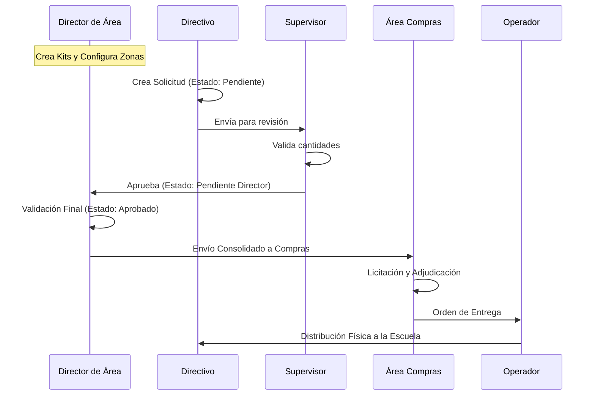

# Arquitectura de Casos de Uso y Flujo de Procesos

Este documento detalla las interacciones de los usuarios con el sistema y el flujo de vida de los pedidos, desde su planificación técnica hasta la entrega en las instituciones.

## 1. Diagrama de Casos de Uso por Rol

El sistema se basa en una estructura jerárquica y colaborativa donde cada rol tiene responsabilidades específicas sobre los recursos y los datos.

```mermaid
useCaseDiagram
    actor "Administrador" as Admin
    actor "Director de Área" as DA
    actor "Supervisor" as SV
    actor "Directivo" as DIR
    actor "Área de Compras" as AC
    actor "Operador de Depósito" as OP

    package "Configuración y Estructura" {
        DA --> (Gestionar Kits de Productos)
        DA --> (Crear Zonas Geográficas)
        DA --> (Asignar Supervisores a Zonas)
        DA --> (Asignar Escuelas a Zonas)
        Admin --> (Gestión de Usuarios y Permisos)
    }

    package "Ciclo de Pedido Anual" {
        DIR --> (Crear Solicitud Anual con Kits)
        SV --> (Revisar y Avalar Solicitud de Escuela)
        DA --> (Aprobación Final de Solicitudes)
        DA --> (Consolidar y Enviar a Compras)
    }

    package "Logística y Suministro" {
        AC --> (Gestionar Licitación Anual)
        AC --> (Adjudicación a Proveedores)
        OP --> (Recepción de Mercadería)
        OP --> (Distribución a Instituciones)
    }
```

---

## 2. Flujo Detallado de la Solicitud Anual

El proceso está diseñado para garantizar que los recursos lleguen de forma precisa a las escuelas, pasando por filtros técnicos y administrativos.

### Fase 1: Preparación Técnica (Director de Área)
1.  **Creación de Kits**: El Director de Área define qué productos componen un "Kit" (ej. Kit Inicial, Kit Primaria) y las cantidades sugeridas.
2.  **Organización Territorial**: Se definen las zonas y se vinculan las escuelas con sus respectivos supervisores.

### Fase 2: Generación del Pedido (Directivo)
1.  **Carga de Solicitud**: El Directivo de la escuela entra al sistema y selecciona el Kit que le corresponde.
2.  **Ajustes**: Puede ajustar cantidades basándose en su matrícula real.
3.  **Estado Inicial**: El pedido queda en estado `PENDIENTE` (esperando revisión del supervisor).

### Fase 3: Aval Técnico (Supervisor)
1.  **Auditoría**: El Supervisor revisa que lo solicitado por la escuela sea coherente con su realidad.
2.  **Validación**: Si es correcto, el Supervisor aprueba.
3.  **Estado Intermedio**: El pedido pasa a `PENDIENTE_DIRECTOR` (esperando firma del área).

### Fase 4: Validación y Consolidación (Director de Área)
1.  **Filtro Final**: El Director de Área revisa todas las solicitudes de su jurisdicción.
2.  **Aprobación Final**: Una vez aprobado, el pedido está listo para ser licitado.
3.  **Envío a Compras**: El Director realiza el "Envío a Compras", lo que bloquea las modificaciones y consolida todas las cantidades de su área.

### Fase 5: Compra y Suministro (Área de Compras)
1.  **Licitación**: Se agrupan los pedidos de todas las Direcciones de Área para abrir una licitación pública.
2.  **Adjudicación**: Se seleccionan los proveedores ganadores.

### Fase 6: Logística y Entrega (Operador)
1.  **Ingreso a Depósito**: Los proveedores entregan los productos. El Operador registra el ingreso.
2.  **Distribución**: El sistema genera las hojas de ruta para que el Operador envíe los productos a cada escuela según lo aprobado originalmente.

---

## Diagrama de Secuencia del Flujo de Pedido


