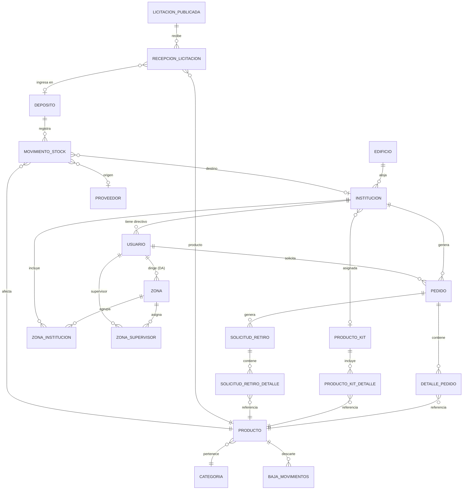
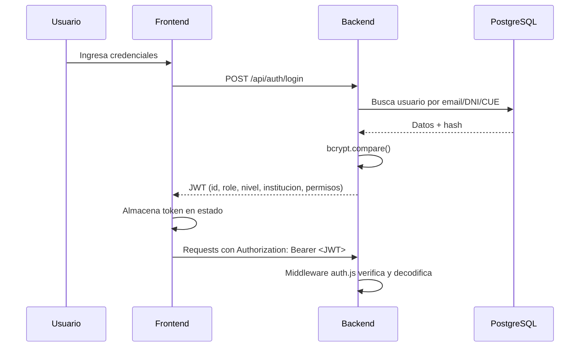
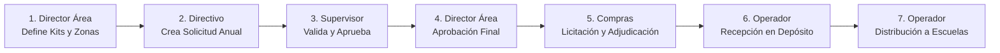
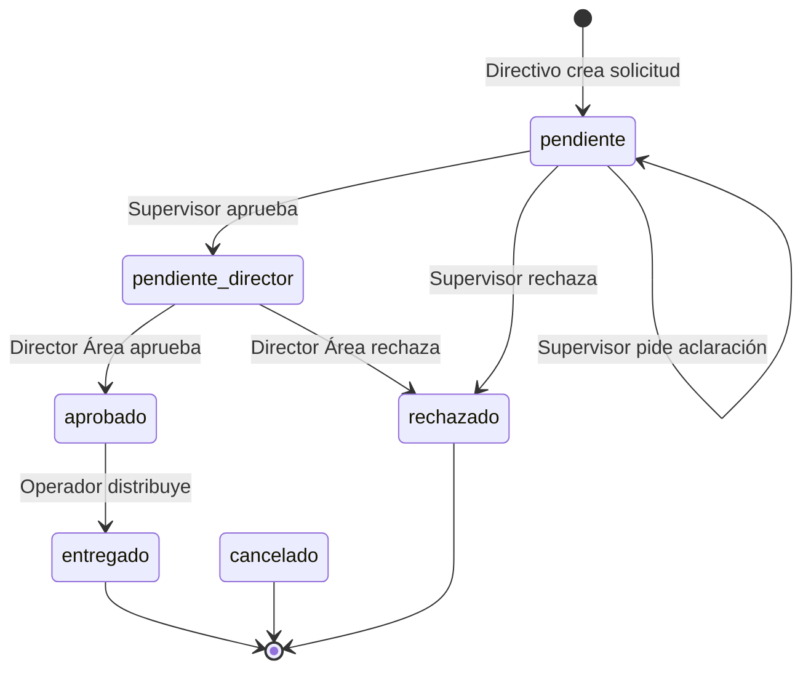
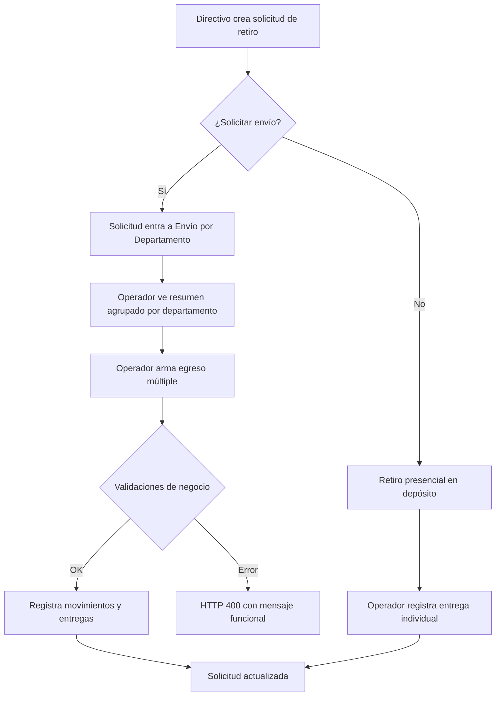
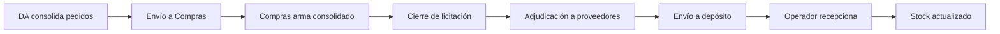

# PDR — Project Design Review: Depo Stock

**Versión**: 1.0  
**Fecha**: 25 de Junio de 2026  
**Proyecto**: Depo Stock — Sistema de Gestión de Stock, Pedidos y Distribución para Instituciones Educativas  
**Repositorio**: `Nahuel-Tapia/Depo`

---

## 1. Resumen Ejecutivo

**Depo Stock** es una aplicación web full-stack diseñada para digitalizar y gestionar el circuito completo de abastecimiento de insumos destinados a instituciones educativas de la Provincia de San Juan, Argentina. El sistema cubre desde la planificación anual de pedidos por parte de los directivos de escuelas, pasando por la supervisión jerárquica, la licitación pública, la recepción de mercadería en depósito, hasta la distribución física a cada institución.

### Problema que resuelve

Antes de la implementación, el circuito de abastecimiento operaba con planillas manuales, comunicación informal y sin trazabilidad. Depo Stock centraliza todo el flujo logístico en una plataforma única con control de acceso por roles, auditoría completa y seguimiento en tiempo real.

### Alcance actual

| Dimensión | Detalle |
|-----------|---------|
| Módulos operativos | 15+ módulos funcionales |
| Roles del sistema | 9 roles con permisos granulares |
| Endpoints API | 90+ endpoints REST |
| Tablas en BD | 30+ tablas PostgreSQL |
| Componentes Frontend | 34+ componentes React + 5 páginas |

---

## 2. Stack Tecnológico

### 2.1 Backend

| Capa | Tecnología | Versión |
|------|------------|---------|
| Runtime | Node.js | — |
| Framework HTTP | Express.js | ^4.19.2 |
| Base de datos | PostgreSQL | — |
| Driver DB | pg (node-postgres) | ^8.20.0 |
| Autenticación | JSON Web Tokens (jsonwebtoken) | ^9.0.2 |
| Hashing | bcryptjs | ^2.4.3 |
| Variables de entorno | dotenv | ^16.4.5 |
| CORS | cors | ^2.8.5 |
| Rate limiting | express-rate-limit | ^8.5.2 |
| Upload de archivos | multer | ^1.4.5-lts.1 |

### 2.2 Frontend

| Capa | Tecnología | Versión |
|------|------------|---------|
| Biblioteca UI | React | ^18.3.1 |
| Bundler | Vite | ^5.4.0 |
| Routing | react-router-dom | ^6.26.0 |
| Gráficos | Recharts | ^3.8.1 |
| Mapas | Leaflet + react-leaflet | ^1.9.4 / ^4.2.1 |
| Clustering mapas | leaflet.markercluster | ^1.5.3 |
| Estilos | Vanilla CSS (Glassmorphism, gradientes, micro-animaciones) | — |

### 2.3 Herramientas de Desarrollo y Testing

| Herramienta | Uso |
|-------------|-----|
| Playwright | Tests E2E y smoke tests de API |
| Scripts `.bat` / `.ps1` | Automatización Windows para iniciar/detener servicios |
| Scripts `backend/scripts/` | 29 scripts utilitarios de BD, seeding y diagnóstico |

---

## 3. Arquitectura del Sistema

### 3.1 Arquitectura General

```
┌──────────────────────────────────────────────────────────────┐
│                        CLIENTE (Browser)                     │
│                    React 18 + Vite (SPA)                     │
│               http://localhost:5173 (dev)                    │
└──────────────────────┬───────────────────────────────────────┘
                       │ HTTP / REST (JSON)
                       │ Authorization: Bearer <JWT>
┌──────────────────────▼───────────────────────────────────────┐
│                     SERVIDOR (Express.js)                     │
│                   http://localhost:4000                        │
│                                                               │
│  ┌─────────────┐  ┌──────────────┐  ┌────────────────────┐   │
│  │ Middleware   │  │   Routes     │  │   Static Files     │   │
│  │ • auth JWT   │  │ • 23 archivos│  │ • frontend/dist    │   │
│  │ • rate limit │  │ • 90+ endpts │  │ • uploads/         │   │
│  │ • errorHndlr │  │              │  │                    │   │
│  └──────┬──────┘  └──────┬───────┘  └────────────────────┘   │
│         │                │                                    │
│  ┌──────▼────────────────▼───────────────────────────────┐   │
│  │              Controllers (21 archivos)                 │   │
│  │     Validación de entrada, orquestación de lógica      │   │
│  └──────────────────────┬────────────────────────────────┘   │
│                         │                                     │
│  ┌──────────────────────▼────────────────────────────────┐   │
│  │               Services (24 archivos)                   │   │
│  │      Lógica de negocio, queries SQL, transacciones     │   │
│  └──────────────────────┬────────────────────────────────┘   │
│                         │                                     │
│  ┌──────────────────────▼────────────────────────────────┐   │
│  │             db.pg.js  (Pool de conexiones)             │   │
│  └───────────────────────────────────────────────────────┘   │
└──────────────────────────┬───────────────────────────────────┘
                           │ TCP :5432
┌──────────────────────────▼───────────────────────────────────┐
│                      PostgreSQL                               │
│                    Base: depo_stock                            │
│              30+ tablas, 3 ENUMs, 18 índices                  │
└──────────────────────────────────────────────────────────────┘
```

### 3.2 Patrón de Diseño Backend

El backend sigue un patrón **Route → Controller → Service → DB** de tres capas:

1. **Routes** (`backend/src/routes/`): Definen endpoints y middleware por ruta (autenticación, permisos).
2. **Controllers** (`backend/src/controllers/`): Validación de entrada, manejo de request/response.
3. **Services** (`backend/src/services/`): Lógica de negocio pura, consultas SQL y transacciones.
4. **DB** (`backend/src/db.pg.js`): Pool de conexiones PostgreSQL compartido.

### 3.3 Modos de Despliegue

| Modo | Backend | Frontend | Descripción |
|------|---------|----------|-------------|
| **Desarrollo** | `localhost:4000` | `localhost:5173` (Vite dev server) | Procesos separados, HMR activo |
| **Unificado** | `localhost:4000` sirve `frontend/dist/` | Build estático | Un solo proceso, ideal para producción |
| **Fallback** | `localhost:4000` sirve `frontend/public/` | HTML mínimo | Solo si `dist/` no existe |

---

## 4. Modelo de Datos

### 4.1 Diagrama Entidad-Relación (Simplificado)



### 4.2 Tablas Principales por Dominio

| Dominio | Tablas |
|---------|--------|
| **Organización** | `edificio`, `deposito` |
| **Productos** | `categoria`, `producto`, `producto_kit`, `producto_kit_detalle`, `kit_producto_anual` |
| **Instituciones** | `institucion`, `stock_institucion`, `consumo_institucion` |
| **Usuarios y RBAC** | `usuario`, `rol`, `usuario_rol` |
| **Supervisión** | `supervisor_escuela_asignacion`, `solicitud_informe_supervisor`, `zona`, `zona_institucion`, `zona_supervisor` |
| **Pedidos** | `pedido`, `detalle_pedido`, `aprobacion_seguimiento`, `comentario_pedido` |
| **Compras** | `planilla_pedido_anual`, `planilla_pedido_anual_detalle`, `licitacion_publicada`, `compra_precio_historico` |
| **Logística** | `remito_licitacion`, `recepcion_licitacion`, `recepcion_danio_imagen`, `distribucion_lote`, `distribucion_lote_item`, `distribucion_lote_item_imagen` |
| **Entregas** | `solicitud_retiro`, `solicitud_retiro_detalle`, `entrega_anual`, `pedido_entrega`, `movimiento_stock` |
| **Patrimonio y Bajas** | `patrimonio_ticket`, `baja_movimientos`, `baja_status_history` |
| **Notificaciones** | `notificacion` |

### 4.3 Tipos ENUM

| Enum | Valores |
|------|---------|
| `estado_tramite` | `pendiente`, `en_revision`, `aprobado_parcial`, `aprobado`, `rechazado`, `entregado`, `finalizado`, `cancelado`, `pendiente_director` |
| `tipo_movimiento` | `ingreso`, `egreso`, `ajuste`, `devolucion`, `traslado` |
| `tipo_bien` | `consumible`, `patrimonial` |

---

## 5. Sistema de Roles y Permisos (RBAC)

### 5.1 Matriz de Roles

| Rol | Descripción | Nivel Educativo | Jerarquía |
|-----|-------------|-----------------|-----------|
| `admin` | Administrador con acceso total | No | Raíz |
| `control_ministerio` | Auditoría ministerial (solo lectura) | No | Externo |
| `director_area` | Director de Área — planificación y supervisión | **Sí** | Nivel 2 |
| `supervisor` | Supervisor de zona — validación de pedidos | **Sí** | Nivel 3 |
| `directivo` | Directivo de escuela — genera pedidos | No | Nivel 4 |
| `area_compras` | Gestión comercial y licitaciones | No | Operativo |
| `operador` | Operador de depósito — logística física | No | Operativo |
| `operador_escolar` | Operador a nivel de escuela | No | Operativo |
| `consulta` | Solo lectura | No | Restringido |

### 5.2 Permisos Granulares

El sistema define **30 permisos individuales** agrupados por módulo:

```
dashboard.view
stock.view / stock.edit / stock.movement.create
users.read / users.create / users.role.update / users.status.update / users.delete
productos.view / productos.create / productos.edit / productos.delete
movimientos.view / movimientos.create
bajas.authorize
ajustes.view / ajustes.create
auditoria.view
pedidos.view / pedidos.create / pedidos.manage
supervision.manage / supervision.reports.request
instituciones.view / instituciones.create / instituciones.edit / instituciones.delete / instituciones.asignar
proveedores.view / proveedores.create / proveedores.edit / proveedores.delete
limites.view / limites.edit
planilla.view / planilla.manage / planilla.enviar
```

### 5.3 Flujo de Autenticación



---

## 6. Módulos Funcionales

### 6.1 Flujo Principal: Ciclo de Pedido Anual



### 6.2 Inventario de Módulos

| # | Módulo | Roles Involucrados | Estado |
|---|--------|-------------------|--------|
| 1 | **Login y Registro** | Todos (registro: directivos) | ✅ Completo |
| 2 | **Dashboard** | Todos (adaptado por rol) | ✅ Completo |
| 3 | **Gestión de Usuarios** | Admin, Director Área | ✅ Completo |
| 4 | **Gestión de Productos** | Admin, Operador | ✅ Completo |
| 5 | **Movimientos de Stock** | Operador, Admin | ✅ Completo |
| 6 | **Gestión de Depósitos** | Operador | ✅ Completo |
| 7 | **Pedidos Anuales** | Directivo → Supervisor → DA | ✅ Completo |
| 8 | **Pedidos de Refuerzo** | Directivo → Supervisor | ✅ Completo |
| 9 | **Gestión de Kits** | Director Área | ✅ Completo |
| 10 | **Gestión de Zonas** | Director Área | ✅ Completo |
| 11 | **Supervisión Territorial** | Director Área, Supervisor | ✅ Completo |
| 12 | **Licitación y Adjudicación** | Área Compras | ✅ Completo |
| 13 | **Recepción de Licitación** | Operador | ✅ Completo |
| 14 | **Distribución a Escuelas** | Operador | ✅ Completo |
| 15 | **Solicitudes de Retiro** | Directivo, Operador | ✅ Completo |
| 16 | **Envío por Departamento** | Operador | ✅ Completo |
| 17 | **Gestión de Proveedores** | Área Compras, Operador | ✅ Completo |
| 18 | **Instituciones** | Admin, DA, Supervisor | ✅ Completo |
| 19 | **Bajas y Descartes** | Operador, Compras | ✅ Completo |
| 20 | **Patrimonio Escolar** | Supervisor | ✅ Base implementada |
| 21 | **Auditoría** | Admin, Control Ministerio | ✅ Completo |
| 22 | **Alertas de Vencimiento** | Operador (Dashboard) | ✅ Completo |
| 23 | **Mapas y Geolocalización** | — | ✅ Disponible (Leaflet) |

---

## 7. Superficie de API

### 7.1 Resumen de Endpoints por Prefijo

| Prefijo | Función | Endpoints |
|---------|---------|-----------|
| `/api/auth` | Autenticación (login, registro) | 2 |
| `/api/users` | CRUD de usuarios, perfil, contraseña | 8 |
| `/api/roles` | Roles y permisos por rol | 4 |
| `/api/permissions` | Permisos del usuario, matriz, catálogo | 3 |
| `/api/dashboard` | Estadísticas por rol | 1 |
| `/api/productos` | CRUD productos + stock detalle | 6 |
| `/api/movimientos` | Movimientos de stock, lote, directo, stats | 6 |
| `/api/ajustes` | Ajustes de inventario | 3 |
| `/api/auditoria` | Log de auditoría + stats | 4 |
| `/api/pedidos` | Pedidos anuales/refuerzo, kits, estados | 12 |
| `/api/instituciones` | CRUD instituciones, asignaciones, historial | 14 |
| `/api/proveedores` | CRUD proveedores | 4 |
| `/api/supervisor` | Instituciones, solicitudes, dashboard | 6 |
| `/api/director-area` | Zonas, catálogo, supervisores, edificios | 15 |
| `/api/compras` | Planillas, licitación, adjudicación | 18 |
| `/api/directivo` | Alertas para directivos | 1 |
| `/api/patrimonio` | Tickets de patrimonio | 2 |
| `/api/entregas` | Solicitudes de retiro, envío por departamento | 13 |
| `/api/depositos` | Stock por depósito, recepciones, distribución | 13 |
| `/api/stock-institucion` | Stock a nivel de institución | 1+ |
| `/api/zones` | Zonas (compatibilidad) | 3 |
| `/api/health` | Healthcheck | 1 |

### 7.2 Convenciones de la API

- **Autenticación**: JWT via header `Authorization: Bearer <token>`
- **Content-Type**: `application/json` (límite 2MB)
- **Códigos de estado**: `200`, `201`, `400`, `401`, `403`, `404`, `409`, `500`
- **Errores de negocio**: Retornan `400` con mensaje funcional claro (no `500`)
- **Rate limiting**: Global en `/api`, reforzado en `/api/auth`

---

## 8. Frontend: Arquitectura de Componentes

### 8.1 Estructura de Navegación

```
App.jsx (react-router-dom)
├── / → Login o redirect a Dashboard
├── /registro → Register
├── /dashboard/:tab → Dashboard (contenedor principal)
│   ├── inicio → Inicio.jsx (adaptado por rol)
│   ├── productos → Productos.jsx
│   ├── movimientos → Movimientos.jsx
│   ├── depositos → Depositos.jsx
│   ├── pedidos → Pedidos.jsx
│   ├── usuarios → Usuarios.jsx
│   ├── instituciones → Instituciones.jsx
│   ├── proveedores → Proveedores.jsx
│   ├── compras → ComprasPanel.jsx
│   ├── distribucion → DistribucionEscuelas.jsx
│   ├── recepcion → RecepcionLicitacion.jsx
│   ├── bajas → Bajas.jsx
│   └── ... (30+ tabs disponibles)
└── /print/remito-general/:id → PrintRemitoGeneral.jsx
```

### 8.2 Componentes Principales por Tamaño

| Componente | Tamaño | Función |
|-----------|--------|---------|
| `ComprasPanel.jsx` | 73KB | Panel completo de compras y licitación |
| `Pedidos.jsx` | 57KB | Gestión de pedidos multi-rol |
| `DistribucionEscuelas.jsx` | 53KB | Distribución física + envío por departamento |
| `Movimientos.jsx` | 49KB | Movimientos de stock y traslados |
| `Inicio.jsx` | 48KB | Dashboard adaptativo por rol |
| `RecepcionLicitacion.jsx` | 37KB | Recepción de mercadería |
| `Bajas.jsx` | 36KB | Descarte con evidencia fotográfica |
| `DirectorAreaZonas.jsx` | 35KB | Gestión territorial |
| `RecepcionMercaderia.jsx` | 33KB | Recepción alternativa de mercadería |
| `Usuarios.jsx` | 32KB | Gestión de usuarios con RBAC en UI |

### 8.3 Sistema de Diseño

- **Estética**: Glassmorphism + gradientes + micro-animaciones
- **Modo**: Preferencia por modo oscuro
- **Badges y Estados**: Estilo visual coherente con semántica por color
- **Componentes de impresión**: Soporta comprobantes y remitos con logo oficial del Gobierno de San Juan

---

## 9. Seguridad

### 9.1 Medidas Implementadas

| Capa | Medida | Detalle |
|------|--------|---------|
| Autenticación | JWT | Firmado con `JWT_SECRET` (mínimo 64 chars) |
| Contraseñas | bcryptjs | Hashing con salt |
| Autorización | RBAC | 30 permisos granulares verificados en middleware y frontend |
| Rate Limiting | express-rate-limit | Global para API, reforzado para auth |
| CORS | cors | Orígenes configurables vía `.env` |
| Validación | Backend | Validación estricta de inputs, tipos y pertenencia |
| Información sensible | Filtrado | El operador no ve precios; solo cantidades y productos |
| Manejo de errores | Middleware centralizado | `errorHandler.js` evita fuga de stack traces |
| Upload | multer | Límite de tamaño en `express.json` (2MB) |

### 9.2 Variables Sensibles

Gestionadas vía `.env` (nunca commiteado):

```
JWT_SECRET, DB_HOST, DB_PORT, DB_NAME, DB_USER, DB_PASSWORD, CORS_ORIGINS
```

---

## 10. Base de Datos: Decisiones de Diseño

### 10.1 Estrategia de Migración

El proyecto usa un enfoque híbrido:

1. **`schema.sql`** (21KB): Esquema canónico unificado con 30+ tablas y todos los índices.
2. **`schemaManager.js`** (32KB): Servicio que verifica y aplica migraciones al iniciar el servidor (columnas faltantes, tablas nuevas).
3. **`db_compat_patch.sql`** (27KB): Parches de compatibilidad para esquemas existentes.
4. **`depo_stock_dump.sql`** (406KB): Dump funcional completo para entornos de desarrollo.

### 10.2 Índices de Rendimiento

18 índices específicos definidos para optimizar:
- Consultas de pedidos por institución
- Búsqueda de movimientos por depósito, usuario, producto e institución
- Navegación de zonas y supervisión
- Consumo institucional por fecha

### 10.3 Integridad Referencial

- Foreign keys con `ON DELETE CASCADE` para datos transaccionales hijos
- `ON DELETE RESTRICT` para entidades que no deben eliminarse con dependencias
- `ON DELETE SET NULL` para referencias opcionales
- Constraints `UNIQUE` compuestos para evitar duplicidad (ej: `cue + nivel_educativo`)

---

## 11. Flujos de Negocio Críticos

### 11.1 Flujo Completo de Pedido Anual



### 11.2 Flujo de Retiro vs Envío por Departamento



### 11.3 Flujo de Licitación



---

## 12. Documentación del Proyecto

### 12.1 Documentación Técnica

| Archivo | Contenido |
|---------|-----------|
| [README.md](file:///c:/Users/Docente/Depo/README.md) | Visión general, arranque rápido e instrucciones |
| [ENDPOINTS.md](file:///c:/Users/Docente/Depo/backend/ENDPOINTS.md) | Referencia completa de la API (90+ endpoints) |
| [ROLES_Y_PERMISOS.md](file:///c:/Users/Docente/Depo/ROLES_Y_PERMISOS.md) | Matriz RBAC y validaciones |
| [GUIA_ROLES_SISTEMA.md](file:///c:/Users/Docente/Depo/GUIA_ROLES_SISTEMA.md) | Flujo operativo por rol |
| [DIAGRAMA_Y_FLUJO_SISTEMA.md](file:///c:/Users/Docente/Depo/DIAGRAMA_Y_FLUJO_SISTEMA.md) | Diagramas de secuencia y casos de uso |
| [CHANGELOG.md](file:///c:/Users/Docente/Depo/CHANGELOG.md) | Historial de cambios detallado |
| [mejoras.md](file:///c:/Users/Docente/Depo/mejoras.md) | Pendientes y roadmap de mejoras |
| [schema.sql](file:///c:/Users/Docente/Depo/backend/schema.sql) | Esquema canónico de la BD |

### 12.2 Documentación Académica

La carpeta `docs/` contiene un **documento de tesis completo** con 18 capítulos:

| Capítulo | Tema |
|----------|------|
| 1 | Introducción |
| 2 | Planteamiento del Problema |
| 3 | Objetivos |
| 4 | Alcance |
| 5 | Marco Teórico |
| 6 | Metodología |
| 7 | Requerimientos |
| 8 | Diseño |
| 9 | Casos de Uso |
| 10 | Implementación |
| 11 | Pruebas |
| 12 | Seguridad |
| 13 | Marco Legal |
| 14 | Plan de Implementación |
| 15 | Factibilidad |
| 16 | Conclusiones |
| 17 | Bibliografía |
| 18 | Anexos |

---

## 13. Métricas del Código

### 13.1 Tamaño del Proyecto

| Componente | Archivos | Tamaño aproximado |
|-----------|----------|-------------------|
| Backend Routes | 23 | ~30KB |
| Backend Controllers | 21 | ~80KB |
| Backend Services | 24 | ~420KB |
| Frontend Components | 34 | ~800KB |
| Frontend Pages | 5 | ~37KB |
| SQL Schemas | 4 | ~460KB |
| Scripts utilitarios | 29 | ~100KB |
| Documentación | 25+ | ~350KB |

### 13.2 Servicios más Complejos (por tamaño)

| Servicio | Tamaño | Dominio |
|----------|--------|---------|
| `entregaService.js` | 76KB | Entregas, retiros y envíos por departamento |
| `depositoService.js` | 49KB | Operaciones de depósito y distribución |
| `pedidoService.js` | 41KB | Pedidos anuales y de refuerzo |
| `compraService.js` | 41KB | Licitaciones y adjudicaciones |
| `schemaManager.js` | 32KB | Migraciones automáticas de BD |
| `directivoService.js` | 31KB | Panel del directivo |
| `institucionService.js` | 31KB | Gestión de instituciones |
| `supervisorService.js` | 30KB | Lógica de supervisión |
| `directorAreaService.js` | 28KB | Planificación territorial |

---

## 14. Riesgos y Deuda Técnica Identificada

### 14.1 Riesgos Técnicos

| Riesgo | Severidad | Mitigación actual |
|--------|-----------|-------------------|
| Sin ORM — SQL directo en services | Media | Facilita control pero dificulta refactors |
| Archivos de servicio muy grandes (76KB max) | Media | Funcional pero candidatos a descomposición |
| Migraciones no secuenciales | Media | `schemaManager.js` compensa con verificaciones |
| Imágenes en base64 en BD | Media | Funcional para volúmenes bajos |
| Sin tests unitarios | Alta | Solo smoke tests E2E con Playwright |
| Sin CI/CD configurado | Media | Proceso manual de deploy |
| Sin TypeScript | Baja | JavaScript puro, validaciones manuales |

### 14.2 Deuda Técnica

1. **Componentización frontend**: Algunos componentes superan los 50KB, candidatos a división en sub-componentes.
2. **SQL inline**: Las queries viven en services; un sistema de queries nombradas o un query builder mejoraría mantenibilidad.
3. **Logging**: Logs básicos con `console.log/error`; falta un logger estructurado (Winston, Pino).
4. **Tests**: Cobertura mínima; se requieren tests unitarios para services y tests de integración para la API.
5. **Tipado**: Sin TypeScript ni JSDoc en gran parte del código.

---

## 15. Roadmap de Mejoras Pendientes

### Corto Plazo

- [ ] Plazo de entrega de 30 días para proveedores post-adjudicación
- [ ] Diferenciación conceptual: Adjudicación vs. Remito
- [ ] Comprobantes de entrega por triplicado (Escuela, Depósito, Tribunal de Cuentas)
- [ ] Filtros avanzados en módulo de Productos
- [ ] Edición de movimientos con restricciones de auditoría

### Mediano Plazo

- [ ] Roles nuevos: Secretario Administrativo, Ministro Financiero
- [ ] Trazabilidad profunda por lotes (vencimiento por lote)
- [ ] Circuito de pago: Compras libera pago solo tras confirmación de recepción completa
- [ ] Firma y sello en documentos de recepción
- [ ] Registro de remito por camión individual

### Largo Plazo

- [ ] Módulo de gestión de flota/transporte
- [ ] Reportes especializados para directivos
- [ ] Notificaciones push/email
- [ ] Migración a TypeScript
- [ ] CI/CD pipeline
- [ ] Logger estructurado

---

## 16. Conclusión

Depo Stock es un sistema de gestión integral con alta complejidad funcional que cubre el ciclo completo de abastecimiento educativo. La arquitectura es pragmática y funcional, con un backend Node.js/Express bien estratificado y un frontend React con diseño visual moderno. El sistema RBAC con 9 roles y 30 permisos granulares garantiza control de acceso preciso para cada función operativa.

El proyecto se encuentra en un estado maduro y operativo, con más de 15 módulos funcionales completos, documentación técnica y académica exhaustiva, y un historial de desarrollo que evidencia iteraciones continuas con usuarios reales del gobierno provincial.

Las áreas de mejora principales se concentran en la calidad de ingeniería (tests, tipado, logging) y en la expansión funcional para cubrir flujos operativos pendientes (logística de transporte, circuito de pagos, nuevos roles jerárquicos).
