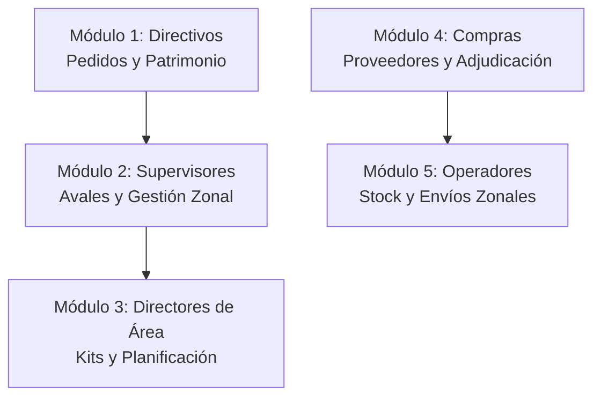

# Capítulo 14: Plan de implementación/despliegue y capacitación a usuarios

Este capítulo detalla la estrategia diseñada para el despliegue técnico del sistema DEPO en la infraestructura del Ministerio de Educación de la Provincia de San Juan. Asimismo, se describen los procedimientos de migración y carga inicial de datos desde sistemas heredados, y se expone el programa de capacitación estructurado por roles para garantizar una transición fluida y la correcta adopción de la plataforma por parte de los usuarios finales.

## 14.1. Introducción

La puesta en marcha de un nuevo sistema de información en una organización pública de gran escala constituye un proceso sociotécnico complejo. El éxito de la implementación no depende únicamente de la ausencia de fallos en el código fuente, sino de una planificación rigurosa del despliegue en servidores, de la migración íntegra de la base de datos operativa y de la preparación y capacitación de los recursos humanos que interactuarán con la herramienta diariamente.

Para el sistema DEPO, que conecta a cientos de escuelas distribuidas geográficamente con el depósito central y el área de compras, el plan de implementación debe asegurar una transición ordenada desde el modelo analógico de papel y hojas de cálculo hacia el modelo digital. En este capítulo se delinean los requerimientos de infraestructura, las fases de puesta en producción y el cronograma pedagógico para capacitar a directivos, supervisores y operadores logísticos en toda la provincia.

## 14.2. Plan de Despliegue Técnico (Infraestructura)

El despliegue de la arquitectura cliente-servidor desacoplada de DEPO se proyecta sobre la infraestructura de servidores virtuales del **Centro de Cómputos de la Provincia de San Juan** (o servidores propios de la Dirección de Informática del Ministerio), bajo el siguiente esquema técnico:

### 14.2.1. Servidor de Base de Datos (PostgreSQL)
- **Entorno**: Base de datos PostgreSQL configurada en una instancia virtualizada dedicada con sistema operativo Linux Enterprise (ej. Ubuntu Server o Red Hat).
- **Especificaciones Recomendadas**: 4 vCPUs, 8 GB de Memoria RAM, y almacenamiento SSD con sistema de backup automático diario configurado mediante tareas cron en el servidor.
- **Seguridad**: Configuración del archivo `pg_hba.conf` para permitir conexiones únicamente provenientes de la dirección IP privada del servidor de aplicaciones, restringiendo cualquier acceso externo.

### 14.2.2. Servidor de Aplicaciones y Backend (Node.js + Express)
- **Entorno**: Servidor virtual Linux con Node.js en su versión LTS (Long Term Support).
- **Gestión de Procesos**: Uso de **PM2** (Production Process Manager) para mantener la ejecución del backend Express en segundo plano, balancear la carga entre los núcleos de procesamiento de la CPU y reiniciar automáticamente la aplicación ante caídas inesperadas del servicio.
- **Servidor Proxy Inverso**: Configuración de **Nginx** operando como proxy inverso por delante de Node.js. Nginx se encarga de recibir las peticiones HTTPS en el puerto 443, gestionar la terminación de los certificados SSL/TLS provistos por la provincia, y derivar las peticiones de API al puerto local `4000`. Asimismo, Nginx sirve de manera directa y optimizada los archivos estáticos compilados del frontend React localizados en la carpeta unificada.

---

## 14.3. Estrategia de Migración y Carga Inicial de Datos

Antes del inicio de la operatoria del sistema, se debe realizar la carga inicial del catálogo de productos y el padrón institucional. Este proceso se estructuró a través de scripts automáticos en JavaScript (`backend/scripts/import-data.js` y `seed-test-schools.js`) que procesan archivos consolidados CSV/Excel extraídos de los registros existentes en el Ministerio:

1. **Catálogo Maestro de Productos**: Importación de los insumos oficiales clasificados por categorías, normalizando las unidades de medida (litros, kilogramos, unidades, resmas).
2. **Padrón de Edificios e Instituciones**: Carga de las escuelas piloto de San Juan detallando su Código Único de Establecimiento (CUE), nivel educativo, departamento geográfico y geolocalización.
3. **Carga de Matrículas**: Importación de los datos cuantitativos de matriculados reales provistos por el sistema de carga del Ministerio (ej: sistema LUA - Legajo Único de Alumnos), esenciales para que los kits de insumos calculen cantidades de forma exacta.
4. **Empadronamiento de Usuarios**: Registro inicial de administradores, supervisores y directores de área vinculados a sus respectivas zonas geográficas de cobertura.

---

## 14.4. Plan de Capacitación a Usuarios

La capacitación se diseñó como un programa pedagógico de modalidad mixta (talleres presenciales en nodos departamentales y material digital interactivo) estructurado en cinco módulos de formación según el rol del usuario:

### 14.4.1. Módulo 1: Gestión de Solicitudes y Consumo (Directivos de Escuela)
- **Objetivo**: Capacitar en la formulación del pedido anual parametrizado, solicitudes de refuerzo, carga de tickets de patrimonio escolar e inicio de solicitudes de retiro indicando la opción de envío.
- **Duración**: 2 horas.

### 14.4.2. Módulo 2: Auditoría y Aval Técnico (Supervisores)
- **Objetivo**: Instruir en el manejo de la bandeja de aprobaciones pendientes, validación de justificaciones de directivos, rechazo y reenvío para aclaraciones.
- **Duración**: 1.5 horas.

### 14.4.3. Módulo 3: Estructura y Autorización Final (Directores de Área)
- **Objetivo**: Enseñar a crear y editar kits de productos por tipología de escuela, configurar zonas geográficas asociando supervisores e instituciones, y generar y consolidar la planilla de compras anual.
- **Duración**: 2 horas.

### 14.4.4. Módulo 4: Gestión Comercial y Adjudicación (Personal de Compras)
- **Objetivo**: Capacitar en el manejo del padrón de proveedores, apertura de licitaciones basadas en el stock del depósito central, carga de presupuestos y adjudicación por menor costo.
- **Duración**: 2 horas.

### 14.4.5. Módulo 5: Recepción, Inventario y Distribución Zonal (Operadores de Depósito)
- **Objetivo**: Enseñar a registrar ingresos de mercadería por remito y proveedor, registrar fechas de vencimiento de lotes (control FIFO), operar el tablero de "Envío por Departamento" con egresos múltiples consolidados y declarar bajas por rotura con evidencia fotográfica.
- **Duración**: 3 horas.

---

## 14.5. Estrategia de Puesta en Producción (Lanzamiento Gradual)

Para mitigar riesgos de soporte técnico y asegurar una estabilización controlada de la plataforma, se ha diseñado un plan de lanzamiento en **tres fases secuenciales**:

- **Fase 1: Piloto Geográfico (Semanas 1 a 4)**
  - Implementación del sistema únicamente en las escuelas piloto de un departamento seleccionado (por ejemplo, Albardón o Pocito), que abarque instituciones de diversos niveles y modalidades.
  - Validación del circuito completo (Directivo → Supervisor → Director → Compras → Depósito).
- **Fase 2: Expansión Regional (Semanas 5 a 8)**
  - Incorporación paulatina de los departamentos del Gran San Juan (Capital, Rawson, Chimbas, Rivadavia, Santa Lucía) y departamentos del sur y este (Caucete, Pocito, Sarmiento).
- **Fase 3: Despliegue General y Zonas Alejadas (Semanas 9 a 12)**
  - Despliegue total del sistema en la provincia, integrando departamentos alejados (Jáchal, Iglesia, Calingasta, Valle Fértil). Habilitación del flujo completo de envíos agrupados departamentales.

## 14.6. Síntesis del Capítulo

Este décimo cuarto capítulo ha presentado el Plan de Implementación, Despliegue y Capacitación para la puesta en producción del sistema DEPO. Se definieron los requerimientos de infraestructura técnica (PostgreSQL, PM2, Nginx) compatibles con el Centro de Cómputos de San Juan. Se estructuró el proceso de migración automática de datos y se diseñó un programa formativo por roles de cinco módulos. Finalmente, la estrategia de lanzamiento gradual en tres fases asegura una adopción progresiva del software, minimizando riesgos operativos y garantizando la estabilización del circuito logístico estatal. Con el plan de despliegue definido, el Capítulo 15 abordará el Análisis de Factibilidad técnica, económica y operativa del proyecto.
