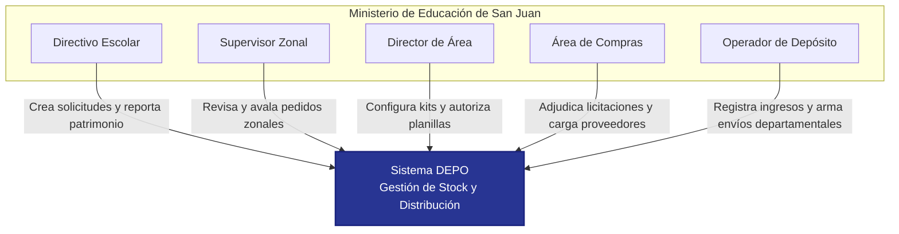
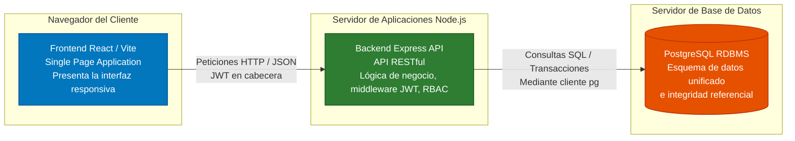
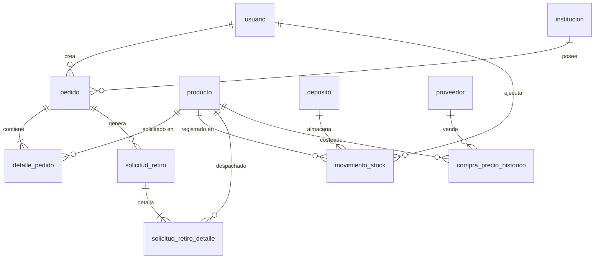

# Capítulo 8: Diseño del sistema

Este capítulo expone el diseño técnico y arquitectónico del sistema DEPO. Se detalla la estructura global de la plataforma a través de diagramas de contenedores y de contexto bajo el estándar del modelo C4. Asimismo, se presenta el modelo físico de base de datos relacional mediante un diagrama entidad-relación (DER) y se documenta de forma exhaustiva el diccionario de datos correspondiente a las principales tablas del sistema, especificando tipos de datos, claves primarias, foráneas y restricciones de negocio.

## 8.1. Introducción

El diseño del sistema representa la transición entre la especificación de requerimientos de negocio y la codificación física de la aplicación. Su propósito principal es definir cómo interactúan las partes constituyentes del software (la interfaz de usuario, los servicios de la API, las políticas de seguridad y la base de datos) para satisfacer los requerimientos funcionales y no funcionales del Ministerio de Educación de San Juan.

Para garantizar la mantenibilidad y modularidad de la plataforma, se ha adoptado una arquitectura desacoplada estructurada en capas independientes. En este capítulo, se documenta tanto la vista lógica de arquitectura de contenedores como la estructura física de persistencia de datos en PostgreSQL, sentando las bases técnicas que posibilitaron la implementación segura de la cadena de suministro digital escolar.

## 8.2. Arquitectura del Sistema

El sistema DEPO implementa una **arquitectura cliente-servidor de tres capas** desacoplada:

1. **Capa de Presentación (Frontend SPA)**: Desarrollada en React y empaquetada con Vite. Funciona en el navegador del cliente de forma asíncrona, gestionando las vistas, la lógica de interacción de usuario, la representación cartográfica mediante Leaflet y el estado local de la sesión.
2. **Capa de Lógica de Negocio (Backend API)**: Implementada sobre Node.js y el framework Express. Se encarga de procesar las peticiones HTTP, verificar la autenticación y permisos de los usuarios mediante tokens JWT, aplicar las reglas lógicas de negocio (validación de stock, flujos de aprobación, etc.) y coordinar las transacciones de base de datos.
3. **Capa de Persistencia (Base de Datos RDBMS)**: Estructurada sobre PostgreSQL. Es responsable del almacenamiento seguro de la información, de garantizar las propiedades ACID en las transacciones operativas y de hacer cumplir las restricciones referenciales e índices de rendimiento.

La comunicación entre el Frontend y el Backend se realiza a través del protocolo HTTP/HTTPS utilizando el estándar de arquitectura **API REST**, intercambiando payloads en formato JSON.

---

## 8.3. Diagramas de Arquitectura (C4 Model)

El modelo C4 permite describir la arquitectura de software utilizando diferentes niveles de abstracción. A continuación, se presentan los niveles de Contexto y de Contenedores.

### 8.3.1. Nivel 1: Diagrama de Contexto del Sistema (C1)
Este diagrama representa el sistema DEPO en su entorno operativo, mostrando las relaciones con los diferentes actores institucionales del Ministerio de Educación de San Juan.

### 8.3.2. Nivel 2: Diagrama de Contenedores (C2)
Este diagrama desglosa el sistema DEPO en sus contenedores de software constituyentes, especificando las tecnologías utilizadas y los protocolos de comunicación.

---

## 8.4. Modelo Físico de Base de Datos

La persistencia del sistema está diseñada sobre un esquema relacional unificado en PostgreSQL. A continuación, se presenta un diagrama simplificado que muestra las entidades nucleares y sus relaciones lógicas (Diagrama Entidad-Relación):

---

## 8.5. Diccionario de Datos

A continuación, se documenta la estructura de las tablas principales que sustentan la lógica transaccional de stock, pedidos, usuarios e instituciones en el sistema.

### 8.5.1. Tabla: `usuario`
Almacena la información de identificación, credenciales cifradas y roles de los operadores del sistema en el Ministerio de Educación de San Juan.

| Nombre de Columna | Tipo de Dato | Restricciones | Descripción |
| :--- | :--- | :--- | :--- |
| `id_usuario` | SERIAL | PRIMARY KEY | Identificador único autoincremental del usuario. |
| `nombre` | VARCHAR(50) | - | Nombre de pila del usuario. |
| `apellido` | VARCHAR(50) | - | Apellido del usuario. |
| `dni` | VARCHAR(20) | - | Documento Nacional de Identidad del usuario. |
| `email` | VARCHAR(100) | UNIQUE, NOT NULL | Correo electrónico institucional (utilizado para login). |
| `password` | VARCHAR(255) | NOT NULL | Hash de la contraseña cifrada con el algoritmo Bcrypt. |
| `telefono` | VARCHAR(20) | - | Teléfono de contacto. |
| `id_institucion` | INT | FOREIGN KEY | Referencia a `institucion(id_institucion)` (para Directivos). |
| `role` | VARCHAR(50) | - | Rol asignado en formato string para middleware RBAC. |
| `activo` | BOOLEAN | DEFAULT TRUE | Estado de la cuenta (activa o suspendida). |
| `nivel_educativo` | VARCHAR(120) | - | Nivel a cargo (para Directores de Área o Supervisores). |
| `director_area_id`| INT | FOREIGN KEY | Autorref. a `usuario(id_usuario)` (supervisor jerárquico). |
| `jurisdiccion` | VARCHAR(120) | - | Región geográfica o institucional a cargo. |
| `created_at` | TIMESTAMP | DEFAULT NOW() | Fecha de creación del registro en el sistema. |

### 8.5.2. Tabla: `institucion`
Almacena el padrón de escuelas y establecimientos dependientes del Ministerio de Educación de San Juan.

| Nombre de Columna | Tipo de Dato | Restricciones | Descripción |
| :--- | :--- | :--- | :--- |
| `id_institucion` | SERIAL | PRIMARY KEY | Identificador único de la escuela. |
| `nombre` | VARCHAR(200) | NOT NULL | Nombre oficial de la escuela (ej. Escuela Prov. de San Juan). |
| `cue` | VARCHAR(20) | NOT NULL | Clave Única Establecimiento (código nacional de escuelas). |
| `id_edificio` | INT | FOREIGN KEY | Referencia a `edificio(id_edificio)` (localización física). |
| `nivel_educativo` | VARCHAR(50) | NOT NULL | Primario, Secundario, Inicial, Albergue, Especial, etc. |
| `categoria` | VARCHAR(20) | - | Categoría administrativa de la escuela (ej. 1ra, 2da, 3ra). |
| `ambito` | VARCHAR(20) | - | Ámbito de ubicación: Rural o Urbano. |
| `matriculados` | INT | DEFAULT 0 | Número de estudiantes inscriptos en el ciclo lectivo real. |
| `kit_id` | INT | FOREIGN KEY | Referencia a `producto_kit(id)` asignado para pedido anual. |
| `activo` | BOOLEAN | DEFAULT TRUE | Estado de funcionamiento de la escuela en el sistema. |

### 8.5.3. Tabla: `pedido`
Registra la cabecera de las solicitudes anuales y de refuerzo generadas por las escuelas.

| Nombre de Columna | Tipo de Dato | Restricciones | Descripción |
| :--- | :--- | :--- | :--- |
| `id_pedido` | SERIAL | PRIMARY KEY | Identificador único de la solicitud o pedido. |
| `fecha_creacion` | TIMESTAMP | DEFAULT NOW() | Fecha y hora de creación de la solicitud. |
| `estado` | estado_tramite| DEFAULT 'pendiente'| Enum del estado del trámite en el flujo de firmas. |
| `tipo` | VARCHAR(20) | DEFAULT 'anual'| Tipo de pedido: 'anual' o 'refuerzo'. |
| `id_usuario_solicitante`| INT | FOREIGN KEY | Referencia al `usuario` directivo que formuló el pedido. |
| `id_institucion` | INT | FOREIGN KEY | Referencia a la `institucion` solicitante. |
| `observaciones_generales`| TEXT | - | Comentarios adicionales cargados por la escuela. |
| `aprobado_por_supervisor_id`| INT| FOREIGN KEY| Referencia al `usuario` supervisor que avaló el pedido. |
| `fecha_aprobacion_supervisor`| TIMESTAMP| - | Fecha y hora en la que el supervisor firmó el aval. |
| `aprobado_por_director_id`| INT | FOREIGN KEY | Referencia al `usuario` Director de Área que firmó la autorización. |
| `requiere_licitacion`| BOOLEAN | DEFAULT FALSE | Flag de compras que indica si se debe adquirir a proveedores. |
| `codigo_retiro` | VARCHAR(20) | - | Código de seguridad alfanumérico generado para retiro en depósito. |

### 8.5.4. Tabla: `movimiento_stock`
Registra de forma atómica cada ingreso, egreso, traslado o ajuste de mercadería en el Depósito Central del Ministerio.

| Nombre de Columna | Tipo de Dato | Restricciones | Descripción |
| :--- | :--- | :--- | :--- |
| `id_movimiento` | SERIAL | PRIMARY KEY | Identificador de auditoría del movimiento de inventario. |
| `id_producto` | INT | FOREIGN KEY | Referencia a `producto(id_producto)` afectado. |
| `cantidad` | INT | NOT NULL | Cantidad de unidades (positivo para ingresos, negativo para egresos). |
| `tipo` | tipo_movimiento| NOT NULL | Enum: 'ingreso', 'egreso', 'ajuste', 'devolucion', 'traslado'. |
| `fecha_movimiento`| TIMESTAMP | DEFAULT NOW() | Fecha y hora en que se computó el cambio de stock. |
| `id_institucion` | INT | FOREIGN KEY | Referencia a la `institucion` destinataria si corresponde a un egreso. |
| `id_usuario` | INT | FOREIGN KEY | Referencia al `usuario` operador que ejecutó el movimiento. |
| `id_proveedor` | INT | FOREIGN KEY | Referencia al `proveedor` de origen en caso de un ingreso. |
| `fecha_vencimiento`| DATE | - | Fecha de vencimiento del lote de productos ingresados. |
| `id_deposito` | INT | FOREIGN KEY | Referencia a `deposito(id)` de origen del stock. |
| `id_deposito_destino`| INT | FOREIGN KEY | Referencia a `deposito(id)` de destino (para traslados). |
| `motivo` | TEXT | - | Justificación de ajustes, roturas o causas especiales. |

### 8.5.5. Tabla: `solicitud_retiro`
Registra la planificación logística de entrega y la modalidad seleccionada por la escuela.

| Nombre de Columna | Tipo de Dato | Restricciones | Descripción |
| :--- | :--- | :--- | :--- |
| `id` | SERIAL | PRIMARY KEY | Identificador único de la solicitud de entrega. |
| `id_pedido` | INT | FOREIGN KEY, NOT NULL| Referencia a `pedido(id_pedido)` adjudicado y listo en depósito. |
| `id_institucion` | INT | FOREIGN KEY, NOT NULL| Referencia a la escuela receptora. |
| `fecha_retiro` | DATE | NOT NULL | Fecha planificada para el retiro o despacho. |
| `retira_tipo` | VARCHAR(20) | NOT NULL | Tipo de retiro: 'presencial' o 'envio'. |
| `retira_nombre` | VARCHAR(180) | - | Nombre de la persona autorizada a retirar físicamente. |
| `retira_dni` | VARCHAR(30) | - | DNI de la persona autorizada a retirar. |
| `solicitar_envio` | BOOLEAN | DEFAULT FALSE | Flag que indica si se requiere envío oficial por departamento. |
| `departamento_envio`| TEXT | - | Departamento de San Juan al que corresponde agrupar la carga. |
| `estado` | VARCHAR(20) | DEFAULT 'pendiente'| Estado de la entrega: 'pendiente', 'aceptada', 'entregada'. |

---

## 8.6. Síntesis del Capítulo

Este octavo capítulo ha detallado las especificaciones de diseño del sistema DEPO. Mediante diagramas C4 en niveles 1 y 2, se demostró la estructura de la aplicación y la separación de responsabilidades entre el frontend reactivo SPA, la API RESTful de Express y el motor PostgreSQL. Asimismo, el diagrama entidad-relación y el diccionario de datos definieron la estructura física de la base de datos, detallando las columnas y restricciones de las tablas nucleares de usuarios, escuelas, pedidos, movimientos de stock y logística de retiro. Este diseño técnico e informático proporciona el plano estructural necesario para avanzar en el Capítulo 9 con la especificación detallada de los Casos de Uso e Historias de Usuario del proyecto.
