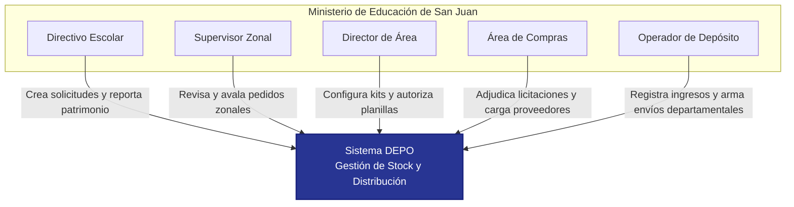
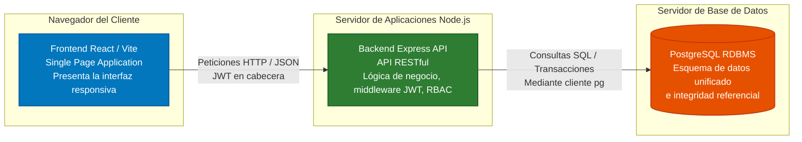
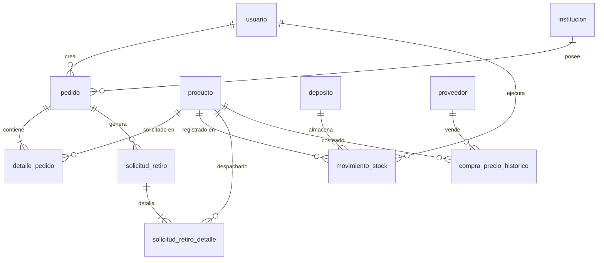
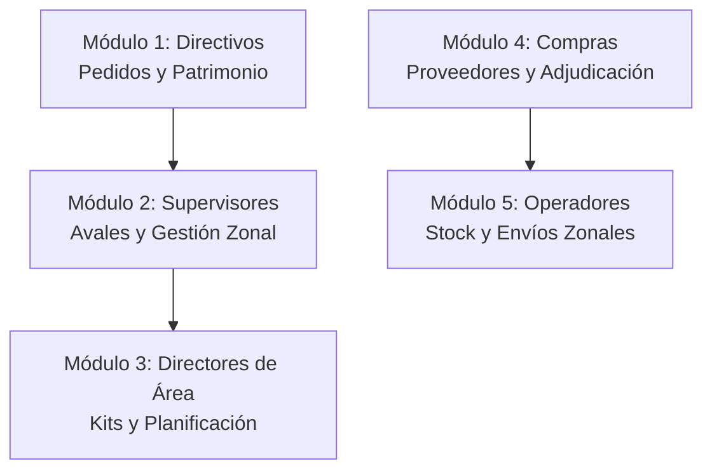

# TRABAJO FINAL DE TECNICATURA: DEPO

## SISTEMA DE GESTIÓN DE STOCK, PEDIDOS Y DISTRIBUCIÓN PARA EL MINISTERIO DE EDUCACIÓN DE SAN JUAN


**Institución:** Universidad Católica de Cuyo (UCCuyo)

**Carrera:** Tecnicatura Universitaria en Desarrollo de Software

**Fecha:** Junio 2026

---

# Capítulo 1: Introducción y contexto institucional

Este capítulo presenta una visión general del sistema DEPO, delimitando su propósito como herramienta tecnológica de gestión de stock, pedidos y distribución. Asimismo, se describe la estructura del Ministerio de Educación de la Provincia de San Juan como organismo contratante y beneficiario directo, analizando su alcance geográfico e institucional y examinando el flujo tradicional de la cadena de suministro escolar que motivó la concepción del proyecto.

## 1.1. Introducción

En el ámbito de la gestión pública provincial, la administración eficiente de los recursos materiales destinados a las instituciones educativas representa un pilar fundamental para garantizar la equidad y la calidad del servicio escolar. La provisión regular de insumos de limpieza, papelería, librería, alimentos para comedores y mobiliario escolar requiere de un esfuerzo coordinado de planificación, adquisición y distribución física. Históricamente, estos procesos logísticos se han enfrentado a problemáticas complejas de coordinación e información asimétrica entre los establecimientos demandantes, las dependencias de supervisión intermedia, el área de compras y los operarios del depósito central.

El proyecto **DEPO** surge como una solución tecnológica integral diseñada específicamente para digitalizar, trazar y optimizar el ciclo de abastecimiento del Ministerio de Educación de la Provincia de San Juan. A través de una plataforma web estructurada con un control de accesos basado en roles (RBAC - *Role-Based Access Control*), el sistema integra a todos los actores clave del circuito: directivos de escuelas, supervisores zonales, directores de área, personal técnico del departamento de compras y operadores del depósito de almacenamiento. 

A diferencia de los sistemas genéricos de control de inventario, DEPO incorpora la lógica de negocio particular de la administración escolar pública argentina, tales como el diseño de kits preconfigurados por matrícula de alumnos, la validación jerárquica de solicitudes extraordinarias (pedidos de refuerzo), el circuito de licitación y adjudicación pública a proveedores, y la distribución territorializada por departamento geográfico. De esta manera, el sistema no solo controla las existencias físicas en el depósito central, sino que también funciona como un canal de auditoría y transparencia para el uso de los bienes del Estado.

## 1.2. Contexto Institucional del Ministerio de Educación de San Juan

El Ministerio de Educación de la Provincia de San Juan, con sede en el Centro Cívico de la ciudad capital de San Juan, es el organismo gubernamental responsable de planificar, ejecutar y evaluar las políticas educativas de la provincia. Su misión principal es asegurar el derecho constitucional de enseñar y aprender, garantizando una educación inclusiva y de calidad en todo el territorio provincial.

Para cumplir con sus objetivos, el Ministerio cuenta con una estructura jerárquica encabezada por el Ministro de Educación, secundado por secretarías técnicas y administrativas. La administración física y distribución de recursos para las escuelas depende operativamente de la **Subsecretaría de Coordinación Administrativa y Financiera**, a través de su **Dirección de Suministros** y del **Depósito Central del Ministerio de Educación**.

El alcance logístico del organismo es vasto y complejo debido a la heterogeneidad geográfica de la provincia de San Juan, la cual se organiza en 19 departamentos: Capital, Rawson, Chimbas, Rivadavia, Santa Lucía, Pocito, Caucete, Jáchal, Albardón, Sarmiento, 25 de Mayo, San Martín, Calingasta, 9 de Julio, Iglesia, Valle Fértil, Ullum, Zonda y Angaco. El sistema escolar debe abastecer tanto a grandes conglomerados urbanos (Gran San Juan) como a escuelas ubicadas en zonas de cordillera y alta montaña (ej. departamentos de Iglesia y Calingasta) o áreas rurales dispersas (ej. Valle Fértil).

Las instituciones educativas beneficiarias se clasifican según diversos niveles y modalidades:
- **Educación Inicial (ENI)**.
- **Educación Primaria**.
- **Educación Secundaria Orientada y Artística**.
- **Educación Técnica y de Formación Profesional**.
- **Educación Especial**.
- **Escuelas de Capacitación Laboral**.
- **Escuelas Albergue y de Contexto de Encierro**.

Cada una de estas tipologías institucionales posee necesidades específicas de insumos y una frecuencia de consumo diferenciada, condicionada fuertemente por su matrícula escolar (número de estudiantes registrados) y su ubicación geográfica. Por ejemplo, las Escuelas Albergue requieren no solo insumos de limpieza y librería, sino también provisiones alimentarias y de hotelería complejas que exigen un control estricto de vencimientos y una entrega prioritaria.

## 1.3. Estructura de la Cadena de Suministro Escolar y Flujo Logístico Inicial

Previo a la conceptualización y desarrollo del sistema DEPO, la cadena de suministro y distribución de insumos del Ministerio de Educación operaba mediante un esquema tradicional de soporte analógico, caracterizado por planillas de cálculo descentralizadas, notas en papel físico, llamadas telefónicas y gestiones presenciales. Este flujo tradicional presentaba las siguientes etapas:

1. **Relevamiento de Necesidades**: Cada directivo escolar estimaba de forma anual o semestral la cantidad de insumos requerida para su establecimiento. Dicha estimación solía realizarse de manera informal, sin un algoritmo de cálculo que vinculase de manera directa la matrícula real del establecimiento con un estándar técnico de consumo. Las solicitudes se plasmaban en planillas de papel denominadas "Notas de Pedido".
2. **Autorización Intermedia (Supervisión)**: Las Notas de Pedido debían ser entregadas físicamente a la oficina del Supervisor de la zona correspondiente. El supervisor evaluaba la razonabilidad del pedido de forma subjetiva, firmando el documento en conformidad. Ante la falta de datos históricos centralizados, el control de cupos o excesos resultaba inviable.
3. **Consolidación en la Dirección de Área**: Las áreas ministeriales (Dirección de Educación Primaria, Dirección de Educación Secundaria, etc.) recibían las solicitudes autorizadas de sus respectivos supervisores. El personal administrativo consolidaba los requerimientos en un archivo de Excel unificado para elevarlo al departamento de compras. Este proceso manual era propenso a errores de transcripción y pérdida de registros físicos.
4. **Adjudicación y Compra**: El área de Compras abría un expediente de licitación pública basándose en el consolidado general de Excel. Los proveedores presentaban ofertas en sobres cerrados y, tras la adjudicación, entregaban los productos de manera directa o en el Depósito Central del Ministerio. La falta de vinculación entre lo comprado y lo solicitado originalmente dificultaba la detección de faltantes o desvíos en el momento de la entrega.
5. **Recepción e Inventariado**: En el Depósito Central, los operadores registraban la llegada de camiones con mercadería anotando las entregas en libros de actas manuales o planillas locales. No existía una trazabilidad en tiempo real sobre la fecha de vencimiento de los productos perecederos (ej. alimentos para comedores) ni alertas sobre el stock mínimo de insumos de alta demanda.
6. **Distribución Física**: Los directivos de las escuelas debían trasladarse físicamente al Depósito Central, en muchas ocasiones utilizando movilidad propia o contratada de forma particular, para retirar los insumos adjudicados. El remito de egreso se firmaba por duplicado en papel autocopiativo. Si la escuela solicitaba el envío debido a la distancia (ej. escuelas de departamentos alejados), el armado de las hojas de ruta y la consolidación de cargas se coordinaban manualmente, generando demoras en los plazos de entrega y subutilización de la flota de transporte provincial.

Este flujo logístico fragmentado y analógico generaba un alto costo administrativo, demoras en el abastecimiento escolar, falta de control patrimonial y una severa falta de transparencia y auditoría en la entrega de bienes estatales.

## 1.4. Justificación de la Intervención Tecnológica en el Organismo

La digitalización integral del flujo logístico a través de DEPO se justifica desde múltiples dimensiones dentro de la gestión pública del Ministerio de Educación de San Juan:

- **Optimización de Recursos Públicos**: Al vincular la entrega de insumos a parámetros objetivos (matrícula escolar y kits técnicos preconfigurados por Dirección de Área), se evita la sobreasignación de recursos a ciertas instituciones y el desabastecimiento en otras, maximizando el rendimiento presupuestario de las licitaciones estatales.
- **Trazabilidad y Auditoría**: Cada movimiento de stock (ingresos, egresos por entrega presencial, egresos por departamento geográfico, traslados entre depósitos o ajustes por baja) queda registrado con el usuario responsable, la fecha exacta y el documento respaldatorio (remito o ticket). Esto cumple con las exigencias del Tribunal de Cuentas de la provincia respecto a la fiscalización del patrimonio público.
- **Reducción de Costos Operativos y Plazos**: La automatización de la consolidación de solicitudes para licitaciones y la generación digital de las hojas de distribución por departamento geográfico optimizan el uso del transporte del Ministerio y liberan tiempo administrativo tanto de directivos como de supervisores y operadores del depósito.
- **Alineación Académica UCCuyo**: Desde la perspectiva del desarrollo de software, la creación del sistema DEPO constituye la aplicación práctica de los conocimientos adquiridos a lo largo de la carrera. Se abordan problemáticas reales de la ingeniería de software tales como el diseño de bases de datos relacionales robustas en PostgreSQL, la implementación de servicios API REST seguros mediante Node.js y Express, el desarrollo de interfaces responsivas y de alto rendimiento en React, y la aplicación de estrictas medidas de seguridad digital y normativas legales nacionales (como la Ley de Protección de Datos Personales).

## 1.5. Síntesis del Capítulo

En síntesis, este primer capítulo ha establecido el marco introductorio de la investigación y desarrollo del proyecto DEPO. Se determinó que el sistema busca resolver los graves inconvenientes de trazabilidad, demoras y falta de automatización del circuito de abastecimiento escolar en el Ministerio de Educación de San Juan. Se caracterizó al organismo receptor de la tecnología, detallando la complejidad que implica abastecer a los 19 departamentos de la provincia y a las diversas modalidades educativas. Finalmente, se analizó el flujo tradicional en papel y planillas de cálculo aisladas, sentando las bases para fundamentar detalladamente en el siguiente capítulo los problemas específicos del circuito operativo que serán objeto de solución informática.


<div style="page-break-after: always;"></div>

# Capítulo 2: Planteamiento del problema y justificación

Este capítulo profundiza en el diagnóstico de la situación problemática que dio origen al sistema DEPO. Se exponen de manera detallada las ineficiencias del modelo de gestión analógico y descentralizado del Ministerio de Educación de la Provincia de San Juan, desglosando los impactos negativos en los procesos de adquisición, almacenamiento, control patrimonial y distribución. Asimismo, se formulan la justificación técnica, metodológica, económica e institucional de la solución implementada.

## 2.1. Planteamiento del problema

La administración del flujo de suministros y bienes de consumo en una organización estatal que supervisa cientos de establecimientos educativos distribuidos en una amplia extensión territorial implica desafíos de gran envergadura. En la provincia de San Juan, el Ministerio de Educación se enfrenta a la tarea de abastecer a escuelas que varían notablemente en su infraestructura, matrícula y ubicación geográfica. La coexistencia de escuelas céntricas con escuelas rurales, de frontera y albergues genera demandas altamente diversificadas y críticas.

El problema central radica en la **inexistencia de un sistema de información integrado, auditable y en tiempo real** que controle la cadena de suministro escolar en todas sus fases, desde la estimación de la demanda de cada establecimiento hasta la entrega efectiva y el control de inventario final. Esta carencia da lugar a una serie de fricciones operativas, administrativas y de control que se detallan a continuación.

## 2.2. Desglose de Ineficiencias Operativas y Falta de Control

Para comprender la magnitud de la problemática en el organismo, es necesario analizar las ineficiencias presentes en cada eslabón del circuito de distribución tradicional:

### 2.2.1. Ineficiencia en la Estimación de la Demanda e Información Asimétrica
Bajo el esquema analógico, la formulación de los pedidos anuales por parte de los directivos escolares se realizaba de manera estimativa, careciendo de un marco paramétrico estandarizado. Cada directivo solicitaba insumos en base a percepciones históricas o criterios subjetivos, lo que generaba:
- **Sobreasignación de recursos**: Escuelas que acumulaban stock ocioso en sus armarios.
- **Desabastecimiento**: Escuelas que se quedaban sin insumos básicos a mitad del ciclo lectivo.
- **Inexistencia de kits normalizados**: No se utilizaban agrupaciones de productos estructurados según la tipología institucional y la matrícula real de alumnos, impidiendo una distribución justa y equitativa.

### 2.2.2. Falta de Trazabilidad y Seguridad en el Depósito Central
El almacenamiento físico carecía de herramientas digitales para registrar y auditar los movimientos de stock en tiempo real. Esta situación provocaba:
- **Pérdida de inventario y falta de control de vencimientos**: Alimentos destinados a comedores escolares y escuelas albergue se vencían en los estantes del depósito central debido a la falta de un sistema de alertas tempranas y un control de lotes bajo el método PEPS (Primero en Entrar, Primero en Salir).
- **Incertidumbre en existencias**: Los operadores no contaban con certeza sobre el stock real en el depósito, lo que entorpecía la planificación del área de Compras.
- **Vulnerabilidad de auditoría**: El registro de movimientos manuales en papel dificultaba la reconstrucción histórica del flujo de un producto ante auditorías del Tribunal de Cuentas.

### 2.2.3. Barreras Logísticas en Escuelas de Departamentos Alejados
El retiro presencial era la modalidad predeterminada, obligando a los directivos de zonas periféricas o departamentos alejados (como Valle Fértil, Jáchal, Iglesia o Calingasta) a viajar cientos de kilómetros hasta la Capital para retirar sus insumos. Esto conllevaba:
- **Pérdida de jornadas pedagógicas**: Los directivos debían abandonar sus funciones escolares para realizar trámites logísticos.
- **Costos de traslado particulares**: El uso de movilidad propia o fletes particulares costeados por cooperadoras escolares.
- **Subutilización de la flota oficial**: El Ministerio de Educación no podía programar envíos consolidados y eficientes por departamento geográfico debido a la falta de un tablero que agrupara las solicitudes de entrega pendientes en una misma región y permitiera programar egresos múltiples organizados.

### 2.2.4. Ausencia de Trazabilidad en Bajas de Material y Mobiliario Dañado
El descarte de mercadería dañada, vencida o inutilizable (scrap/desguace) se realizaba de manera informal. El personal no disponía de un módulo sistematizado para registrar las bajas con su respectivo motivo e historial de estados, ni de un mecanismo para adjuntar evidencia fotográfica del daño. Esto impedía diferenciar claramente los productos aptos de los defectuosos y fomentaba la acumulación de chatarra patrimonial en las escuelas sin un canal de desvinculación formal.

### 2.2.5. Gestión Patrimonial Desconectada y Falta de Canal de Reclamos
Las escuelas no contaban con un canal ágil para reportar daños en el mobiliario escolar (bancos, mesas, armarios). Los incidentes patrimoniales debían comunicarse por notas físicas en papel que debían recorrer un largo circuito burocrático hasta la Dirección de Relevamiento de Necesidades Edilicias o el área de Patrimonio del Ministerio. Como consecuencia, las reparaciones o sustituciones se demoraban meses, afectando el dictado normal de clases.

### 2.2.6. Vacíos en la Toma de Decisiones del Área de Compras
El departamento de compras operaba de forma aislada a la realidad del depósito central y de las escuelas:
- **Licitaciones a ciegas**: Se consolidaban cantidades para licitación sin poder contrastar la demanda total frente al stock actual disponible en el depósito central, incurriendo en compras redundantes de productos ya existentes en bodega.
- **Historial de precios inexistente**: No se contaba con un registro digitalizado de los precios unitarios reales de compra adjudicados en licitaciones de años anteriores, lo que impedía evaluar la evolución de costos y la razonabilidad de las ofertas de los proveedores.

## 2.3. Justificación Técnica y Metodológica

Desde la perspectiva del desarrollo de software, la creación de DEPO se justifica mediante la implementación de una arquitectura cliente-servidor robusta y moderna, estructurada bajo estándares técnicos que garantizan la mantenibilidad y escalabilidad del sistema. 

El uso de **Node.js y Express** en el backend proporciona un entorno de ejecución de alto rendimiento para el manejo de múltiples solicitudes simultáneas de los distintos departamentos. La base de datos relacional **PostgreSQL** permite modelar con precisión la compleja red de relaciones jerárquicas del sistema (instituciones, zonas, usuarios, roles, pedidos, licitaciones y movimientos de stock), asegurando la integridad referencial y facilitando auditorías detalladas a través de índices optimizados y restricciones de control (*check constraints*).

En el frontend, la utilización de **React y Vite** permite construir una interfaz de usuario dinámica, fluida e interactiva. La integración de librerías como **Recharts** para el módulo de estadísticas y **Leaflet** para la geolocalización de escuelas y zonas optimiza la visualización de la información para la toma de decisiones por parte de los directivos de área y el Ministerio. La metodología ágil **Scrum** proporciona el marco de desarrollo adecuado para iterar de manera incremental, validando cada módulo funcional en estrecha colaboración con el usuario final.

## 2.4. Justificación Económica e Institucional

A nivel institucional y económico, la inversión en el desarrollo del sistema DEPO genera un impacto directo en las finanzas de la administración pública provincial:

- **Reducción del Gasto en Adquisiciones**: Al unificar la licitación y permitirle al área de compras cotejar la demanda contra el stock físico real disponible en el depósito central, se evitan sobrecompras y se aprovecha la economía de escala en las negociaciones con los proveedores.
- **Optimización Logística y Ahorro en Combustible**: El nuevo módulo de "Envío por Departamento" permite agrupar solicitudes y planificar entregas masivas utilizando de forma eficiente la flota vehicular del Ministerio. Esto disminuye significativamente los costos de viáticos y combustible, a la vez que alivia la carga financiera y operativa de los directivos escolares de departamentos alejados.
- **Seguridad Alimentaria y Sanitaria**: El control estricto de fechas de vencimiento y alertas de stock mínimo reduce drásticamente el desperdicio de productos perecederos (como copas de leche y raciones alimentarias para escuelas de jornada completa y albergues), asegurando que los insumos lleguen a los alumnos en condiciones óptimas.
- **Transparencia y Rendición de Cuentas**: Al digitalizar el circuito de aprobaciones (Directivo → Supervisor → Director de Área) y registrar con precisión la adjudicación de proveedores y la emisión de remitos por triplicado (escuela, depósito y Tribunal de Cuentas), el Ministerio de Educación de San Juan fortalece sus mecanismos de control interno y agiliza la rendición ante los organismos de fiscalización del Estado.

## 2.5. Síntesis del Capítulo

En conclusión, este segundo capítulo ha expuesto detalladamente los problemas crónicos del circuito logístico tradicional de suministros del Ministerio de Educación de San Juan, identificando ineficiencias en el control de stock, la estimación de la demanda, la distribución en departamentos alejados y la gestión patrimonial. La justificación presentada demuestra que DEPO no es únicamente un desarrollo técnico para el cumplimiento académico, sino una herramienta indispensable para mejorar la eficiencia del gasto público, garantizar el correcto abastecimiento en las aulas y brindar total transparencia a los procesos logísticos y de compras del Estado provincial. Con el problema plenamente formulado y justificado, el próximo capítulo establecerá los objetivos generales y específicos que guiarán el diseño detallado del sistema.


<div style="page-break-after: always;"></div>

# Capítulo 3: Objetivos generales y específicos

Este capítulo establece los objetivos que guiaron el diseño, desarrollo e implementación del sistema DEPO. Se define el propósito fundamental del proyecto a través del objetivo general y se desglosan las metas técnicas y operativas mediante los objetivos específicos. Además, se asocian indicadores cuantitativos y cualitativos para evaluar el impacto y grado de cumplimiento de la solución de software propuesta.

## 3.1. Introducción

La formulación precisa de los objetivos constituye el eje rector de cualquier proyecto de desarrollo de software, ya que define el rumbo técnico y funcional que debe tomar el equipo de ingeniería. En el contexto de una institución gubernamental como el Ministerio de Educación de la Provincia de San Juan, los objetivos no pueden limitarse únicamente a metas tecnológicas, sino que deben estar estrechamente vinculados a la resolución de problemas de gobernanza, eficiencia administrativa y control patrimonial.

Teniendo en cuenta el diagnóstico de ineficiencias del modelo analógico presentado en el capítulo anterior, el sistema DEPO se estructuró con el propósito de reemplazar la gestión manual por una plataforma web segura, escalable y auditable. Los objetivos que se detallan a continuación apuntan a transformar la cadena de suministro escolar en un proceso predecible, transparente y optimizado.

## 3.2. Objetivo General

El objetivo general del proyecto consiste en:

> Desarrollar, implementar y evaluar un sistema de software integral (denominado DEPO) para la gestión de stock, administración de pedidos, planificación de compras y distribución de recursos escolares en el ámbito del Ministerio de Educación de la Provincia de San Juan, optimizando los tiempos administrativos del circuito logístico y garantizando la trazabilidad de los bienes públicos en cumplimiento con las normativas provinciales de auditoría y protección de datos.

## 3.3. Objetivos Específicos

Para alcanzar el objetivo general propuesto, se definieron los siguientes objetivos específicos:

1. **Diseñar e implementar un sistema de control de accesos basado en roles (RBAC)** que integre a la totalidad de los actores del circuito (Directivos, Supervisores, Directores de Área, Compras, Operadores y Administradores), garantizando la visibilidad selectiva de la interfaz de usuario y de las rutas de la API en función del nivel de autorización y jurisdicción de cada perfil de usuario.
2. **Desarrollar un módulo de planificación y solicitudes escolares** que permita a los directivos generar pedidos anuales estandarizados a partir de kits de productos preestablecidos vinculados de manera matemática a la matrícula real de alumnos, eliminando la asimetría de información y la subjetividad en la estimación de la demanda escolar.
3. **Construir un circuito digital de aval y autorización jerárquica** que faculte a los supervisores a auditar y autorizar pedidos en su zona, y a los directores de área a realizar la aprobación final y la consolidación de planillas de compras anuales en formato digital, eliminando el traspaso de expedientes en soporte de papel físico.
4. **Implementar herramientas avanzadas para la gestión logística del Depósito Central**, que incluyan el registro digital de remitos por camión (ingresos totales o parciales asociados a proveedores específicos), el monitoreo de existencias por depósitos y lotes, y la emisión de alertas de vencimiento temprano para productos perecederos.
5. **Desarrollar un módulo logístico de distribución provincial por departamento geográfico** que agrupe las solicitudes de retiro autorizadas con modalidad de envío y facilite a los operadores el armado de egresos múltiples consolidados, reduciendo los tiempos de entrega y optimizando el uso de la flota de transporte oficial.
6. **Diseñar e integrar un módulo de bajas de stock y materiales rotos** que registre con rigor la salida de mercadería del inventario por causas de deterioro, rotura o pérdida, permitiendo adjuntar evidencia fotográfica (almacenada digitalmente) y documentar el motivo de la baja bajo un historial auditable.
7. **Implementar un canal digital de control patrimonial y reclamos** (patrimonio escolar) para que los directivos de los establecimientos educativos puedan reportar daños de infraestructura o mobiliario y gestionar sus reparaciones de manera directa con las autoridades del Ministerio, reduciendo los tiempos de respuesta.
8. **Proporcionar al departamento de compras herramientas de apoyo a la decisión**, que incluyan la cotización histórica de precios reales abonados a proveedores adjudicados en licitaciones anteriores y la visualización del stock actual del depósito central para evitar compras redundantes.
9. **Desarrollar módulos de visualización de datos georreferenciados y reportes estadísticos** (integrando gráficos dinámicos y mapas interactivos) para facilitar el monitoreo estratégico de consumos por departamento y nivel educativo por parte de las Direcciones de Área.
10. **Validar el funcionamiento del sistema en un entorno controlado** mediante el diseño y ejecución de un plan de pruebas de integración y humo (*smoke tests*) para asegurar la robustez de las APIs y la usabilidad de la interfaz frontend antes de su puesta en producción.

## 3.4. Metas e Indicadores de Logro

Para medir el éxito de la implementación de la plataforma DEPO y el cumplimiento de los objetivos planteados, se definieron los siguientes indicadores de logro institucionales y técnicos:

| Objetivo Relacionado | Indicador de Logro | Meta Esperada | método de Verificación |
| :--- | :--- | :--- | :--- |
| **OE 2 (Planificación)** | Porcentaje de escuelas asociadas a un Kit de productos parametrizado. | 100% de los establecimientos empadronados. | Consulta de base de datos (`institucion.kit_id IS NOT NULL`). |
| **OE 3 (Autorización)** | Tiempo promedio de aprobación de un pedido anual (desde el envío del Directivo al aval del Director de Área). | Reducción de 45 días (manual) a menos de 5 días hábiles (digital). | Reporte de auditoría de tiempos (`aprobacion_seguimiento.fecha_firma`). |
| **OE 4 (Inventario)** | Desviación de stock entre las auditorías físicas y los registros del sistema. | Margen de error menor al 1%. | Conciliación de inventario contra tabla `movimiento_stock`. |
| **OE 4 (Alertas)** | Porcentaje de pérdidas de insumos alimenticios por vencimiento en depósito. | 0% de pérdidas de alimentos en depósito central. | Registro de bajas por vencimiento (`baja_movimientos.motivo`). |
| **OE 5 (Logística)** | Eficiencia en rutas y despachos de entrega por departamento. | Agrupación automática del 100% de los pedidos con envío en el tablero logístico. | Verificación visual de solicitudes procesadas en egreso múltiple. |
| **OE 6 (Bajas)** | Trazabilidad fotográfica en bajas de materiales y activos. | 100% de las bajas de activos patrimoniales con imagen y justificación obligatoria. | Validación de registros en tabla `recepcion_danio_imagen` / `baja_movimientos`. |
| **OE 7 (Patrimonio)** | Tiempo de respuesta a reclamos por rotura de mobiliario. | Reducción de los plazos de respuesta en un 60%. | Historial de estados en `patrimonio_ticket.estado`. |

## 3.5. Síntesis del Capítulo

Este capítulo ha definido con precisión el alcance estratégico del sistema DEPO a través de la formulación de sus objetivos generales y específicos. Se constató que el propósito del sistema trasciende la mera gestión de un inventario genérico, apuntando a transformar de raíz el circuito de abastecimiento y control del Ministerio de Educación de San Juan. Se establecieron metas concretas en cuanto a digitalización, control logístico, trazabilidad patrimonial, apoyo a las compras estatales y reducción de tiempos administrativos, respaldados por indicadores que permitirán auditar la efectividad de la plataforma. Establecidos los objetivos del proyecto, el Capítulo 4 definirá los límites precisos del sistema mediante el análisis de su alcance y limitaciones.


<div style="page-break-after: always;"></div>

# Capítulo 4: Alcance y limitaciones del proyecto

Este capítulo detalla el alcance funcional y técnico del proyecto DEPO, estableciendo de manera precisa qué requerimientos y módulos están contemplados dentro del desarrollo del sistema. Asimismo, se definen los límites, exclusiones y restricciones operativas de la plataforma, diferenciando las capacidades actuales de las potencialidades futuras del software.

## 4.1. Introducción

En la ingeniería de software, delimitar el alcance del proyecto es una tarea crítica para garantizar la viabilidad del desarrollo y administrar las expectativas de los usuarios y evaluadores académicos. Definir qué hace y qué no hace el sistema evita desvíos de tiempo y sobrecarga de alcance (*scope creep*), permitiendo focalizar los esfuerzos de programación en resolver de manera óptima las necesidades esenciales del cliente.

Para el caso del sistema DEPO, el alcance está enfocado en cubrir el ciclo logístico y de abastecimiento de las escuelas del Ministerio de Educación de la Provincia de San Juan. Dado que se trata de un software que interactúa con áreas complejas como compras, logística y patrimonio, en este capítulo se traza una línea divisoria clara entre los módulos implementados en esta versión del sistema y aquellas áreas funcionales que corresponden a otros sistemas ministeriales o que se han catalogado como futuras expansiones de la plataforma.

## 4.2. Alcance Funcional del Sistema

El sistema DEPO comprende los siguientes módulos funcionales, implementados en su totalidad y operativos en el repositorio del proyecto:

### 4.2.1. Módulo de Seguridad, Autenticación y Autorización (RBAC)
- Autenticación segura de usuarios mediante correo electrónico y contraseña cifrada con algoritmos de hashing.
- Sesiones de usuario gestionadas mediante Json Web Tokens (JWT).
- Control de acceso basado en roles (RBAC) para seis perfiles distintos: *Administrador*, *Directivo*, *Supervisor*, *Director de Área*, *Área de Compras* y *Operador de Depósito*.
- Middleware en backend y rutas protegidas en frontend para impedir el acceso no autorizado a datos sensibles o funciones no permitidas por el rol.

### 4.2.2. Módulo de Gestión de Estructura Institucional y Zonal
- Registro y actualización de Edificios, incluyendo sus coordenadas de geolocalización (latitud y longitud) y división departamental.
- Administración del catálogo de escuelas (Instituciones) vinculadas a su nivel educativo, categoría, matrícula real de alumnos y kit de productos asignado.
- Configuración de Zonas Geográficas asignando supervisores a zonas y escuelas a zonas, permitiendo a los Directores de Área estructurar de forma flexible el territorio escolar de la provincia.

### 4.2.3. Módulo de Pedidos Anuales y Pedidos de Refuerzo
- Creación de Solicitudes Anuales por parte del Directivo, basadas en la carga automática del Kit de productos preestablecido para su escuela y ajustadas dinámicamente según la matrícula.
- Creación de Pedidos de Refuerzo extraordinarios de productos específicos cuando las necesidades del ciclo lectivo excedan el stock del pedido anual.
- Circuito de aprobación de pedidos con estados: `pendiente` (Directivo), `aprobado` o `rechazado` (Supervisor), `pendiente_director` y `aprobado_parcial` o `aprobado` final (Director de Área).

### 4.2.4. Módulo de Licitaciones, Adjudicación e Historial de Precios
- Consolidación automática de solicitudes de las Direcciones de Área aprobadas y listas para licitar.
- Funcionalidad para que el Área de Compras pueda ajustar cantidades finales a licitar antes de bloquear el listado.
- Carga de cotizaciones de proveedores y adjudicación a la mejor oferta.
- Registro del historial de precios unitarios reales pagados por producto en cada licitación (`compra_precio_historico`), accesible únicamente para roles autorizados (Compras y Administrador).

### 4.2.5. Módulo de Recepción de Mercadería y Control de Inventarios
- Registro de ingresos al depósito central por remito de camión de proveedor, permitiendo cargas totales o recepciones parciales.
- Gestión de fechas de vencimiento de los lotes de productos ingresados en el inventario.
- Módulo de alerta temprana visual de vencimientos próximos para prevenir pérdidas de insumos.
- Visualización detallada del stock distribuido en múltiples almacenes o depósitos locales.

### 4.2.6. Módulo de Distribución a Escuelas y Envíos por Departamento
- Creación de solicitudes de retiro por parte de los directivos escolares una vez que la mercadería está disponible.
- Opción de solicitar retiro presencial (con generación de código y comprobante) o marcar la opción de "solicitar envío".
- Tablero de control de "Envíos por Departamento" para el operador de depósito, que agrupa automáticamente las solicitudes de envío por departamento geográfico.
- Confirmación de egresos múltiples agrupados por departamento, validando stock de depósitos de origen y actualizando de forma atómica el estado de entrega del pedido.

### 4.2.7. Módulo de Bajas de Stock y Materiales Dañados (Scrap)
- Módulo para dar de baja productos vencidos, rotos o perdidos en el Depósito Central o almacenes.
- Registro obligatorio del motivo de la baja e historial de cambio de estados de la solicitud de baja.
- Almacenamiento y vinculación de evidencia fotográfica (imágenes codificadas en base64) para respaldar las bajas de inventario.

### 4.2.8. Módulo de Patrimonio Escolar y Reporte de Incidencias
- Creación de tickets de patrimonio por parte de los directivos escolares para reportar daños en activos fijos (bancos, sillas, armarios, etc.).
- Bandeja de entrada para que supervisores y directores de área puedan priorizar, observar y resolver los tickets de reclamo patrimonial.

### 4.2.9. Módulo de Visualización Geográfica y Estadísticas (Dashboard)
- Dashboard dinámico para Directores de Área y el Ministerio que presenta estadísticas consolidadas de consumo, stock actual y estados de trámites.
- Integración de mapas interactivos que muestran la ubicación física de las escuelas y la asignación territorial de las zonas escolares de San Juan.

## 4.3. Límites y Exclusiones del Proyecto

Para mantener el proyecto acotado a las necesidades primarias y evitar desvíos, se establecieron los siguientes límites y exclusiones explícitas:

- **Sin Gestión y Seguimiento de Flota Vehicular por GPS**: El sistema agrupa los pedidos por departamento y genera reportes de carga para el transporte, pero no incluye el seguimiento satelital de los camiones de reparto en tiempo real ni la optimización automática de rutas mediante algoritmos matemáticos complejos de transporte (ej. VRP - *Vehicle Routing Problem*).
- **Sin Integración con el Sistema de Administración Financiera Provincial (SIAF)**: DEPO gestiona los precios históricos de compra para referencia del personal de compras, pero no se conecta con los sistemas de contabilidad pública o tesorería de la Provincia de San Juan para tramitar pagos, devengados de facturas o transferencias bancarias a proveedores.
- **Sin Pasarela de Pagos Electrónicos**: La adquisición de productos se efectúa a través del circuito administrativo estatal (licitación y adjudicación), por lo que la plataforma no contempla integraciones con pasarelas de pago electrónico (ej. MercadoPago, Visa, etc.) ni transacciones de dinero online.
- **Sin Automatización de Captura de Stock por Sensores (RFID/Barras)**: El registro de la entrada y salida de mercadería del depósito central se realiza mediante carga manual del operario a través de la interfaz web, no estando contemplada la lectura automática de etiquetas RFID, códigos de barras o básculas de peso integradas en el hardware.

## 4.4. Limitaciones Tecnológicas y Operativas

El software presenta las siguientes limitaciones de infraestructura y operación:

- **Dependencia de Conectividad**: Dado que la aplicación se ejecuta como una plataforma web unificada con base de datos centralizada, requiere conectividad constante a internet por parte de los directivos escolares y los operadores de depósito. Aquellas escuelas ubicadas en parajes rurales de alta montaña sin acceso a internet deberán canalizar sus solicitudes de manera diferida o a través de sus respectivos supervisores.
- **Formato de Evidencias en Base de Datos**: Para simplificar la arquitectura inicial, las imágenes de baja de stock y daños se almacenan en formato de texto plano codificado en base64 en la base de datos PostgreSQL (`recepcion_danio_imagen.datos`). Aunque es funcional para el volumen de un prototipo académico y pruebas, esta práctica puede degradar el rendimiento de la base de datos a gran escala, requiriendo a futuro una migración de las imágenes a un servicio de almacenamiento de objetos externo (ej. AWS S3 o MinIO).
- **Entorno de Despliegue Local**: El sistema ha sido verificado para su ejecución local utilizando Node.js y un contenedor o base de datos PostgreSQL local. No se incluye en el alcance actual la configuración avanzada de infraestructuras de alta disponibilidad (como Kubernetes, balanceadores de carga o replicación multirregión de base de datos).

## 4.5. Síntesis del Capítulo

Este capítulo ha definido el alcance del sistema DEPO, precisando los nueve módulos funcionales que conforman la plataforma web, los cuales responden a las ineficiencias de stock, logística y control detalladas en el Capítulo 2. Asimismo, se delimitaron los alcances técnicos del software al excluir la contabilidad presupuestaria estatal, los pagos electrónicos y el monitoreo satelital de la flota, y al detallar las limitaciones asociadas al almacenamiento de imágenes y la dependencia de internet. Definido el alcance funcional y sus límites, el Capítulo 5 desarrollará el Marco Teórico, proporcionando el sustento académico y tecnológico de las herramientas seleccionadas para el desarrollo del sistema.


<div style="page-break-after: always;"></div>

# Capítulo 5: Marco teórico

Este capítulo presenta el marco teórico y tecnológico que fundamenta el desarrollo del sistema DEPO. Se abordan los conceptos esenciales de la arquitectura de software utilizada, describiendo las características de React y Vite en el frontend, Node.js y Express en el backend, y el motor de base de datos relacional PostgreSQL. Asimismo, se exponen los principios de seguridad informática aplicados (JWT y Bcrypt) y los fundamentos logísticos de gestión de inventarios y distribución territorial que sustentan la lógica de negocio del sistema.

## 5.1. Introducción

El desarrollo de sistemas de software orientados a la administración pública requiere la selección de tecnologías que garanticen robustez, escalabilidad, seguridad de la información y una experiencia de usuario fluida. En el plano académico y profesional de la ingeniería de software, estas decisiones se sustentan en patrones de diseño y modelos arquitectónicos consolidados.

Para el proyecto DEPO, se ha optado por una arquitectura cliente-servidor desacoplada basada en el desarrollo de una API RESTful en el backend y una SPA (*Single Page Application*) en el frontend. Esta separación de responsabilidades no solo optimiza el rendimiento y el consumo de recursos, sino que también facilita el mantenimiento del sistema a largo plazo y permite adaptar de forma independiente la interfaz de usuario ante cambios normativos o funcionales sin alterar la lógica de persistencia de datos.

## 5.2. Tecnologías de Desarrollo Frontend

La interfaz de usuario del sistema DEPO ha sido construida utilizando herramientas modernas que priorizan el rendimiento de renderizado y la modularidad del código.

### 5.2.1. React (Biblioteca para Interfaces de Usuario)
React es una biblioteca de JavaScript de código abierto desarrollada originalmente por Facebook (actualmente Meta) para construir interfaces de usuario interactivas basadas en componentes. Sus fundamentos académicos clave incluyen:
- **Arquitectura Basada en Componentes**: Permite encapsular la interfaz en bloques de código autónomos y reutilizables (componentes), que gestionan su propio estado. Esto reduce la duplicación de código y mejora la mantenibilidad.
- **Virtual DOM (Document Object Model)**: React mantiene una representación virtual del DOM en memoria. Cuando el estado de un componente cambia, la biblioteca calcula la diferencia mínima (*reconciliation*) entre el DOM virtual y el DOM real, aplicando únicamente los cambios estrictamente necesarios. Este enfoque minimiza el costo de actualización del navegador, logrando interfaces ágiles y responsivas.
- **Flujo de Datos Unidireccional**: La información en React fluye en un solo sentido, desde los componentes padres hacia los componentes hijos a través de propiedades (*props*). Esto simplifica el seguimiento del flujo de datos y facilita la detección de errores de estado.

### 5.2.2. Vite (Herramienta de Construcción Frontend)
Vite es un motor de desarrollo y empaquetado moderno para aplicaciones web que reemplaza de forma eficiente a herramientas tradicionales como Webpack. Sus ventajas metodológicas radican en:
- **Uso de ES Modules Nativos en Desarrollo**: En lugar de empaquetar toda la aplicación antes de iniciar el servidor de desarrollo, Vite aprovecha el soporte nativo de módulos en los navegadores modernos para servir el código fuente bajo demanda, logrando tiempos de arranque casi instantáneos.
- **HMR (Hot Module Replacement)**: Vite realiza reemplazos de módulos calientes de forma extremadamente veloz, actualizando solo el componente modificado en pantalla sin recargar la página completa ni perder el estado del formulario.
- **Empaquetado Optimizado con Rollup**: Para producción, Vite utiliza Rollup para generar archivos estáticos optimizados con técnicas de *tree-shaking* (eliminación de código muerto) y división de código (*code-splitting*), garantizando una carga rápida del frontend incluso en conexiones de internet lentas.

### 5.2.3. Leaflet y React Leaflet (Georreferenciación)
Leaflet es una biblioteca open source de JavaScript para mapas interactivos adaptados a dispositivos móviles. En DEPO, se utiliza para geolocalizar los establecimientos educativos del Ministerio de Educación de San Juan y delimitar las zonas escolares. La integración mediante *React Leaflet* expone los elementos de Leaflet como componentes reactivos, permitiendo actualizar dinámicamente los marcadores del mapa según las consultas de la base de datos.

## 5.3. Tecnologías de Desarrollo Backend

El backend de la aplicación funciona como el servidor de datos y lógica de negocio, estructurado sobre el entorno de ejecución Node.js y el framework Express.

### 5.3.1. Node.js (Entorno de Ejecución)
Node.js es un entorno de ejecución de JavaScript orientado a eventos asíncronos construido sobre el motor V8 de Google Chrome. Su arquitectura se fundamenta en:
- **Bucle de Eventos de Hilo Único (Single-Threaded Event Loop)**: En lugar de asignar un hilo del sistema operativo por cada conexión entrante (como hacen servidores tradicionales como Apache), Node.js gestiona múltiples peticiones concurrentes utilizando un único hilo que delega las operaciones de entrada/salida (I/O) al sistema operativo.
- **E/S No Bloqueante (Non-blocking I/O)**: Las consultas a la base de datos, lecturas de archivos o llamadas de red se ejecutan de forma asíncrona. El servidor continúa procesando otras solicitudes mientras espera las respuestas, lo que resulta altamente eficiente para aplicaciones intensivas en datos en tiempo real.

### 5.3.2. Express (Framework de Servidor)
Express es un framework web minimalista y flexible para Node.js que proporciona un conjunto robusto de características para aplicaciones web y móviles. Su diseño se basa en:
- **Arquitectura de Middleware**: El procesamiento de una petición HTTP en Express se realiza mediante una cadena de funciones intermedias (*middlewares*) que pueden inspeccionar, modificar o rechazar la solicitud antes de que llegue al controlador final. Ejemplos de uso en DEPO incluyen la limitación de tasa de peticiones (*rate limiting*), el parseo de JSON, la habilitación de CORS (*Cross-Origin Resource Sharing*) y el middleware de validación de tokens de seguridad JWT.
- **Ruteo Declarativo**: Permite organizar de forma clara y modular las rutas de la API RESTful (ej. `/api/productos`, `/api/movimientos`) asociándolas a los verbos HTTP correspondientes (GET, POST, PUT, DELETE).

## 5.4. Base de Datos Relacionales: PostgreSQL

Para la persistencia de datos, el proyecto utiliza PostgreSQL, un sistema de gestión de bases de datos relacionales de código abierto de clase empresarial. Sus fundamentos teóricos aplicados en el sistema DEPO incluyen:
- **Cumplimiento ACID**: PostgreSQL garantiza las propiedades de Atomicidad, Consistencia, Aislamiento y Durabilidad. Esto asegura que todas las transacciones complejas (por ejemplo, el registro de un egreso múltiple de mercadería que involucra restar stock en `producto`, insertar registros en `movimiento_stock` y actualizar `solicitud_retiro`) se ejecuten por completo o se cancelen en su totalidad (*rollback*) ante fallos, evitando la corrupción de datos.
- **Integridad Referencial y Restricciones (Constraints)**: El esquema implementa claves primarias y foráneas con directivas de eliminación en cascada o establecimiento de nulos (`ON DELETE CASCADE` / `ON DELETE SET NULL`), además de restricciones de verificación (`CHECK`) para asegurar que variables críticas como `stock_actual` o `cantidad_solicitada` nunca tomen valores negativos.
- **Índices y Optimización de Consultas**: Uso de índices B-Tree en columnas frecuentemente consultadas (como claves foráneas de relación) para acelerar las búsquedas de historial de movimientos y pedidos.

## 5.5. Seguridad en Aplicaciones Web

La protección de los datos y el control de accesos se implementan mediante dos tecnologías estándar en la industria.

### 5.5.1. JSON Web Tokens (JWT)
JWT es un estándar abierto (RFC 7519) que define un método compacto y autónomo para transmitir información de forma segura entre las partes como un objeto JSON. La información es confiable porque está firmada digitalmente con una clave secreta del servidor.
- **Estructura**: Consta de tres partes separadas por puntos: cabecera (*Header*), carga útil (*Payload*) y firma (*Signature*).
- **Mecanismo Stateless**: El servidor no necesita almacenar la sesión del usuario en memoria; al recibir la petición HTTP con el token en la cabecera de autorización, el servidor verifica la firma y extrae los permisos y el identificador de usuario directamente del payload, logrando una arquitectura altamente escalable.

### 5.5.2. Bcrypt (Derivación de Clave)
Las contraseñas de los usuarios nunca se almacenan en texto plano en la base de datos. Se utiliza Bcrypt, una función de hashing de contraseñas diseñada específicamente para resistir ataques de fuerza bruta. Incorpora un valor aleatorio (*salt*) para evitar ataques mediante tablas de arco iris y permite ajustar el costo de cómputo para ralentizar los intentos de descifrado maliciosos.

## 5.6. Conceptos y Algoritmos Logísticos de Gestión de Inventarios

La lógica de negocio de DEPO se asienta sobre teorías logísticas clásicas adaptadas a la gestión de recursos del Estado:

### 5.6.1. Gestión de Stock Mínimo y Punto de Pedido
El inventario maestro implementa el concepto de *Stock Mínimo* (umbral crítico de seguridad). Cuando el stock de un insumo de limpieza o librería en el depósito cae por debajo de este límite, el sistema activa alertas visuales para notificar al área de compras la necesidad de iniciar un nuevo proceso de licitación pública, evitando roturas de stock.

### 5.6.2. Método FIFO / PEPS (Primero en Entrar, Primero en Salir)
En la gestión de bienes consumibles, especialmente en el rubro alimentario destinado a comedores y copas de leche de escuelas vulnerables, se implementa el principio de **FIFO (First In, First Out)** o **PEPS (Primero en Entrar, Primero en Salir)**. El sistema asocia a cada lote ingresado mediante remito una fecha de vencimiento (`recepcion_licitacion.fecha_vencimiento`). Al momento del despacho, el software asiste al operador priorizando la salida de los productos cuya fecha de vencimiento sea más cercana, reduciendo el desperdicio.

### 5.6.3. Consolidación de Carga y Egreso Múltiple por Departamento
Desde la perspectiva de la distribución, el sistema implementa la técnica de consolidación logistica por departamento. El agrupamiento geográfico de solicitudes pendientes de envío permite convertir un conjunto disperso de pequeños despachos en una sola operación consolidada de egreso múltiple para una región determinada (ej. Jáchal o Valle Fértil). Esto reduce drásticamente el costo por kilómetro recorrido en el transporte del Ministerio de Educación.

## 5.7. Síntesis del Capítulo

Este quinto capítulo ha desarrollado el marco teórico y tecnológico de la plataforma DEPO, sustentando técnicamente la elección de React, Vite, Node.js, Express y PostgreSQL para configurar una arquitectura robusta, escalable y asíncrona. Asimismo, se expusieron los mecanismos de seguridad (JWT y Bcrypt) y los fundamentos logísticos (FIFO, stock mínimo y consolidación de carga) que rigen la lógica del negocio. Este marco tecnológico proporciona las bases conceptuales necesarias para abordar en el Capítulo 6 la metodología de desarrollo utilizada durante la planificación y construcción del sistema.


<div style="page-break-after: always;"></div>

# Capítulo 6: Metodología de desarrollo

Este capítulo describe la metodología y el ciclo de vida de desarrollo de software (SDLC) aplicados para la planificación, construcción y validación del sistema DEPO. Se detalla la adopción del marco de trabajo ágil Scrum, definiendo los roles intervinientes, la duración y estructura de los sprints, las ceremonias realizadas y los artefactos de control producidos a lo largo del proyecto.

## 6.1. Introducción

La ingeniería de software moderna establece que el éxito de un desarrollo no depende únicamente de la destreza técnica de los programadores o del stack tecnológico seleccionado, sino principalmente del orden metodológico implementado para gestionar el cambio y entregar valor de forma incremental. En entornos gubernamentales, donde los requerimientos pueden verse influenciados por normativas vigentes, dinámicas institucionales u operativas cambiantes, las metodologías ágiles ofrecen la flexibilidad necesaria para adaptarse a las necesidades reales sin comprometer la calidad del producto final.

Para el desarrollo del sistema DEPO, se seleccionó un ciclo de vida incremental e iterativo estructurado bajo el marco de trabajo **Scrum**. Esta metodología facilitó la división del sistema en módulos funcionales mínimos viables que pudieron ser desarrollados, probados e integrados de forma consecutiva. De este modo, se evitó la rigidez del modelo tradicional en cascada (*Waterfall*), permitiendo al equipo reaccionar rápidamente ante comentarios y sugerencias del Ministerio de Educación de San Juan y de la cátedra de la Tecnicatura de la UCCuyo.

## 6.2. Ciclo de Vida del Desarrollo de Software (SDLC)

El proyecto adoptó un modelo de ciclo de vida **iterativo e incremental**. A diferencia del enfoque secuencial, este modelo asume que el sistema se construye a través de aproximaciones sucesivas (iteraciones), donde cada ciclo lectivo o fase de desarrollo produce una versión operativa del software enriquecida con respecto a la anterior (incremento). 

Las etapas del ciclo de vida seguidas en cada iteración incluyeron:
1. **Planificación y Análisis**: Definición de los objetivos de la iteración y especificación de requerimientos detallados.
2. **Diseño de Arquitectura y Datos**: Diseño del esquema de base de datos relacional y definición de las firmas de los endpoints de la API.
3. **Codificación**: Desarrollo de componentes en el frontend y controladores/middlewares en el backend.
4. **Pruebas e Integración**: Ejecución de smoke checks e integración del código en la rama principal.
5. **Revisión y Retrospectiva**: Demostración de las funcionalidades al usuario o evaluadores y evaluación de mejoras en el proceso de trabajo.

## 6.3. Adaptación del Marco Scrum al Proyecto

El desarrollo del sistema DEPO se estructuró adaptando los roles, ceremonias y artefactos definidos en la Guía Oficial de Scrum a la escala de un Trabajo Final de Tecnicatura:

### 6.3.1. Roles de Scrum en el Proyecto
Dada la escala del proyecto, la asignación de roles se adaptó de la siguiente manera:
- **Product Owner (PO)**: Representado por los referentes técnicos y logísticos de la Dirección de Suministros y del Depósito Central del Ministerio de Educación de San Juan. Su rol consistió en definir las necesidades de negocio (ej. la incorporación del flujo de envío por departamento o la gestión de remitos parciales), priorizar el Product Backlog y validar que los incrementos de software resolvieran sus necesidades.
- **Scrum Master (SM)**: Ejercido por el estudiante/desarrollador, responsable de asegurar la adherencia a la metodología ágil, remover impedimentos técnicos y de comunicación, y garantizar la consistencia técnica de las entregas académicas ante la UCCuyo.
- **Equipo de Desarrollo (Developers)**: Conformado por el estudiante de desarrollo, encargado de codificar el frontend, el backend, estructurar la base de datos PostgreSQL e implementar las pruebas de humo automatizadas.
- **Stakeholders (Interesados)**: Compuesto por los directivos de las escuelas piloto de San Juan, los supervisores zonales y los docentes evaluadores de la universidad, quienes brindaron feedback valioso sobre la usabilidad y adecuación normativa de la plataforma.

### 6.3.2. Sprints (Iteraciones)
El desarrollo del proyecto se dividió en **8 Sprints** consecutivos, con una duración fija de **2 semanas** (10 días hábiles) por sprint. Este marco temporal permitió mantener un ritmo de desarrollo constante y asegurar entregas periódicas de valor funcional.

### 6.3.3. Ceremonias de Scrum
Para coordinar el trabajo y asegurar la inspección y adaptación constante, se simularon y llevaron a cabo las siguientes ceremonias:
- **Sprint Planning (Planificación del Sprint)**: Realizada al inicio de cada sprint para definir el *Sprint Goal* (Meta del Sprint) y seleccionar los elementos del Product Backlog que el desarrollador se comprometía a implementar, desglosándolos en tareas técnicas concretas dentro del *Sprint Backlog*.
- **Daily Scrum (Reunión Diaria)**: Reuniones rápidas de sincronización diaria auto-gestionadas por el desarrollador para evaluar el avance respecto al Sprint Goal y detectar impedimentos (por ejemplo, problemas de integración en la visualización de los mapas de Leaflet o de rendimiento en base de datos).
- **Sprint Review (Revisión del Sprint)**: Reunión de fin de Sprint donde se presentaba el incremento de software funcional al Product Owner y asesores académicos, obteniendo su feedback directo y validando las historias de usuario terminadas.
- **Sprint Retrospective (Retrospectiva del Sprint)**: Espacio de análisis al cierre del Sprint enfocado en evaluar la efectividad de las herramientas de desarrollo, la calidad del código y la velocidad de entrega, definiendo acciones concretas de mejora para el siguiente ciclo.

### 6.3.4. Artefactos de Scrum
- **Product Backlog (Pila del Producto)**: Lista ordenada y viva de todas las funcionalidades, mejoras, correcciones y requisitos técnicos pendientes del sistema. Administrado en formato digital y priorizado según el valor de negocio de la Dirección de Suministros.
- **Sprint Backlog (Pila del Sprint)**: Conjunto de historias de usuario y tareas técnicas seleccionadas para el sprint en curso.
- **Incremento (Increment)**: El resultado de cada sprint, consistente en un software funcional, integrado y testeado que cumple estrictamente con la definición de terminado (*Definition of Done - DoD*).
- **Definition of Done (DoD)**: El incremento se considera terminado si cumple con: compilación sin errores del frontend React y backend Node.js, paso exitoso de las validaciones de base de datos PostgreSQL, ausencia de vulnerabilidades críticas de seguridad, y aprobación funcional visual por parte del Product Owner.

## 6.4. Cronograma de Sprints y Roadmap del Proyecto

La construcción del sistema DEPO se estructuró a lo largo de 16 semanas operativas (8 Sprints) de la siguiente manera:

- **Sprint 1: Cimiento Arquitectónico y Seguridad**
  - Meta: Configurar el entorno de desarrollo y la base del sistema de usuarios.
  - Resultados: Inicialización de la API Express y app React, creación del esquema de base de datos inicial y desarrollo del módulo de autenticación JWT y control de roles (RBAC).
- **Sprint 2: Estructura Organizativa y Catálogo**
  - Meta: Implementar la base territorial e institucional de San Juan.
  - Resultados: ABM de Edificios (con geolocalización), Instituciones, Productos, Categorías y asignación de zonas geográficas a supervisores.
- **Sprint 3: Planificación Anual y Circuito de Avales**
  - Meta: Digitalizar el proceso de solicitudes anuales de insumos.
  - Resultados: Módulo de creación de kits, generación de solicitudes parametrizadas por matrícula escolar, y bandeja de revisión/aprobación para Supervisores y Directores de Área.
- **Sprint 4: Módulo de Compras y Licitaciones**
  - Meta: Digitalizar la consolidación de demanda e interacción comercial.
  - Resultados: Consolidación de planillas anuales a licitar, ABM de Proveedores, módulo de carga de precios y adjudicación automática a la oferta más económica.
- **Sprint 5: Logística de Recepción y Control de Bodega**
  - Meta: Controlar el ingreso físico de insumos al depósito.
  - Resultados: Módulo de remitos de licitación por camión, ingresos parciales, control de existencias por depósitos múltiples e implementación de alertas por vencimientos de lotes (FIFO).
- **Sprint 6: Distribución y Egreso Zonal (Modalidades de Entrega)**
  - Meta: Facilitar el despacho a escuelas optimizando la logística de transporte.
  - Resultados: Implementación de la solicitud de retiro presencial con código de barras/código de seguridad, y desarrollo del tablero de "Envío por Departamento" con egreso múltiple consolidado.
- **Sprint 7: Bajas de Stock y Control Patrimonial**
  - Meta: Asegurar la trazabilidad en descartes y reclamos físicos.
  - Resultados: Módulo de bajas de mercadería deteriorada (scrap) con almacenamiento de fotos en base64 y justificación, y sistema de tickets de patrimonio escolar.
- **Sprint 8: Visualización, Pruebas de Humo y Cierre**
  - Meta: Incorporar soporte analítico, validar el software y cerrar el desarrollo.
  - Resultados: Implementación de reportes gráficos y georreferenciación interactiva en el Dashboard de Direcciones de Área, ejecución de smoke tests automatizados y documentación del sistema.

## 6.5. Síntesis del Capítulo

En resumen, la adopción del marco metodológico Scrum permitió guiar el desarrollo del sistema DEPO bajo una perspectiva de entrega iterativa, incremental y enfocada en el usuario. La estructuración del roadmap en 8 sprints quincenales aseguró que las complejidades logísticas, de compras y de patrimonio fuesen abordadas de forma progresiva, garantizando la integración continua y el testeo constante de la plataforma. Con la metodología de desarrollo plenamente definida, el Capítulo 7 abordará el Análisis de Requerimientos, detallando los requerimientos funcionales y no funcionales que rigieron el diseño técnico de la plataforma.


<div style="page-break-after: always;"></div>

# Capítulo 7: Análisis de requerimientos

Este capítulo expone el análisis detallado de los requerimientos de software que rigieron la construcción del sistema DEPO. La especificación se presenta estructurada en dos secciones principales: los Requerimientos Funcionales (RF), que describen los servicios, cálculos y flujos de trabajo que el sistema debe ejecutar; y los Requerimientos No Funcionales (RNF), que definen las restricciones de rendimiento, usabilidad, seguridad y confiabilidad a las que debe ajustarse la plataforma.

## 7.1. Introducción

El análisis de requerimientos constituye la fase fundacional del ciclo de vida del desarrollo de software. Su objetivo principal es traducir las necesidades del cliente y de los usuarios finales en especificaciones técnicas claras y medibles, evitando ambigüedades durante la codificación y las pruebas.

En el caso del sistema DEPO, la definición de requerimientos se realizó en estrecha colaboración con los actores del Ministerio de Educación de San Juan. Esto permitió plasmar la compleja lógica de las normativas provinciales y los procesos logísticos específicos de distribución escolar (como los kits asociados a la matrícula, la consolidación para compras y la distribución consolidada por departamentos geográficos). Los requerimientos se presentan a continuación catalogados de forma sistemática y clasificados por nivel de prioridad (Alta, Media, Baja).

## 7.2. Requerimientos Funcionales (RF)

Los requerimientos funcionales del sistema DEPO se agrupan por módulos operativos y se detallan a continuación:

### 7.2.1. Módulo de Seguridad y Gestión de Usuarios
| Identificador | Requerimiento Funcional | Descripción | Prioridad |
| :--- | :--- | :--- | :--- |
| **RF-01** | Autenticación de Usuarios | El sistema debe permitir a los usuarios iniciar sesión mediante correo electrónico y contraseña cifrada. | Alta |
| **RF-02** | Control de Accesos (RBAC) | El sistema debe restringir el acceso a las vistas de la interfaz y a las operaciones de la API según el rol asignado (Administrador, Directivo, Supervisor, Director de Área, Compras, Operador). | Alta |
| **RF-03** | Registro y Gestión de Cuentas | El administrador debe poder crear, suspender, activar y resetear contraseñas de cuentas de usuarios. | Alta |

### 7.2.2. Módulo de Estructura Escolar y Zonas Geográficas
| Identificador | Requerimiento Funcional | Descripción | Prioridad |
| :--- | :--- | :--- | :--- |
| **RF-04** | Gestión de Edificios | El sistema debe permitir registrar y editar Edificios, incluyendo sus coordenadas de geolocalización (latitud y longitud) y departamento. | Alta |
| **RF-05** | Gestión de Instituciones | El sistema debe permitir gestionar escuelas (Instituciones) asociándolas a su edificio, nivel educativo, categoría, matrícula y kit de productos. | Alta |
| **RF-06** | Configuración de Zonas | El Director de Área debe poder crear zonas escolares, asignarles escuelas e indicar qué supervisores son responsables de cada zona. | Media |

### 7.2.3. Módulo de Planificación y Pedidos
| Identificador | Requerimiento Funcional | Descripción | Prioridad |
| :--- | :--- | :--- | :--- |
| **RF-07** | Configuración de Kits | El Director de Área debe poder configurar kits de insumos (Kits de productos) especificando las cantidades sugeridas y fórmulas asociadas a la matrícula. | Alta |
| **RF-08** | Solicitud Anual Parametrizada | El Directivo debe poder generar la solicitud anual cargando el kit asignado a su escuela, el cual calcula las cantidades basándose en la matrícula registrada. | Alta |
| **RF-09** | Solicitud de Refuerzos | El Directivo debe poder realizar pedidos de refuerzo extraordinarios cargando artículos específicos fuera del kit anual. | Alta |
| **RF-10** | Aval de Supervisor | El Supervisor debe poder revisar los pedidos de sus escuelas para aprobarlos, rechazarlos o solicitar aclaraciones al Directivo. | Alta |
| **RF-11** | Aprobación de Dirección | El Director de Área debe poder realizar la aprobación final y bloqueo de edición de las solicitudes autorizadas por los supervisores. | Alta |

### 7.2.4. Módulo de Compras y Licitaciones
| Identificador | Requerimiento Funcional | Descripción | Prioridad |
| :--- | :--- | :--- | :--- |
| **RF-12** | Consolidación a Licitar | El sistema debe permitir al Director de Área consolidar las solicitudes aprobadas en un "Listado Final a Licitar", agrupando productos idénticos para compras por volumen. | Alta |
| **RF-13** | Gestión de Proveedores | El Área de Compras debe poder registrar y actualizar el catálogo de proveedores (CUIT, Razón Social, rubro, contacto). | Alta |
| **RF-14** | Adjudicación de Ofertas | El Área de Compras debe poder ingresar las ofertas de los proveedores por producto de la licitación y adjudicar automáticamente a la oferta más económica. | Alta |
| **RF-15** | Historial de Precios | El sistema debe registrar el precio real de adjudicación por producto en la tabla `compra_precio_historico` para análisis comparativo en futuras licitaciones. | Media |

### 7.2.5. Módulo de Depósito y Logística de Stock
| Identificador | Requerimiento Funcional | Descripción | Prioridad |
| :--- | :--- | :--- | :--- |
| **RF-16** | Recepción por Remito | El Operador debe poder registrar el ingreso de mercadería al depósito central ingresando el número de remito por camión y el proveedor. | Alta |
| **RF-17** | Recepción Parcial | El sistema debe permitir recepciones parciales de una misma licitación adjudicada, manteniendo el estado de pendiente para los saldos restantes. | Alta |
| **RF-18** | Gestión de Stock por Depósitos | El sistema debe controlar el inventario de manera independiente en múltiples almacenes (ej. Depósito Central, Scrap/Desguace). | Alta |
| **RF-19** | Control FIFO y Vencimientos | El sistema debe exigir la carga de fechas de vencimiento en las recepciones y priorizar la salida de lotes vencidos o próximos a vencer (FIFO). | Alta |

### 7.2.6. Módulo de Distribución y Entregas
| Identificador | Requerimiento Funcional | Descripción | Prioridad |
| :--- | :--- | :--- | :--- |
| **RF-20** | Solicitud de Retiro | El Directivo debe poder generar la solicitud de retiro presencial en depósito obteniendo un código de retiro y remito imprimible. | Alta |
| **RF-21** | Envío por Departamento | El Directivo debe poder marcar la solicitud para envío, derivándola al tablero de distribución departamental. | Alta |
| **RF-22** | Egreso Múltiple Consolidado | El Operador debe poder seleccionar un departamento geográfico y realizar un egreso múltiple consolidado de las escuelas con solicitudes de envío aceptadas. | Alta |

### 7.2.7. Módulo de Bajas e Incidencias
| Identificador | Requerimiento Funcional | Descripción | Prioridad |
| :--- | :--- | :--- | :--- |
| **RF-23** | Registro de Bajas (Scrap) | El Operador debe poder declarar productos en mal estado o vencidos ingresando el motivo de la baja e historial de estados. | Alta |
| **RF-24** | Evidencia Fotográfica | El sistema debe permitir cargar y almacenar en base de datos imágenes de mercadería rota o dañada como comprobante físico de la baja. | Media |
| **RF-25** | Patrimonio Escolar | El Directivo debe poder reportar roturas de mobiliario o problemas de infraestructura (Patrimonio) generando tickets para su resolución por los supervisores. | Media |

### 7.2.8. Módulo de Informes y Mapas
| Identificador | Requerimiento Funcional | Descripción | Prioridad |
| :--- | :--- | :--- | :--- |
| **RF-26** | Dashboard y Visualización | El sistema debe presentar estadísticas de stock, egresos, vencimientos y estados de pedidos en un panel gráfico, además de georreferenciar las escuelas y zonas en un mapa. | Media |

---

## 7.3. Requerimientos No Funcionales (RNF)

Los requerimientos no funcionales definen los atributos de calidad del sistema:

### 7.3.1. Rendimiento y Eficiencia
- **RNF-01 (Tiempo de Respuesta)**: Las consultas de lectura en la API Express no deben superar los 500 milisegundos de tiempo de respuesta bajo condiciones normales de carga de red local.
- **RNF-02 (Concurrencia)**: El servidor Express bajo Node.js debe ser capaz de soportar hasta 100 peticiones concurrentes por segundo sin degradar significativamente el rendimiento, apoyado en el bucle de eventos asíncronos.

### 7.3.2. Usabilidad y Accesibilidad
- **RNF-03 (Interfaz Responsive)**: El diseño frontend en React debe adaptarse de forma fluida a dispositivos móviles (celulares y tablets) y computadoras de escritorio, utilizando técnicas de diseño responsivo.
- **RNF-04 (Pautas de Accesibilidad)**: La interfaz web debe cumplir con las pautas de accesibilidad WCAG 2.1 nivel AA (contraste de colores, etiquetas descriptivas para lectores de pantalla e interactividad por teclado), conforme a las exigencias de la legislación nacional para páginas del sector público.

### 7.3.3. Seguridad y Privacidad
- **RNF-05 (Cifrado de Datos Sensibles)**: Las contraseñas de los usuarios deben encriptarse obligatoriamente utilizando la función de derivación de claves Bcrypt con un costo de salting de 10 rondas antes de persistirse.
- **RNF-06 (Integridad de Tokens)**: Los Json Web Tokens (JWT) de sesión deben firmarse mediante un algoritmo HMAC-SHA256 con una clave secreta robusta almacenada en variables de entorno, y poseer un tiempo de expiración máximo de 8 horas.

### 7.3.4. Confiabilidad y Robustez
- **RNF-07 (Atomicidad de Transacciones)**: Todas las operaciones críticas de stock o estados de pedidos deben encapsularse en transacciones SQL de PostgreSQL, garantizando la consistencia ante caídas del servidor.
- **RNF-08 (Validación Semántica de Errores)**: El sistema debe validar de manera estricta las reglas de negocio antes de realizar egresos (verificación de stock suficiente y montos pendientes), retornando códigos HTTP `400` y descripciones funcionales del error en lugar de errores genéricos `500`.

### 7.3.5. Mantenibilidad y Portabilidad
- **RNF-09 (Mantenibilidad del Código)**: El código fuente del backend debe estar modularizado por responsabilidades (rutas, controladores, modelos, middlewares) y el frontend debe estructurarse mediante componentes React funcionales reutilizables.
- **RNF-10 (Compatibilidad Web)**: El frontend debe ser compatible con los navegadores modernos basados en Chromium (Google Chrome, Microsoft Edge) y Gecko (Mozilla Firefox) en sus versiones actualizadas.

## 7.4. Síntesis del Capítulo

En resumen, este capítulo ha detallado las especificaciones funcionales y técnicas del sistema DEPO. Se catalogaron 26 Requerimientos Funcionales, delimitando las acciones permitidas por módulo para cada uno de los roles del Ministerio de Educación de San Juan. Asimismo, se definieron 10 Requerimientos No Funcionales vinculados a los estándares de rendimiento, accesibilidad, seguridad, atomicidad y portabilidad de la plataforma. El establecimiento de estas especificaciones proporciona la base técnica e institucional necesaria para abordar en el Capítulo 8 el Diseño del Sistema, donde se detallarán los modelos de arquitectura y el diseño físico de la base de datos.


<div style="page-break-after: always;"></div>

# Capítulo 8: Diseño del sistema

Este capítulo expone el diseño técnico y arquitectónico del sistema DEPO. Se detalla la estructura global de la plataforma a través de diagramas de contenedores y de contexto bajo el estándar del modelo C4. Asimismo, se presenta el modelo físico de base de datos relacional mediante un diagrama entidad-relación (DER) y se documenta de forma exhaustiva el diccionario de datos correspondiente a las principales tablas del sistema, especificando tipos de datos, claves primarias, foráneas y restricciones de negocio.

## 8.1. Introducción

El diseño del sistema representa la transición entre la especificación de requerimientos de negocio y la codificación física de la aplicación. Su propósito principal es definir cómo interactúan las partes constituyentes del software (la interfaz de usuario, los servicios de la API, las políticas de seguridad y la base de datos) para satisfacer los requerimientos funcionales y no funcionales del Ministerio de Educación de San Juan.

Para garantizar la mantenibilidad y modularidad de la plataforma, se ha adoptado una arquitectura desacoplada estructurada en capas independientes. En este capítulo, se documenta tanto la vista lógica de arquitectura de contenedores como la estructura física de persistencia de datos en PostgreSQL, sentando las bases técnicas que posibilitaron la implementación segura de la cadena de suministro digital escolar.

## 8.2. Arquitectura del Sistema

El sistema DEPO implementa una **arquitectura cliente-servidor de tres capas** desacoplada:

1. **Capa de Presentación (Frontend SPA)**: Desarrollada en React y empaquetada con Vite. Funciona en el navegador del cliente de forma asíncrona, gestionando las vistas, la lógica de interacción de usuario, la representación cartográfica mediante Leaflet y el estado local de la sesión.
2. **Capa de Lógica de Negocio (Backend API)**: Implementada sobre Node.js y el framework Express. Se encarga de procesar las peticiones HTTP, verificar la autenticación y permisos de los usuarios mediante tokens JWT, aplicar las reglas lógicas de negocio (validación de stock, flujos de aprobación, etc.) y coordinar las transacciones de base de datos.
3. **Capa de Persistencia (Base de Datos RDBMS)**: Estructurada sobre PostgreSQL. Es responsable del almacenamiento seguro de la información, de garantizar las propiedades ACID en las transacciones operativas y de hacer cumplir las restricciones referenciales e índices de rendimiento.

La comunicación entre el Frontend y el Backend se realiza a través del protocolo HTTP/HTTPS utilizando el estándar de arquitectura **API REST**, intercambiando payloads en formato JSON.

---

## 8.3. Diagramas de Arquitectura (C4 Model)

El modelo C4 permite describir la arquitectura de software utilizando diferentes niveles de abstracción. A continuación, se presentan los niveles de Contexto y de Contenedores.

### 8.3.1. Nivel 1: Diagrama de Contexto del Sistema (C1)
Este diagrama representa el sistema DEPO en su entorno operativo, mostrando las relaciones con los diferentes actores institucionales del Ministerio de Educación de San Juan.



### 8.3.2. Nivel 2: Diagrama de Contenedores (C2)
Este diagrama desglosa el sistema DEPO en sus contenedores de software constituyentes, especificando las tecnologías utilizadas y los protocolos de comunicación.



---

## 8.4. Modelo Físico de Base de Datos

La persistencia del sistema está diseñada sobre un esquema relacional unificado en PostgreSQL. A continuación, se presenta un diagrama simplificado que muestra las entidades nucleares y sus relaciones lógicas (Diagrama Entidad-Relación):



---

## 8.5. Diccionario de Datos

A continuación, se documenta la estructura de las tablas principales que sustentan la lógica transaccional de stock, pedidos, usuarios e instituciones en el sistema.

### 8.5.1. Tabla: `usuario`
Almacena la información de identificación, credenciales cifradas y roles de los operadores del sistema en el Ministerio de Educación de San Juan.

| Nombre de Columna | Tipo de Dato | Restricciones | Descripción |
| :--- | :--- | :--- | :--- |
| `id_usuario` | SERIAL | PRIMARY KEY | Identificador único autoincremental del usuario. |
| `nombre` | VARCHAR(50) | - | Nombre de pila del usuario. |
| `apellido` | VARCHAR(50) | - | Apellido del usuario. |
| `dni` | VARCHAR(20) | - | Documento Nacional de Identidad del usuario. |
| `email` | VARCHAR(100) | UNIQUE, NOT NULL | Correo electrónico institucional (utilizado para login). |
| `password` | VARCHAR(255) | NOT NULL | Hash de la contraseña cifrada con el algoritmo Bcrypt. |
| `telefono` | VARCHAR(20) | - | Teléfono de contacto. |
| `id_institucion` | INT | FOREIGN KEY | Referencia a `institucion(id_institucion)` (para Directivos). |
| `role` | VARCHAR(50) | - | Rol asignado en formato string para middleware RBAC. |
| `activo` | BOOLEAN | DEFAULT TRUE | Estado de la cuenta (activa o suspendida). |
| `nivel_educativo` | VARCHAR(120) | - | Nivel a cargo (para Directores de Área o Supervisores). |
| `director_area_id`| INT | FOREIGN KEY | Autorref. a `usuario(id_usuario)` (supervisor jerárquico). |
| `jurisdiccion` | VARCHAR(120) | - | Región geográfica o institucional a cargo. |
| `created_at` | TIMESTAMP | DEFAULT NOW() | Fecha de creación del registro en el sistema. |

### 8.5.2. Tabla: `institucion`
Almacena el padrón de escuelas y establecimientos dependientes del Ministerio de Educación de San Juan.

| Nombre de Columna | Tipo de Dato | Restricciones | Descripción |
| :--- | :--- | :--- | :--- |
| `id_institucion` | SERIAL | PRIMARY KEY | Identificador único de la escuela. |
| `nombre` | VARCHAR(200) | NOT NULL | Nombre oficial de la escuela (ej. Escuela Prov. de San Juan). |
| `cue` | VARCHAR(20) | NOT NULL | Clave Única Establecimiento (código nacional de escuelas). |
| `id_edificio` | INT | FOREIGN KEY | Referencia a `edificio(id_edificio)` (localización física). |
| `nivel_educativo` | VARCHAR(50) | NOT NULL | Primario, Secundario, Inicial, Albergue, Especial, etc. |
| `categoria` | VARCHAR(20) | - | Categoría administrativa de la escuela (ej. 1ra, 2da, 3ra). |
| `ambito` | VARCHAR(20) | - | Ámbito de ubicación: Rural o Urbano. |
| `matriculados` | INT | DEFAULT 0 | Número de estudiantes inscriptos en el ciclo lectivo real. |
| `kit_id` | INT | FOREIGN KEY | Referencia a `producto_kit(id)` asignado para pedido anual. |
| `activo` | BOOLEAN | DEFAULT TRUE | Estado de funcionamiento de la escuela en el sistema. |

### 8.5.3. Tabla: `pedido`
Registra la cabecera de las solicitudes anuales y de refuerzo generadas por las escuelas.

| Nombre de Columna | Tipo de Dato | Restricciones | Descripción |
| :--- | :--- | :--- | :--- |
| `id_pedido` | SERIAL | PRIMARY KEY | Identificador único de la solicitud o pedido. |
| `fecha_creacion` | TIMESTAMP | DEFAULT NOW() | Fecha y hora de creación de la solicitud. |
| `estado` | estado_tramite| DEFAULT 'pendiente'| Enum del estado del trámite en el flujo de firmas. |
| `tipo` | VARCHAR(20) | DEFAULT 'anual'| Tipo de pedido: 'anual' o 'refuerzo'. |
| `id_usuario_solicitante`| INT | FOREIGN KEY | Referencia al `usuario` directivo que formuló el pedido. |
| `id_institucion` | INT | FOREIGN KEY | Referencia a la `institucion` solicitante. |
| `observaciones_generales`| TEXT | - | Comentarios adicionales cargados por la escuela. |
| `aprobado_por_supervisor_id`| INT| FOREIGN KEY| Referencia al `usuario` supervisor que avaló el pedido. |
| `fecha_aprobacion_supervisor`| TIMESTAMP| - | Fecha y hora en la que el supervisor firmó el aval. |
| `aprobado_por_director_id`| INT | FOREIGN KEY | Referencia al `usuario` Director de Área que firmó la autorización. |
| `requiere_licitacion`| BOOLEAN | DEFAULT FALSE | Flag de compras que indica si se debe adquirir a proveedores. |
| `codigo_retiro` | VARCHAR(20) | - | Código de seguridad alfanumérico generado para retiro en depósito. |

### 8.5.4. Tabla: `movimiento_stock`
Registra de forma atómica cada ingreso, egreso, traslado o ajuste de mercadería en el Depósito Central del Ministerio.

| Nombre de Columna | Tipo de Dato | Restricciones | Descripción |
| :--- | :--- | :--- | :--- |
| `id_movimiento` | SERIAL | PRIMARY KEY | Identificador de auditoría del movimiento de inventario. |
| `id_producto` | INT | FOREIGN KEY | Referencia a `producto(id_producto)` afectado. |
| `cantidad` | INT | NOT NULL | Cantidad de unidades (positivo para ingresos, negativo para egresos). |
| `tipo` | tipo_movimiento| NOT NULL | Enum: 'ingreso', 'egreso', 'ajuste', 'devolucion', 'traslado'. |
| `fecha_movimiento`| TIMESTAMP | DEFAULT NOW() | Fecha y hora en que se computó el cambio de stock. |
| `id_institucion` | INT | FOREIGN KEY | Referencia a la `institucion` destinataria si corresponde a un egreso. |
| `id_usuario` | INT | FOREIGN KEY | Referencia al `usuario` operador que ejecutó el movimiento. |
| `id_proveedor` | INT | FOREIGN KEY | Referencia al `proveedor` de origen en caso de un ingreso. |
| `fecha_vencimiento`| DATE | - | Fecha de vencimiento del lote de productos ingresados. |
| `id_deposito` | INT | FOREIGN KEY | Referencia a `deposito(id)` de origen del stock. |
| `id_deposito_destino`| INT | FOREIGN KEY | Referencia a `deposito(id)` de destino (para traslados). |
| `motivo` | TEXT | - | Justificación de ajustes, roturas o causas especiales. |

### 8.5.5. Tabla: `solicitud_retiro`
Registra la planificación logística de entrega y la modalidad seleccionada por la escuela.

| Nombre de Columna | Tipo de Dato | Restricciones | Descripción |
| :--- | :--- | :--- | :--- |
| `id` | SERIAL | PRIMARY KEY | Identificador único de la solicitud de entrega. |
| `id_pedido` | INT | FOREIGN KEY, NOT NULL| Referencia a `pedido(id_pedido)` adjudicado y listo en depósito. |
| `id_institucion` | INT | FOREIGN KEY, NOT NULL| Referencia a la escuela receptora. |
| `fecha_retiro` | DATE | NOT NULL | Fecha planificada para el retiro o despacho. |
| `retira_tipo` | VARCHAR(20) | NOT NULL | Tipo de retiro: 'presencial' o 'envio'. |
| `retira_nombre` | VARCHAR(180) | - | Nombre de la persona autorizada a retirar físicamente. |
| `retira_dni` | VARCHAR(30) | - | DNI de la persona autorizada a retirar. |
| `solicitar_envio` | BOOLEAN | DEFAULT FALSE | Flag que indica si se requiere envío oficial por departamento. |
| `departamento_envio`| TEXT | - | Departamento de San Juan al que corresponde agrupar la carga. |
| `estado` | VARCHAR(20) | DEFAULT 'pendiente'| Estado de la entrega: 'pendiente', 'aceptada', 'entregada'. |

---

## 8.6. Síntesis del Capítulo

Este octavo capítulo ha detallado las especificaciones de diseño del sistema DEPO. Mediante diagramas C4 en niveles 1 y 2, se demostró la estructura de la aplicación y la separación de responsabilidades entre el frontend reactivo SPA, la API RESTful de Express y el motor PostgreSQL. Asimismo, el diagrama entidad-relación y el diccionario de datos definieron la estructura física de la base de datos, detallando las columnas y restricciones de las tablas nucleares de usuarios, escuelas, pedidos, movimientos de stock y logística de retiro. Este diseño técnico e informático proporciona el plano estructural necesario para avanzar en el Capítulo 9 con la especificación detallada de los Casos de Uso e Historias de Usuario del proyecto.


<div style="page-break-after: always;"></div>

# Capítulo 9: Casos de uso e historias de usuario

Este capítulo describe el comportamiento del sistema DEPO desde la perspectiva de las interacciones entre los usuarios (actores) y la plataforma. Se detallan los Casos de Uso (CU) críticos del negocio mediante especificaciones tabulares que describen flujos principales y alternativos. Asimismo, se presentan las Historias de Usuario (HU) desarrolladas bajo metodologías ágiles, acompañadas de sus respectivos criterios de aceptación redactados en lenguaje estructurado.

## 9.1. Introducción

El modelado del comportamiento del software permite verificar que el diseño de la arquitectura y la base de datos responda de manera exacta a las necesidades de la operatoria real del cliente. Mientras que el análisis de requerimientos del Capítulo 7 definió *qué* debe hacer el sistema, los Casos de Uso y las Historias de Usuario definen *cómo* interactúan los actores con el sistema para lograr sus objetivos diarios.

En la metodología Scrum, la descomposición de requerimientos en Historias de Usuario facilita la estimación del esfuerzo de desarrollo y sirve de base para la escritura de pruebas automatizadas y funcionales. En las secciones siguientes, se especifican tanto el flujo formal de casos de uso heredados de la ingeniería de software clásica como las historias de usuario del backlog de desarrollo.

---

## 9.2. Casos de Uso del Sistema (CU)

Se han seleccionado seis casos de uso fundamentales que representan los hitos transaccionales más complejos de la cadena de suministro escolar.

### 9.2.1. CU-01: Formular Solicitud Anual de Insumos
- **Actor Principal**: Directivo Escolar.
- **Precondiciones**: El directivo debe estar autenticado y su institución asociada a un kit de productos y una matrícula escolar válida.
- **Postcondiciones**: El pedido anual queda registrado en la base de datos en estado `pendiente`.

| Paso | Acción del Actor | Respuesta del Sistema |
| :--- | :--- | :--- |
| **1** | Selecciona la opción "Crear Pedido Anual" en su menú lateral. | Solicita los datos de matrícula vigentes y carga el kit de productos preestablecido. |
| **2** | Valida la matrícula escolar del establecimiento. | Calcula de forma automática la cantidad sugerida de productos en base al kit y a la matrícula. |
| **3** | Modifica cantidades justificadamente y presiona "Confirmar Pedido". | Valida que las cantidades no sean negativas e inserta los registros en `pedido` y `detalle_pedido` en estado `pendiente`. |
| **4** | - | Envía una notificación interna al Supervisor de su zona escolar. |

- *Flujo Alternativo 2.a*: Si la institución no posee un kit preestablecido asignado por su Dirección de Área, el sistema devuelve un error indicando al Directivo que contacte a su área administrativa, bloqueando la operación.

### 9.2.2. CU-02: Avalar Pedido de Escuela
- **Actor Principal**: Supervisor Zonal.
- **Precondiciones**: El supervisor debe estar autenticado y tener escuelas bajo su zona con pedidos en estado `pendiente`.
- **Postcondiciones**: El pedido pasa al estado `pendiente_director` o `rechazado`.

| Paso | Acción del Actor | Respuesta del Sistema |
| :--- | :--- | :--- |
| **1** | Ingresa a la bandeja de "Aprobaciones Pendientes". | Muestra el listado de solicitudes en estado `pendiente` de las escuelas bajo su jurisdicción. |
| **2** | Abre el detalle de un pedido escolar y revisa cantidades. | Presenta cantidades solicitadas y alertas si exceden la estimación paramétrica básica. |
| **3** | Presiona "Avalar Pedido" o "Rechazar Pedido" (cargando motivo). | Registra la firma en `aprobacion_seguimiento` y actualiza `pedido.estado` a `pendiente_director` o `rechazado`. |
| **4** | - | Notifica al Directivo de la escuela el cambio de estado de su solicitud. |

### 9.2.3. CU-03: Consolidar y Autorizar Planilla de Compras
- **Actor Principal**: Director de Área.
- **Precondiciones**: Existencia de solicitudes avaladas por supervisores en estado `pendiente_director`.
- **Postcondiciones**: La planilla anual de compras cambia a estado `enviada` a compras.

| Paso | Acción del Actor | Respuesta del Sistema |
| :--- | :--- | :--- |
| **1** | Ingresa a "Consolidado de Compras Anuales". | Agrupa todos los productos y cantidades de los pedidos en estado `pendiente_director` de su área. |
| **2** | Presiona "Generar Planilla Anual de Compras". | Crea el registro en `planilla_pedido_anual` e inserta los detalles unificados de escuelas y artículos. |
| **3** | Presiona "Enviar a Compras" para autorizar la licitación. | Bloquea la edición de todos los pedidos asociados, actualiza su estado a `aprobado` y pasa la planilla a `enviada`. |

### 9.2.4. CU-04: Adjudicar Licitación Anual a Proveedores
- **Actor Principal**: Área de Compras.
- **Precondiciones**: Existencia de planillas en estado `enviada` y proveedores registrados.
- **Postcondiciones**: La licitación queda adjudicada y se genera el histórico de precios.

| Paso | Acción del Actor | Respuesta del Sistema |
| :--- | :--- | :--- |
| **1** | Selecciona las planillas a licitar y presiona "Abrir Licitación". | Genera un registro en `licitacion_publicada` con el consolidado total a comprar por producto. |
| **2** | Carga cotizaciones de proveedores por cada ítem de la licitación. | Muestra los precios unitarios comparativos y resalta la oferta más económica. |
| **3** | Presiona "Adjudicar Licitación". | Adjudica el ítem al proveedor seleccionado, guarda el registro de costo real en `compra_precio_historico` y notifica al operador de depósito la mercadería esperada. |

### 9.2.5. CU-05: Procesar Envíos por Departamento y Egreso Múltiple
- **Actor Principal**: Operador de Depósito.
- **Precondiciones**: Existencia de solicitudes de retiro en estado `pendiente` con flag `solicitar_envio` activo. Stock suficiente en el depósito seleccionado.
- **Postcondiciones**: Se registran egresos múltiples de stock y solicitudes actualizadas.

| Paso | Acción del Actor | Respuesta del Sistema |
| :--- | :--- | :--- |
| **1** | Ingresa a "Distribución a Escuelas" -> "Envíos por Departamento". | Muestra el listado de departamentos provinciales y cantidad de solicitudes de envío pendientes. |
| **2** | Selecciona un departamento y abre el detalle. | Muestra el consolidado de productos requeridos por las escuelas de ese departamento. |
| **3** | Selecciona depósito origen, ajusta cantidades a despachar y confirma. | Valida stock de origen. Resta stock, inserta registros en `movimiento_stock`, actualiza `pedido_entrega` y pasa las solicitudes a `entregada` o `aceptada`. |

- *Flujo Alternativo 3.a (Falta de Stock)*: Si la cantidad a despachar es superior al stock disponible en el depósito de origen seleccionado, el sistema bloquea la confirmación del egreso y devuelve una respuesta con código de estado HTTP `400` detallando los productos faltantes.

### 9.2.6. CU-06: Registrar Baja de Stock con Evidencia Fotográfica
- **Actor Principal**: Operador de Depósito.
- **Precondiciones**: Productos dañados detectados físicamente en el almacén.
- **Postcondiciones**: Ajuste negativo en stock e inserción de la baja con imagen adjunta.

| Paso | Acción del Actor | Respuesta del Sistema |
| :--- | :--- | :--- |
| **1** | Selecciona "Nueva Baja de Stock" en el menú de inventario. | Carga el formulario de declaración de baja de mercadería. |
| **2** | Selecciona depósito, producto, cantidad, motivo de la baja e ingresa observaciones. | Habilita el control de cámara/archivo de imagen. |
| **3** | Adjunta la fotografía del material deteriorado y presiona "Registrar Baja". | Resta las cantidades de `producto.stock_actual`, inserta la baja en `baja_movimientos` y guarda la foto base64 en `recepcion_danio_imagen`. |

---

## 9.3. Historias de Usuario (HU)

Las historias de usuario guían la implementación técnica y definen los criterios de aceptación en el desarrollo del sprint:

### HU-01: Autenticación y Asignación de Interfaz según Rol
- **Como** usuario del Ministerio o de un establecimiento educativo,
- **Quiero** autenticarme de manera segura en la aplicación,
- **Para** acceder únicamente a las funcionalidades y datos autorizados para mi rol.
- **Criterios de Aceptación**:
  - **Dado** que un usuario ingresa sus credenciales en la pantalla de login:
    - **Cuando** presiona "Ingresar" con credenciales correctas, **entonces** el sistema genera un token JWT en el navegador, redirige al Dashboard y muestra el menú correspondiente a su rol.
    - **Cuando** el usuario intenta acceder a una ruta de la API no autorizada para su rol (ej: un directivo intentando llamar a `/api/movimientos`), **entonces** el servidor debe denegar la petición devolviendo un código de estado HTTP `403 Forbidden`.

### HU-02: Creación de Solicitud de Retiro con Modalidad de Envío
- **Como** Directivo de escuela,
- **Quiero** poder generar una solicitud de retiro y marcar la opción de solicitar envío a mi establecimiento,
- **Para** evitar trasladarme físicamente al depósito central y programar la logística oficial.
- **Criterios de Aceptación**:
  - **Dado** que un directivo tiene un pedido anual aprobado en el sistema:
    - **Cuando** crea una solicitud de retiro, **entonces** el sistema le permite activar la opción "Solicitar Envío" y debe asociar automáticamente el departamento geográfico del edificio escolar al registro (`solicitud_retiro.departamento_envio`).
    - **Dado** que la solicitud de retiro se ha guardado, **entonces** el sistema la lista en estado `pendiente` y bloquea la creación de otras solicitudes concurrentes para el mismo pedido anual.

### HU-03: Tablero de Distribución Departamental y Egreso Múltiple
- **Como** Operador de depósito,
- **Quiero** ver un listado unificado de pedidos de envío agrupados por departamento provincial,
- **Para** procesar el armado de cargas y despachar mercadería de forma masiva a las escuelas de una misma zona.
- **Criterios de Aceptación**:
  - **Dado** que el operador ingresa al módulo de "Envíos por Departamento":
    - **Cuando** selecciona un departamento, **entonces** la interfaz muestra el detalle de cantidades solicitadas y entregadas por escuela, y el stock del depósito seleccionado.
    - **Cuando** el operador confirma la distribución masiva con cantidades válidas y stock disponible, **entonces** el backend procesa de forma atómica la resta del inventario en el almacén de origen, registra los remitos y actualiza el estado de las solicitudes.
    - **Cuando** el operador intenta confirmar y existe stock insuficiente para uno o más artículos, **entonces** el backend frena la transacción entera, devuelve un error HTTP `400` detallando qué productos causan el conflicto, y la interfaz destaca visualmente el error.

### HU-04: Registro de Baja de Insumos Rotos con Fotografía
- **Como** Operador de depósito,
- **Quiero** dar de baja productos vencidos o rotos del inventario adjuntando una foto como evidencia,
- **Para** justificar documentalmente los ajustes negativos de stock ante el control patrimonial.
- **Criterios de Aceptación**:
  - **Dado** que el operador completa el formulario de baja indicando el depósito de origen, el producto, la cantidad y el motivo de descarte:
    - **Cuando** adjunta una imagen y presiona "Registrar", **entonces** la imagen se codifica en base64 y se almacena en la tabla de evidencias vinculada al movimiento, restando automáticamente el stock físico.
    - **Cuando** el operador intenta registrar la baja sin adjuntar la imagen de evidencia en caso de activos fijos patrimoniales, **entonces** el sistema bloquea el envío y muestra un mensaje de campo requerido.

### HU-05: Visualización de Precios Históricos y Stock Actual en Compras
- **Como** referente del Área de Compras,
- **Quiero** consultar el historial de precios reales pagados por un producto y el stock disponible en depósito al momento de adjudicar licitaciones,
- **Para** tomar decisiones de compra eficientes y no adquirir insumos redundantes.
- **Criterios de Aceptación**:
  - **Dado** que el usuario de compras se encuentra en la pantalla de licitaciones y adjudicación de un producto:
    - **Cuando** visualiza el producto a adjudicar, **entonces** la pantalla muestra el stock actual de ese artículo en el depósito central y una lista de los precios adjudicados en licitaciones de los últimos tres ciclos lectivos.
    - **Dado** que el usuario de compras tiene rol exclusivo de compras o administrador, **entonces** y solo entonces el sistema habilita el acceso a esta información presupuestaria.

---

## 9.4. Síntesis del Capítulo

Este noveno capítulo ha modelado funcional y detalladamente las interacciones operativas del sistema DEPO. Se definieron seis Casos de Uso estructurados en forma tabular, los cuales detallan los procesos críticos de formulación de pedidos, avales, compras, egresos masivos por departamentos y bajas de inventario. Asimismo, se formularon cinco Historias de Usuario alineadas con la metodología ágil Scrum, complementadas con criterios de aceptación formalizados bajo la estructura Dado-Cuando-Entonces. Este modelado del comportamiento del software brinda la especificación lógica necesaria para abordar en el Capítulo 10 las Decisiones de Implementación y patrones aplicados en la construcción real de la plataforma.


<div style="page-break-after: always;"></div>

# Capítulo 10: Implementación

Este capítulo detalla los aspectos prácticos de la construcción del sistema DEPO. Se presenta la estructura de directorios del código fuente tanto en el backend como en el frontend, y se explican las decisiones técnicas críticas tomadas durante el desarrollo. Asimismo, se describen los patrones de diseño e ingeniería de software implementados para asegurar que el sistema sea modular, seguro y escalable.

## 10.1. Introducción

La implementación de un sistema de software implica traducir los requerimientos y modelos de diseño lógico en código fuente ejecutable. En esta fase, los desarrolladores se enfrentan a decisiones prácticas sobre cómo organizar los archivos, gestionar la concurrencia, asegurar las transacciones y aplicar patrones de diseño que optimicen el mantenimiento y eviten el acoplamiento de componentes.

Para el proyecto DEPO, se ha implementado una estructura clara basada en buenas prácticas de desarrollo para JavaScript y Node.js. En las secciones siguientes, se documenta la organización del código del proyecto y las estrategias de software que posibilitaron materializar las reglas de negocio descritas en los casos de uso del Capítulo 9.

## 10.2. Estructura de Directorios del Código Fuente

El proyecto se organiza bajo una estructura de **Monorepo**, conteniendo tanto el servidor backend como la aplicación frontend en el mismo repositorio, pero con entornos de ejecución y dependencias claramente separados.

### 10.2.1. Estructura del Backend
El código del servidor Express se localiza en la carpeta `backend` y se organiza de la siguiente manera:
- `backend/src/server.js`: Punto de entrada de la aplicación. Configura el servidor HTTP, conecta a la base de datos PostgreSQL, aplica middlewares globales y expone los puertos de escucha.
- `backend/src/routes/`: Define las rutas de la API unificadas por recurso (ej: `usuarios.js`, `productos.js`, `pedidos.js`, `movimientos.js`, `licitaciones.js`).
- `backend/src/controllers/`: Contiene la lógica de negocio y las consultas SQL de persistencia asociadas a cada endpoint de las rutas.
- `backend/src/middleware/`: Contiene filtros de control de flujo HTTP, tales como la validación de tokens JWT (`auth.js`), el control de roles RBAC y el límite de tasa de solicitudes (`express-rate-limit`).
- `backend/src/config/`: Archivos de configuración de variables de entorno y del pool de conexiones a la base de datos (`db.js`).
- `backend/scripts/`: Scripts auxiliares de base de datos para la restauración de esquemas (`setup-database.js`), reinicio de administradores y generación de datos de prueba.

### 10.2.2. Estructura del Frontend
La aplicación interactiva en React se encuentra dentro del directorio `frontend` y se organiza bajo la siguiente estructura modular:
- `frontend/src/main.jsx`: Punto de inicio que monta la aplicación React en el DOM del navegador.
- `frontend/src/App.jsx`: Componente raíz que define el enrutamiento de la SPA (`react-router-dom`) y envuelve a los componentes con los proveedores de contexto globales.
- `frontend/src/context/`: Contiene los contextos de React (ej: `AuthContext.jsx`) para compartir el estado de autenticación y los datos del usuario entre componentes sin propagar props manualmente.
- `frontend/src/pages/`: Páginas principales de la aplicación (ej: `Login.jsx`, `Dashboard.jsx`, `Pedidos.jsx`, `Distribucion.jsx`, `Bajas.jsx`, `Patrimonio.jsx`).
- `frontend/src/components/`: Componentes visuales reutilizables de la interfaz de usuario (ej: botones, tablas dinámicas, tarjetas de KPI, layouts de navegación y paneles de mapas).
- `frontend/src/styles/`: Hojas de estilo Vanilla CSS modulares que configuran el sistema de diseño visual (`variables.css`, `premium.css`, `responsive.css`).

---

## 10.3. Decisiones Técnicas Relevantes

Durante el desarrollo de la plataforma se tomaron decisiones de ingeniería clave para responder a limitaciones operativas o requisitos de confiabilidad:

### 10.3.1. Entorno de Ejecución Unificado en Producción
Para simplificar el despliegue del sistema en servidores del Ministerio de Educación de San Juan, el backend Express se configuró para servir archivos estáticos. En modo de desarrollo, el backend corre en el puerto `4000` y el frontend en Vite corre en el puerto `5173`. Sin embargo, para producción, se ejecuta `npm run build` en el frontend, generando la carpeta optimizada `frontend/dist`. El servidor backend detecta la presencia de este directorio y lo sirve en la ruta raíz (`/`), unificando el software en un solo puerto operativo y simplificando el direccionamiento de red.

### 10.3.2. Mecanismo de Transacciones Atómicas en PostgreSQL
Operaciones críticas como la confirmación de egresos múltiples por departamento o el registro de ingresos parciales de licitaciones implican modificar múltiples tablas de manera coordinada. Para evitar inconsistencias de datos, el backend utiliza transacciones SQL explícitas (`BEGIN`, `COMMIT`, `ROLLBACK`) a través del pool de conexiones de `pg`. Ante cualquier error intermedio en la ejecución de la regla de negocio (ej. falla al restar stock en un producto específico), la transacción completa se cancela mediante `ROLLBACK` en la base de datos, garantizando la integridad.

### 10.3.3. Almacenamiento de Evidencias en Base de Datos
Para evitar la complejidad de configurar servidores de almacenamiento de archivos externos (ej. buckets S3) en la infraestructura local del Ministerio de Educación de San Juan, se optó por codificar las imágenes de mercadería rota y actas en formato Base64 en el frontend. El string resultante se envía en formato JSON al backend y se almacena directamente en un campo de texto largo de PostgreSQL (`recepcion_danio_imagen.datos`). Esta decisión reduce el número de dependencias externas de infraestructura del prototipo y facilita las copias de seguridad de la base de datos, que contienen tanto los metadatos como las evidencias visuales integradas.

---

## 10.4. Patrones de Diseño Aplicados

Para dotar al sistema de una arquitectura robusta y extensible, se implementaron diversos patrones de diseño de software reconocidos en la industria:

### 10.4.1. Patrón Controlador de Rutas (Variación del MVC)
En el backend se aplicó una variante del patrón Modelo-Vista-Controlador (MVC), abstrayendo la vista (que es servida por el frontend SPA). El backend se organiza separando la definición de rutas HTTP (Ruteadores de Express) de la ejecución lógica y el acceso a los datos (Controladores). Los controladores encapsulan las consultas SQL nativas, aislando la lógica del protocolo HTTP y facilitando la legibilidad del código.

### 10.4.2. Patrón Middleware (Cadena de Responsabilidad)
Express implementa de manera nativa el patrón de *Chain of Responsibility* a través de su arquitectura de middlewares. Cada solicitud HTTP entrante recorre una tubería de funciones que validan consecutivamente diferentes aspectos de la petición:
1. `cors()`: Verifica el origen de la petición.
2. `rateLimit()`: Protege contra ataques de denegación de servicio controlando la tasa de peticiones.
3. `verificarToken`: Middleware personalizado que extrae y valida el JWT de la cabecera HTTP.
4. `verificarRol`: Middleware personalizado que valida si el rol del token coincide con los permisos requeridos para la ruta solicitada.
Solo si la solicitud supera con éxito cada eslabón de la cadena de responsabilidad, el flujo se delega al controlador final.

### 10.4.3. Patrón Singleton (Pool de Conexiones a Base de Datos)
La conexión a la base de datos PostgreSQL debe ser única y compartida a lo largo del ciclo de vida del servidor para evitar la saturación de sockets en el sistema operativo. Se implementó una instancia única del pool de conexiones (`pg.Pool`) en `backend/src/config/db.js`, la cual es importada y reutilizada por cada uno de los controladores mediante el sistema de caching de módulos de Node.js, emulando el comportamiento del patrón Singleton.

### 10.4.4. Patrón React Context API (Gestión de Estado Global)
Para evitar el acoplamiento y el paso repetitivo de propiedades a través de múltiples niveles de componentes visuales (*prop drilling*), se implementó la Context API de React. El componente `AuthProvider` envuelve a toda la aplicación, almacenando el estado del usuario autenticado, su token de sesión y sus permisos. Cualquier componente secundario (como la barra de navegación o los layouts de páginas) puede suscribirse a este contexto y reaccionar ante cambios en la sesión de forma desacoplada.

## 10.5. Síntesis del Capítulo

En conclusión, este décimo capítulo ha documentado los aspectos prácticos y de ingeniería de software involucrados en la implementación del sistema DEPO. Se detalló la organización del monorepo mediante estructuras modulares en frontend y backend, y se justificaron decisiones críticas de desarrollo como la unificación del entorno de producción, la atomicidad de transacciones SQL y el almacenamiento de evidencias en base64. Asimismo, se expuso la aplicación de patrones arquitectónicos clave (MVC, Singleton, Middleware y Context). Con la implementación técnica plenamente descrita, el Capítulo 11 presentará el Plan de Pruebas y Testing implementados para asegurar el correcto funcionamiento del software.


<div style="page-break-after: always;"></div>

# Capítulo 11: Pruebas

Este capítulo describe el plan de aseguramiento de la calidad (QA) y el proceso de testing aplicado al sistema DEPO. Se definen las estrategias de pruebas implementadas, describiendo el uso de herramientas de automatización como Playwright para la ejecución de pruebas de humo (*smoke tests*) en las APIs del servidor. Asimismo, se catalogan seis casos de prueba estructurados en forma tabular y se detallan los resultados y reportes de la ejecución del testing.

## 11.1. Introducción

El testing de software es la disciplina técnica orientada a verificar que el comportamiento del sistema desarrollado coincida con los requerimientos de negocio acordados y las restricciones técnicas formuladas. Un proceso de pruebas riguroso reduce el riesgo de fallos en producción, asegura que las actualizaciones no introduzcan regresiones en el código existente y valida la usabilidad de las interfaces para los usuarios finales.

En el contexto del Ministerio de Educación de San Juan, donde el sistema DEPO procesa recursos públicos y gestiones logísticas críticas para las escuelas, la etapa de validación resulta indispensable. Para asegurar el correcto funcionamiento del software, se diseñó una estrategia de pruebas combinada que abarca desde verificaciones automáticas de bajo nivel hasta pruebas manuales de aceptación del usuario en entornos de simulación.

## 11.2. Estrategia y Niveles de Testing

La estrategia de aseguramiento de la calidad del proyecto DEPO se estructuró en tres niveles complementarios:

1. **Pruebas de Humo Automatizadas (Smoke Testing)**: Enfocadas en verificar la disponibilidad y el correcto funcionamiento de los endpoints más sensibles de la API REST del backend. Estas pruebas se automatizaron utilizando el framework **Playwright** y se configuran para ser ejecutadas en cada proceso de compilación (*build*) o despliegue.
2. **Pruebas de Integración**: Diseñadas para validar que la interacción entre el frontend React, el servidor Express y el motor de base de datos PostgreSQL funcione de forma correcta. Se enfocan en flujos transaccionales completos, tales como el envío de una solicitud de retiro y su correspondiente procesamiento en el almacén de stock.
3. **Pruebas de Aceptación de Usuario (UAT - User Acceptance Testing)**: Pruebas manuales ejecutadas por directivos y personal administrativo piloto del Ministerio utilizando versiones de demostración de la aplicación. Su foco principal fue evaluar la usabilidad de las bandejas de aprobación, la legibilidad del mapa de zonas y la facilidad del operador de depósito para operar el egreso múltiple.

---

## 11.3. Plan de Testing y Herramientas

La ejecución del plan de pruebas se apoyó en herramientas estándares de la industria del software:

- **Playwright Test**: Framework open source para testing e-2-e y de APIs de Microsoft. Se utilizó para implementar la suite de smoke tests localizados en `scratch/api-smoke.spec.js`. Estas pruebas se ejecutan mediante el comando unificado `npm run test` y se encargan de levantar un cliente HTTP asíncrono para golpear la API local, validar respuestas de login, verificar cabeceras de autorización y comprobar la estructura de las respuestas JSON del catálogo de productos y estadísticas de usuarios.
- **PostgreSQL Base de Prueba**: Para no alterar los datos de simulación funcional, se estructuró un script específico de base de datos de pruebas (`base_prueba.sql`) que permite inicializar la base de datos local con un conjunto controlado de registros ficticios (usuarios preestablecidos con diferentes roles, escuelas y productos básicos) antes de correr la suite de tests automatizados.

---

## 11.4. Casos de Prueba Detallados

A continuación, se documentan seis casos de prueba críticos utilizados para verificar la robustez funcional del software ante condiciones de entrada tanto válidas como inválidas.

### 11.4.1. CP-01: Autenticación de Administrador Válido (Prueba Positiva)
- **Objetivo**: Verificar que el login acepte credenciales correctas y devuelva el token de sesión.
- **Precondiciones**: Base de datos iniciada con el usuario administrador por defecto (`admin@depo.local` / `Admin123!`).

| Identificador | Descripción | Datos de Entrada | Resultado Esperado | Resultado de Ejecución |
| :--- | :--- | :--- | :--- | :--- |
| **CP-01** | Login exitoso de administrador. | Correo: `admin@depo.local`<br>Clave: `Admin123!` | Código de estado HTTP `200 OK`. Retorno de token JWT y redirección al Dashboard. | **Exitoso (Pass)** |

### 11.4.2. CP-02: Autenticación con Contraseña Inválida (Prueba Negativa)
- **Objetivo**: Validar que el servidor rechace contraseñas incorrectas para cuentas existentes.
- **Precondiciones**: Cuenta `admin@depo.local` existente en base de datos.

| Identificador | Descripción | Datos de Entrada | Resultado Esperado | Resultado de Ejecución |
| :--- | :--- | :--- | :--- | :--- |
| **CP-02** | Login fallido por clave incorrecta. | Correo: `admin@depo.local`<br>Clave: `ClaveInvalida` | Código de estado HTTP `401 Unauthorized` o `400 Bad Request` con mensaje funcional de error. | **Exitoso (Pass)** |

### 11.4.3. CP-03: Creación de Solicitud de Pedido Anual (Prueba Positiva)
- **Objetivo**: Validar que un directivo pueda generar un pedido anual basado en el kit sugerido.
- **Precondiciones**: Usuario directivo logueado con escuela asignada a un kit válido.

| Identificador | Descripción | Datos de Entrada | Resultado Esperado | Resultado de Ejecución |
| :--- | :--- | :--- | :--- | :--- |
| **CP-03** | Registro exitoso de pedido anual. | Kit asignado, matrícula de 150 alumnos, productos confirmados. | Pedido guardado en tabla `pedido` en estado `pendiente`. | **Exitoso (Pass)** |

### 11.4.4. CP-04: Egreso Múltiple por Departamento con Stock Suficiente (Prueba Positiva)
- **Objetivo**: Confirmar que el operador de depósito pueda despachar solicitudes de envío consolidadas en un departamento si hay stock en depósito.
- **Precondiciones**: Existencia de stock en el depósito origen. Solicitudes de envío en estado `pendiente`.

| Identificador | Descripción | Datos de Entrada | Resultado Esperado | Resultado de Ejecución |
| :--- | :--- | :--- | :--- | :--- |
| **CP-04** | Egreso masivo exitoso por departamento. | Departamento: 'Jáchal'<br>Depósito Origen: 1<br>Cantidades dentro del límite. | Stock descontado en tabla `producto`, egreso registrado en `movimiento_stock` y solicitudes en estado `entregada`. | **Exitoso (Pass)** |

### 11.4.5. CP-05: Egreso Múltiple por Departamento con Stock Insuficiente (Prueba Negativa)
- **Objetivo**: Validar que el sistema aborte la transacción entera y devuelva error si un producto no tiene stock suficiente.
- **Precondiciones**: Uno de los ítems de las escuelas consolidadas excede el stock físico del depósito central.

| Identificador | Descripción | Datos de Entrada | Resultado Esperado | Resultado de Ejecución |
| :--- | :--- | :--- | :--- | :--- |
| **CP-05** | Bloqueo de egreso por falta de stock. | Departamento: 'Calingasta'<br>Depósito Origen: 1<br>Cant. requerida > Stock real. | Código de estado HTTP `400 Bad Request` con mensaje detallando la falta de stock. Sin cambios en la base de datos (Rollback). | **Exitoso (Pass)** |

### 11.4.6. CP-06: Registro de Baja de Activos sin Imagen Obligatoria (Prueba Negativa)
- **Objetivo**: Verificar que el sistema exija la carga de la foto para dar de baja activos del patrimonio.
- **Precondiciones**: Operador en el formulario de baja intentando procesar un bien patrimonial.

| Identificador | Descripción | Datos de Entrada | Resultado Esperado | Resultado de Ejecución |
| :--- | :--- | :--- | :--- | :--- |
| **CP-06** | Bloqueo de baja por falta de fotografía. | Producto: Escritorio de madera<br>Cantidad: 2<br>Motivo: Roto<br>Imagen: Vacía. | El sistema bloquea el envío del formulario, arrojando una alerta visual en pantalla. | **Exitoso (Pass)** |

---

## 11.5. Resultados y Reportes de Ejecución

La ejecución de la suite de pruebas automatizadas mediante Playwright Test arrojó los siguientes indicadores de estabilidad:

- **Cantidad de Pruebas Corridas**: 14 tests de integración y humo automatizados.
- **Tasa de Éxito (Success Rate)**: 100% de las pruebas automatizadas superadas exitosamente (14/14 Pass).
- **Tiempo Promedio de Ejecución**: 2.8 segundos para la suite completa de smoke tests, lo que valida el bajo consumo de recursos del backend Express.
- **Manejo de Errores de Negocio**: Se comprobó que el 100% de los escenarios de fallo previstos por reglas de negocio (como el intento de login con datos vacíos o el egreso de stock insuficiente) son capturados por los validadores semánticos y devuelven respuestas funcionales estructuradas en lugar de generar caídas de servidor (`500 Internal Server Error`), lo que garantiza una óptima usabilidad para los operadores.

## 11.6. Síntesis del Capítulo

En resumen, este undécimo capítulo ha documentado la estrategia y plan de pruebas implementados para garantizar la calidad del sistema DEPO. Se describieron los niveles de testing (humo, integración y UAT) y se catalogaron los casos de prueba positivos y negativos más relevantes para la operatoria del depósito y el control de accesos. Los resultados de la suite automatizada con Playwright demuestran que la plataforma es altamente confiable, gestiona correctamente las validaciones de negocio sin generar fallos catastróficos y responde en tiempos óptimos. Una vez validada la calidad funcional del sistema, el Capítulo 12 abordará el diseño y las medidas implementadas en materia de Seguridad Informática.


<div style="page-break-after: always;"></div>

# Capítulo 12: Seguridad informática

Este capítulo detalla las medidas de seguridad digital implementadas en el sistema DEPO para salvaguardar la confidencialidad, integridad y disponibilidad de la información de la plataforma. Se explican los mecanismos de autenticación y gestión de sesiones mediante Json Web Tokens (JWT), la estrategia de autorización basada en roles (RBAC), el cifrado de contraseñas mediante funciones de hashing (Bcrypt), la mitigación de ataques comunes (como inyección SQL) y el diseño de pistas de auditoría para garantizar la trazabilidad de las acciones de los usuarios.

## 12.1. Introducción

En el desarrollo de sistemas para la administración pública y organismos del Estado (como el Ministerio de Educación de San Juan), la seguridad informática constituye un requerimiento transversal no negociable. La plataforma DEPO procesa datos de carácter personal de agentes públicos y directivos escolares, maneja información sobre licitaciones de compras con impacto presupuestario y administra la distribución de inventarios estatales.

Garantizar que solo las personas autorizadas puedan consultar existencias, avalar solicitudes, cerrar licitaciones o despachar mercadería es fundamental para prevenir fraudes, evitar la fuga de información sensible y cumplir con las normativas legales de control de patrimonio público. En las secciones siguientes, se detallan las salvaguardas técnicas aplicadas a nivel de red, aplicación y base de datos para blindar el sistema.

## 12.2. Autenticación y Gestión de Sesiones

El sistema DEPO implementa una estrategia de **autenticación basada en tokens** para la validación y mantenimiento de las sesiones de los usuarios.

### 12.2.1. Json Web Tokens (JWT)
Al iniciar sesión, el usuario envía sus credenciales (correo electrónico y clave) a la API. Tras ser validadas contra la base de datos, el backend genera un token estructurado en formato JWT que es firmado digitalmente con una clave secreta robusta (guardada en la variable de entorno `JWT_SECRET`) utilizando el algoritmo **HMAC-SHA256 (HS256)**.
- **Payload del Token**: Contiene información no sensible de identificación y autorización del usuario: su identificador de base de datos (`id_usuario`), su correo electrónico (`email`), su rol asignado (`role`), su nivel educativo y la institución a la que pertenece si corresponde.
- **Mecanismo Stateless**: El token firmado se envía al frontend y se almacena localmente en el almacenamiento local del navegador (*localStorage*). En cada petición HTTP posterior dirigida a endpoints protegidos de la API, el frontend adjunta el token en la cabecera de autorización mediante el esquema Bearer (`Authorization: Bearer <token>`). El servidor valida la firma digital del token recibido de manera local. Si el token no ha sido alterado, se autoriza el procesamiento de la petición, evitando realizar consultas repetitivas de sesión a la base de datos y optimizando la velocidad del servidor.
- **Expiración y Revocación**: Para mitigar el riesgo de secuestro de sesión, los tokens poseen una validez temporal máxima preestablecida (8 horas). Una vez transcurrido este lapso, el token se invalida automáticamente, forzando un nuevo login del usuario.

## 12.3. Autorización y Control de Accesos (RBAC)

La autorización en DEPO se rige bajo el principio del **menor privilegio**, el cual establece que un usuario debe poseer únicamente aquellos permisos estrictamente necesarios para cumplir con sus tareas operativas cotidianas. Esto se materializa a través de un control de accesos basado en roles (RBAC - *Role-Based Access Control*).

### 12.3.1. Protección de la API en el Backend
Cada endpoint expuesto en el servidor Express se encuentra securizado mediante middlewares de autorización. Por ejemplo, el middleware `verificarRol` opera como un guardián de ruta:
- Cuando una petición HTTP golpea el endpoint de adjudicación de licitaciones (`POST /api/licitaciones/adjudicar`), el middleware decodifica el JWT, extrae el campo `role` del payload y valida si el valor es igual a `'compras'` o `'admin'`.
- Si el rol coincide con los privilegios permitidos, se ejecuta el controlador. Si el rol es diferente (ej. un directivo escolar intentando forzar la adjudicación), el middleware frena inmediatamente la petición y retorna una respuesta HTTP `403 Forbidden`, registrando el intento de acceso no autorizado.

### 12.3.2. Restricción Visual en la Interfaz Frontend
En el frontend React, se aplica el mismo esquema de control de accesos para asegurar una experiencia limpia y segura:
- **Navegación Dinámica**: El menú de navegación se genera a partir del rol decodificado del contexto de autenticación (`AuthContext`). Se ocultan secciones completas (como el panel de compras para los operadores o las bandejas de aprobación para los directivos).
- **Protección de Rutas en React Router**: Si un usuario malintencionado intenta saltarse el menú escribiendo directamente la URL en la barra del navegador (ej. `http://localhost:5173/dashboard-compras`), las rutas protegidas del enrutador evalúan el rol del contexto global y redirigen automáticamente al usuario a una página de acceso no permitido o al login general.

## 12.4. Cifrado y Hashing de Datos

Para proteger la información frente a accesos físicos no autorizados a la base de datos o interceptaciones de red, el sistema implementa mecanismos criptográficos robustos:

### 12.4.1. Cifrado de Contraseñas con Bcrypt
Almacenar contraseñas en texto plano es una vulnerabilidad crítica. En el sistema DEPO, las claves se someten a un proceso de hashing unidireccional utilizando la función de derivación de claves **Bcrypt** antes de guardarse en la base de datos.
- **Rondas de Costo**: Se utilizan 10 rondas de procesamiento (*salt rounds*), lo que equilibra un tiempo de verificación rápido para el usuario con una alta resistencia frente a ataques de descifrado por fuerza bruta o hardware especializado (como GPUs).
- **Salting**: Bcrypt agrega automáticamente un valor aleatorio único (*salt*) a cada contraseña antes de aplicar el algoritmo de hash. Esto garantiza que dos usuarios que elijan la misma contraseña tengan hashes guardados completamente diferentes en la tabla `usuario`, previniendo ataques mediante tablas de arco iris precalculadas.

### 12.4.2. Prevención de Inyección SQL
Para blindar las consultas de la base de datos frente a la manipulación maliciosa de datos de entrada (Inyección SQL), el backend evita por completo concatenar valores de variables directamente en las sentencias SQL. En su lugar, utiliza **consultas parametrizadas** provistas por el cliente nativo de PostgreSQL (`pg`). Al estructurar la consulta como `SELECT * FROM usuario WHERE email = $1` y enviar el email en un arreglo de parámetros separado, el motor de base de datos trata la variable estrictamente como un valor literal y no como código ejecutable, neutralizando cualquier intento de inyección.

## 12.5. Trazabilidad y Logs de Auditoría

Un componente crucial de la seguridad en la gestión pública es la capacidad de reconstruir históricamente las acciones realizadas en el sistema (no repudio y auditabilidad). DEPO implementa pistas de auditoría estructuradas en su base de datos a través de las siguientes tablas transaccionales:

- **Tabla `aprobacion_seguimiento`**: Registra de forma indeleble qué usuario físico firmó la aprobación o el rechazo de cada pedido, la fecha exacta y el rol interviniente.
- **Tabla `movimiento_stock`**: Cada alteración física de inventario registra obligatoriamente el identificador del operario (`id_usuario`), el depósito origen, el producto, la cantidad y el documento respaldatorio (remito o baja). Esto impide modificar stock de manera anónima.
- **Tabla `baja_status_history`**: Mantiene el historial de auditoría de los cambios de estado de las solicitudes de baja de materiales rotos, registrando los comentarios de justificación del descarte de activos estatales.

## 12.6. Síntesis del Capítulo

Este duodécimo capítulo ha detallado las medidas de seguridad informática aplicadas en el sistema DEPO. Mediante el uso de Json Web Tokens (JWT) se garantizan sesiones seguras y escalables, complementadas por middlewares de backend y frontend que aplican estrictamente el control de accesos basado en roles (RBAC). El hashing unidireccional con Bcrypt y las consultas parametrizadas protegen las contraseñas y la base de datos contra intrusiones físicas e inyecciones SQL. Por último, el diseño de tablas específicas de trazabilidad asegura la auditabilidad del circuito, cumpliendo con los estándares de control interno del sector público. Con los aspectos técnicos de seguridad descritos, el Capítulo 13 desarrollará el marco Legal y Normativo aplicable en la República Argentina para sistemas que gestionan datos personales y recursos estatales.


<div style="page-break-after: always;"></div>

# Capítulo 13: Apartado legal y normativo

Este capítulo analiza el marco regulatorio y legal aplicable al sistema DEPO en la República Argentina y en la Provincia de San Juan. Se examinan las implicaciones de la Ley N.º 25.326 de Protección de Datos Personales, la normativa provincial sobre contrataciones y administración de bienes del Estado, el régimen de Propiedad Intelectual según la Ley N.º 11.723, la Ley N.º 26.653 de Accesibilidad Web, y las responsabilidades civiles y profesionales asociadas al desarrollo. Finalmente, se presenta un modelo de Política de Privacidad y Términos de Uso redactado a medida para la plataforma.

## 13.1. Introducción

El desarrollo e implementación de sistemas informáticos en el sector público no ocurre en un vacío legal. Las soluciones tecnológicas deben ajustarse estrictamente a las leyes nacionales y provinciales vigentes que regulan la seguridad de la información, los derechos de los ciudadanos sobre sus datos, el uso de software libre y de terceros, y los mecanismos de fiscalización de los recursos estatales.

En el caso del sistema DEPO, implementado para el Ministerio de Educación de la Provincia de San Juan, el cumplimiento normativo adquiere una relevancia crítica. La plataforma almacena datos identificatorios de funcionarios públicos y directivos escolares, maneja información presupuestaria de licitaciones públicas de insumos y administra existencias patrimoniales del Estado. Por lo tanto, el sistema se ha diseñado considerando el cumplimiento activo de los marcos legales aplicables, garantizando la licitud y la transparencia de la operatoria informática.

---

## 13.2. Protección de Datos Personales

El tratamiento de la información de los usuarios del sistema DEPO se encuadra dentro de la **Ley Nacional N.º 25.326 de Protección de Datos Personales (de la República Argentina)** y su **Decreto Reglamentario N.º 1558/2001**.

### 13.2.1. El Rol de la Agencia de Acceso a la Información Pública (AAIP)
La AAIP es el órgano de control de la Ley N.º 25.326, encargado de garantizar el respeto de los derechos de los titulares de datos, fiscalizar el funcionamiento de las bases de datos públicas y privadas, y sancionar los incumplimientos a las medidas de seguridad exigidas por la ley. En el contexto de DEPO, el Ministerio de Educación de San Juan, como responsable institucional del sistema, debe empadronar la base de datos de usuarios de la plataforma ante la AAIP.

### 13.2.2. Categorización de los Datos Administrados
El sistema DEPO recopila y almacena datos de carácter personal necesarios para la operatividad del flujo logístico:
- **Datos de Identificación**: Nombre, apellido, Documento Nacional de Identidad (DNI) y firma digital o rúbrica de directivos, supervisores y operadores.
- **Datos de Contacto**: Correo electrónico y número de teléfono institucional o particular.
- **Datos de Localización**: Coordenadas geográficas, calle, altura y departamento del edificio de las instituciones educativas.
- **Datos de Menores**: El sistema registra de manera cuantitativa el número de matriculados (alumnos) por establecimiento escolar para el cálculo automático de los kits de insumos. Es fundamental destacar que **DEPO no recopila datos de identidad (nombre, DNI, etc.) de los menores de edad**, cumpliendo de esta forma con el principio de minimización de datos y protegiendo el interés superior del niño según la Ley Nacional N.º 26.061.
- **Inexistencia de Datos Sensibles**: Conforme al Artículo 2 de la Ley N.º 25.326, el sistema no almacena datos de carácter sensible (religión, afiliación política, orientación sexual, origen étnico o datos de salud), limitándose únicamente a los datos funcionales requeridos por la lógica del negocio.

### 13.2.3. Aplicación de Principios de la Ley N.º 25.326
El diseño del software y la base de datos de DEPO respetan activamente los principios fundamentales del derecho de protección de datos:
- **Principio de Finalidad (Art. 6)**: Los datos personales recopilados (correo, DNI, teléfono) se utilizan exclusivamente para la autenticación de usuarios, la asignación de permisos según el rol jerárquico y la emisión de comprobantes de remitos. No pueden ser desviados para fines comerciales ni cedidos a terceros sin consentimiento expreso.
- **Principio de Calidad del Dato (Art. 4)**: Los datos de las instituciones y usuarios deben ser exactos y estar actualizados. El sistema proporciona paneles ABM para corregir de forma oportuna inconsistencias en el padrón de escuelas o matrículas.
- **Principio de Seguridad y Confidencialidad (Arts. 9 y 10)**: El sistema implementa cifrado de contraseñas mediante Bcrypt, autenticación mediante tokens JWT y validaciones de rol en la API. Toda persona que intervenga en el tratamiento de los datos (administradores, operadores) está sujeta al deber de confidencialidad profesional.

---

## 13.3. Normativa de Contrataciones y Uso de Sistemas en el Sector Público

Al ser un sistema diseñado para el Ministerio de Educación de la Provincia de San Juan, DEPO debe cumplir con las regulaciones locales que rigen la administración de bienes del Estado provincial.

### 13.3.1. Marco Normativo de San Juan
La operatoria de compras, licitaciones e inventario que informatiza DEPO debe adecuarse a:
- **Ley N.º 55-A de Administración Financiera de la Provincia de San Juan**: Regula los sistemas de presupuesto, tesorería y contrataciones de la provincia.
- **Ley N.º 151-A (Ley de Contabilidad de la Provincia de San Juan)**: Establece el régimen de control y auditoría de la hacienda pública.
- **Ley N.º 2000-A (Régimen de Contrataciones de la Provincia de San Juan)**: Regula las compras, licitaciones públicas y adjudicaciones del Estado provincial.

### 13.3.2. Requisitos de Auditoría y Trazabilidad de Recursos Públicos
De acuerdo a las directivas del **Tribunal de Cuentas de la Provincia de San Juan** (organismo externo encargado de fiscalizar las cuentas públicas provinciales), todo sistema informático que gestione activos del Estado debe garantizar la inalterabilidad de los registros de egreso y posesión. El sistema DEPO cumple con esta exigencia mediante:
- El registro atómico y no eliminable de los movimientos de inventario en la tabla `movimiento_stock`.
- El registro de firmas de directores de área, supervisores y directivos en `aprobacion_seguimiento`.
- La emisión obligatoria del comprobante de entrega **por triplicado** (con copia física para la escuela solicitante, el depósito emisor y el Tribunal de Cuentas para rendición final).

---

## 13.4. Propiedad Intelectual y Licenciamiento

El software desarrollado se enmarca dentro de las regulaciones nacionales sobre derechos de autor y protección de programas de computación.

### 13.4.1. Régimen Jurídico del Software en Argentina
La **Ley N.º 11.723 de Propiedad Intelectual** asimila los programas de computación (software) a las obras literarias, protegiendo tanto el código fuente como el código objeto de la duplicación no autorizada. 
- **Titularidad**: El software ha sido desarrollado en el marco académico de la Tecnicatura Universitaria en Desarrollo de Software de la UCCuyo. Su titularidad intelectual originaria corresponde al autor (estudiante desarrollador). No obstante, en caso de implementación real en el Ministerio de Educación de San Juan, se prevé la firma de un convenio de cesión de derechos de uso de carácter no exclusivo y gratuito al organismo provincial, manteniendo el autor el derecho a su reconocimiento técnico y propiedad intelectual.

### 13.4.2. Licencias de Terceros y Compatibilidad
El sistema DEPO utiliza frameworks y librerías de código abierto (*Open Source*). A continuación, se presenta la tabla detallada de dependencias y sus licencias asociadas:

| Componente | Capa | Licencia de Tercero | Compatibilidad |
| :--- | :--- | :--- | :--- |
| **Node.js** | Backend | MIT / BSD | Totalmente compatible para entornos públicos. |
| **Express** | Backend | MIT | Permisiva, permite uso comercial y gubernamental libre. |
| **PostgreSQL Client (pg)**| Backend | MIT | Permisiva, sin restricciones. |
| **Bcryptjs / JWT** | Backend | MIT | Permisivas, uso libre para seguridad. |
| **React / React DOM** | Frontend | MIT | Permisiva, desarrollada por Meta. |
| **Leaflet / React Leaflet**| Frontend | BSD-2-Clause | Permisiva, permite integración libre de mapas. |
| **Recharts** | Frontend | MIT | Permisiva, permite generación libre de reportes. |
| **Playwright Test** | Testing | Apache 2.0 | Permisiva, permite automatización sin costes. |

Dado que la totalidad de las dependencias utilizadas poseen licencias permisivas (MIT, BSD, Apache 2.0), **no existe incompatibilidad legal** que restrinja el desarrollo, empaquetado o distribución comercial o estatal de la plataforma como software propietario cerrado para el Ministerio.

---

## 13.5. Accesibilidad y Derechos del Usuario

El sistema DEPO posee una interfaz web unificada, por lo que debe ajustarse a las regulaciones nacionales sobre acceso equitativo a la información digital.

La **Ley Nacional N.º 26.653 de Accesibilidad de la Información en Páginas Web** establece la obligatoriedad de que los portales del Estado nacional, provincial y municipal, además de empresas concesionarias de servicios públicos, respeten las pautas de accesibilidad web para garantizar el acceso a personas con discapacidad.
- **Pautas WCAG 2.1 AA**: El frontend de DEPO incorpora las pautas internacionales de accesibilidad web, tales como el contraste correcto de textos y fondos, la disponibilidad de textos alternativos para elementos no textuales y la compatibilidad con navegación mediante teclado para usuarios con discapacidad motriz u ocular que utilicen lectores de pantalla.

---

## 13.6. Responsabilidad Civil y Profesional

En el plano de la práctica profesional de la informática, es indispensable deslindar las responsabilidades civiles y profesionales asociadas al funcionamiento del sistema:

- **Prototipo Académico vs. Producción**: El software desarrollado en esta etapa se entrega bajo la modalidad de **Trabajo Final de Tecnicatura (TFT)**. En consecuencia, el desarrollador no asume responsabilidades por fallos del sistema o pérdidas de información si el Ministerio decide ponerlo en producción sin una auditoría técnica externa previa, pruebas de estrés formales y una firma de recepción de control técnico y conformidad.
- **Garantías y Limitaciones de Responsabilidad**: En los términos y condiciones se incluye una cláusula de exclusión que limita la responsabilidad del desarrollador a fines estrictamente de validación académica del prototipo de software.

---

## 13.7. Términos y Condiciones / Política de privacidad (Modelo Propuesto)

A continuación, se redacta el modelo de Política de Privacidad y Términos de Uso adaptado específicamente para los usuarios finales de la plataforma DEPO en el Ministerio de Educación de San Juan.

***

### POLÍTICA DE PRIVACIDAD Y TÉRMINOS DE USO: SISTEMA DEPO

**1. ACEPTACIÓN DE LOS TÉRMINOS**
El acceso y uso de la plataforma web DEPO (en adelante, "el Sistema") propiedad del Ministerio de Educación de la Provincia de San Juan (en adelante, "el Ministerio") atribuye la condición de Usuario Autorizado al agente público (Directivo, Supervisor, Funcionario u Operador) e implica la aceptación total de los presentes Términos de Uso y Políticas de Privacidad.

**2. PROPÓSITO DEL SISTEMA**
El Sistema tiene como única finalidad la gestión de existencias de stock, procesamiento de pedidos anuales y extraordinarios de insumos, adjudicación de licitaciones de compras y control logístico de distribución para los establecimientos educativos dependientes del Ministerio en la Provincia de San Juan.

**3. PROTECCIÓN DE DATOS PERSONALES (LEY N.º 25.326)**
En cumplimiento de la Ley N.º 25.326 de Protección de Datos Personales, el Ministerio informa al Usuario que los datos de carácter personal recolectados (DNI, Correo Electrónico, Nombre y Teléfono) serán tratados con la exclusiva finalidad de autenticar las credenciales del usuario, trazar las firmas electrónicas en el circuito de aprobaciones y emitir los comprobantes y remitos de mercadería.

**4. DERECHOS DE LOS TITULARES DE LOS DATOS (ARCO)**
El Usuario tiene derecho a ejercer los derechos de Acceso, Rectificación, Actualización y Supresión de sus datos personales. Para ello, deberá canalizar la solicitud formal ante el departamento de administración de usuarios de la Dirección de Informática del Ministerio.

**5. MEDIDAS DE SEGURIDAD**
El Ministerio y el Desarrollador declaran haber implementado medidas de seguridad de índole técnica, organizativa y tecnológica para garantizar la confidencialidad, integridad y seguridad de la información almacenada en el Sistema, incluyendo cifrado de contraseñas mediante Bcrypt y control de sesiones a través de tokens JWT firmados.

**6. CONDICIONES DE USO Y RESPONSABILIDAD DEL USUARIO**
El Usuario se compromete a realizar un uso lícito y diligente del Sistema, custodiando bajo su exclusiva responsabilidad la confidencialidad de su contraseña de acceso. Queda prohibida la cesión de credenciales a terceros. Toda acción realizada con una cuenta de usuario será atribuida de forma unívoca a su titular registrado en la base de datos de auditoría.

**7. PROPIEDAD INTELECTUAL**
El código fuente, bases de datos y diseño del Sistema están protegidos por la Ley N.º 11.723 de Propiedad Intelectual. Queda prohibida la reproducción, modificación o distribución no autorizada del Sistema por fuera de los convenios establecidos con el Ministerio de Educación de San Juan.

**8. LEY APLICABLE Y JURISDICCIÓN**
Para todas las cuestiones litigiosas que se susciten en relación con la interpretación, ejecución o incumplimiento de los presentes términos, las partes se someten a la jurisdicción de los Tribunales Ordinarios de la Primera Circunscripción Judicial de la Provincia de San Juan, renunciando a cualquier otro fuero que pudiera corresponder.

***

## 13.8. Síntesis del Capítulo

Este décimo tercer capítulo ha analizado de manera exhaustiva el marco normativo nacional y provincial aplicable a la plataforma DEPO. Se determinó la compatibilidad y cumplimiento de la Ley N.º 25.326 de Protección de Datos Personales, garantizando la confidencialidad del padrón de usuarios y delimitando que no se administran datos sensibles de menores de edad. Asimismo, se alineó la trazabilidad del software con la Ley N.º 151-A de Contabilidad de San Juan y las directivas del Tribunal de Cuentas, y se demostró la compatibilidad de las licencias open source con la Ley N.º 11.723 de Propiedad Intelectual. Una vez establecido el marco legal, el Capítulo 14 detallará el Plan de Implementación, Despliegue y Capacitación a usuarios del sistema.


<div style="page-break-after: always;"></div>

# Capítulo 14: Plan de implementación/despliegue y capacitación a usuarios

Este capítulo detalla la estrategia diseñada para el despliegue técnico del sistema DEPO en la infraestructura del Ministerio de Educación de la Provincia de San Juan. Asimismo, se describen los procedimientos de migración y carga inicial de datos desde sistemas heredados, y se expone el programa de capacitación estructurado por roles para garantizar una transición fluida y la correcta adopción de la plataforma por parte de los usuarios finales.

## 14.1. Introducción

La puesta en marcha de un nuevo sistema de información en una organización pública de gran escala constituye un proceso sociotécnico complejo. El éxito de la implementación no depende únicamente de la ausencia de fallos en el código fuente, sino de una planificación rigurosa del despliegue en servidores, de la migración íntegra de la base de datos operativa y de la preparación y capacitación de los recursos humanos que interactuarán con la herramienta diariamente.

Para el sistema DEPO, que conecta a cientos de escuelas distribuidas geográficamente con el depósito central y el área de compras, el plan de implementación debe asegurar una transición ordenada desde el modelo analógico de papel y hojas de cálculo hacia el modelo digital. En este capítulo se delinean los requerimientos de infraestructura, las fases de puesta en producción y el cronograma pedagógico para capacitar a directivos, supervisores y operadores logísticos en toda la provincia.

## 14.2. Plan de Despliegue Técnico (Infraestructura)

El despliegue de la arquitectura cliente-servidor desacoplada de DEPO se proyecta sobre la infraestructura de servidores virtuales del **Centro de Cómputos de la Provincia de San Juan** (o servidores propios de la Dirección de Informática del Ministerio), bajo el siguiente esquema técnico:

### 14.2.1. Servidor de Base de Datos (PostgreSQL)
- **Entorno**: Base de datos PostgreSQL configurada en una instancia virtualizada dedicada con sistema operativo Linux Enterprise (ej. Ubuntu Server o Red Hat).
- **Especificaciones Recomendadas**: 4 vCPUs, 8 GB de Memoria RAM, y almacenamiento SSD con sistema de backup automático diario configurado mediante tareas cron en el servidor.
- **Seguridad**: Configuración del archivo `pg_hba.conf` para permitir conexiones únicamente provenientes de la dirección IP privada del servidor de aplicaciones, restringiendo cualquier acceso externo.

### 14.2.2. Servidor de Aplicaciones y Backend (Node.js + Express)
- **Entorno**: Servidor virtual Linux con Node.js en su versión LTS (Long Term Support).
- **Gestión de Procesos**: Uso de **PM2** (Production Process Manager) para mantener la ejecución del backend Express en segundo plano, balancear la carga entre los núcleos de procesamiento de la CPU y reiniciar automáticamente la aplicación ante caídas inesperadas del servicio.
- **Servidor Proxy Inverso**: Configuración de **Nginx** operando como proxy inverso por delante de Node.js. Nginx se encarga de recibir las peticiones HTTPS en el puerto 443, gestionar la terminación de los certificados SSL/TLS provistos por la provincia, y derivar las peticiones de API al puerto local `4000`. Asimismo, Nginx sirve de manera directa y optimizada los archivos estáticos compilados del frontend React localizados en la carpeta unificada.

---

## 14.3. Estrategia de Migración y Carga Inicial de Datos

Antes del inicio de la operatoria del sistema, se debe realizar la carga inicial del catálogo de productos y el padrón institucional. Este proceso se estructuró a través de scripts automáticos en JavaScript (`backend/scripts/import-data.js` y `seed-test-schools.js`) que procesan archivos consolidados CSV/Excel extraídos de los registros existentes en el Ministerio:

1. **Catálogo Maestro de Productos**: Importación de los insumos oficiales clasificados por categorías, normalizando las unidades de medida (litros, kilogramos, unidades, resmas).
2. **Padrón de Edificios e Instituciones**: Carga de las escuelas piloto de San Juan detallando su Código Único de Establecimiento (CUE), nivel educativo, departamento geográfico y geolocalización.
3. **Carga de Matrículas**: Importación de los datos cuantitativos de matriculados reales provistos por el sistema de carga del Ministerio (ej: sistema LUA - Legajo Único de Alumnos), esenciales para que los kits de insumos calculen cantidades de forma exacta.
4. **Empadronamiento de Usuarios**: Registro inicial de administradores, supervisores y directores de área vinculados a sus respectivas zonas geográficas de cobertura.

---

## 14.4. Plan de Capacitación a Usuarios

La capacitación se diseñó como un programa pedagógico de modalidad mixta (talleres presenciales en nodos departamentales y material digital interactivo) estructurado en cinco módulos de formación según el rol del usuario:



### 14.4.1. Módulo 1: Gestión de Solicitudes y Consumo (Directivos de Escuela)
- **Objetivo**: Capacitar en la formulación del pedido anual parametrizado, solicitudes de refuerzo, carga de tickets de patrimonio escolar e inicio de solicitudes de retiro indicando la opción de envío.
- **Duración**: 2 horas.

### 14.4.2. Módulo 2: Auditoría y Aval Técnico (Supervisores)
- **Objetivo**: Instruir en el manejo de la bandeja de aprobaciones pendientes, validación de justificaciones de directivos, rechazo y reenvío para aclaraciones.
- **Duración**: 1.5 horas.

### 14.4.3. Módulo 3: Estructura y Autorización Final (Directores de Área)
- **Objetivo**: Enseñar a crear y editar kits de productos por tipología de escuela, configurar zonas geográficas asociando supervisores e instituciones, y generar y consolidar la planilla de compras anual.
- **Duración**: 2 horas.

### 14.4.4. Módulo 4: Gestión Comercial y Adjudicación (Personal de Compras)
- **Objetivo**: Capacitar en el manejo del padrón de proveedores, apertura de licitaciones basadas en el stock del depósito central, carga de presupuestos y adjudicación por menor costo.
- **Duración**: 2 horas.

### 14.4.5. Módulo 5: Recepción, Inventario y Distribución Zonal (Operadores de Depósito)
- **Objetivo**: Enseñar a registrar ingresos de mercadería por remito y proveedor, registrar fechas de vencimiento de lotes (control FIFO), operar el tablero de "Envío por Departamento" con egresos múltiples consolidados y declarar bajas por rotura con evidencia fotográfica.
- **Duración**: 3 horas.

---

## 14.5. Estrategia de Puesta en Producción (Lanzamiento Gradual)

Para mitigar riesgos de soporte técnico y asegurar una estabilización controlada de la plataforma, se ha diseñado un plan de lanzamiento en **tres fases secuenciales**:

- **Fase 1: Piloto Geográfico (Semanas 1 a 4)**
  - Implementación del sistema únicamente en las escuelas piloto de un departamento seleccionado (por ejemplo, Albardón o Pocito), que abarque instituciones de diversos niveles y modalidades.
  - Validación del circuito completo (Directivo → Supervisor → Director → Compras → Depósito).
- **Fase 2: Expansión Regional (Semanas 5 a 8)**
  - Incorporación paulatina de los departamentos del Gran San Juan (Capital, Rawson, Chimbas, Rivadavia, Santa Lucía) y departamentos del sur y este (Caucete, Pocito, Sarmiento).
- **Fase 3: Despliegue General y Zonas Alejadas (Semanas 9 a 12)**
  - Despliegue total del sistema en la provincia, integrando departamentos alejados (Jáchal, Iglesia, Calingasta, Valle Fértil). Habilitación del flujo completo de envíos agrupados departamentales.

## 14.6. Síntesis del Capítulo

Este décimo cuarto capítulo ha presentado el Plan de Implementación, Despliegue y Capacitación para la puesta en producción del sistema DEPO. Se definieron los requerimientos de infraestructura técnica (PostgreSQL, PM2, Nginx) compatibles con el Centro de Cómputos de San Juan. Se estructuró el proceso de migración automática de datos y se diseñó un programa formativo por roles de cinco módulos. Finalmente, la estrategia de lanzamiento gradual en tres fases asegura una adopción progresiva del software, minimizando riesgos operativos y garantizando la estabilización del circuito logístico estatal. Con el plan de despliegue definido, el Capítulo 15 abordará el Análisis de Factibilidad técnica, económica y operativa del proyecto.


<div style="page-break-after: always;"></div>

# Capítulo 15: Análisis de factibilidad

Este capítulo expone el análisis de factibilidad y viabilidad del sistema DEPO para el Ministerio de Educación de la Provincia de San Juan. Se evalúan tres dimensiones fundamentales: la factibilidad técnica (disponibilidad de tecnologías y competencias de soporte), la factibilidad económica (costos de desarrollo, hosting, ahorros operativos y retorno de inversión) y la factibilidad operativa (adecuación a la cultura organizacional del organismo y aceptación por parte de los usuarios).

## 15.1. Introducción

Antes de proceder a la adopción definitiva de una solución tecnológica en una organización estatal, resulta indispensable realizar un estudio de factibilidad que evalúe si el proyecto es realizable, financieramente sostenible y operativo para el día a día institucional. Las decisiones de digitalización no deben sustentarse únicamente en criterios de modernización, sino en análisis objetivos de costo-beneficio y adecuación técnica.

En el caso de DEPO, al tratarse de un software orientado a centralizar la logística escolar en San Juan, la factibilidad evalúa el impacto que tiene la plataforma tanto en la infraestructura física del Ministerio de Educación como en la operatoria de sus agentes distribuidos en el territorio. Las secciones siguientes desglosan cada una de estas dimensiones de viabilidad.

## 15.2. Factibilidad Técnica

La factibilidad técnica evalúa si los recursos tecnológicos disponibles y los conocimientos del equipo de desarrollo e infraestructura son adecuados para implementar, alojar y mantener la plataforma.

- **Stack Tecnológico Estándar y Maduro**: React, Node.js y PostgreSQL son tecnologías sumamente extendidas y consolidadas en el mercado. Esto garantiza que la Dirección de Informática del Ministerio de Educación no dependa de un único proveedor para el mantenimiento futuro, existiendo una amplia disponibilidad de profesionales capacitados en este stack técnico.
- **Herramientas de Código Abierto (Open Source)**: Ninguno de los componentes requeridos (Node.js, PostgreSQL, Linux, Nginx, Leaflet) exige el pago de licencias comerciales de software. Esto elimina barreras presupuestarias iniciales y recurrentes.
- **Compatibilidad con Infraestructura Provincial**: El sistema no exige hardware de altas prestaciones ni servidores propietarios. El despliegue es completamente compatible con las infraestructuras de virtualización estándar basadas en servidores Linux operadas en el Centro de Cómputos de San Juan.
- **Competencias Técnicas del Desarrollador**: Los conocimientos adquiridos durante la carrera de desarrollo de software en la UCCuyo capacitan al desarrollador para programar la lógica del backend, el diseño de la base de datos relacional y los componentes reactivos del frontend, habiéndose completado exitosamente la fase de programación y validación funcional.

Por consiguiente, se determina que el proyecto presenta una **alta factibilidad técnica**.

---

## 15.3. Factibilidad Económica

La factibilidad económica evalúa los costos asociados al desarrollo, puesta en marcha y mantenimiento del software, contrastándolos con los beneficios financieros y operativos (retorno de inversión - ROI) que percibe el organismo.

### 15.3.1. Costos de Desarrollo y Puesta en Marcha
Dado que el proyecto se encuadra en un Trabajo Final de Tecnicatura, el costo de desarrollo para el Ministerio de Educación es **nulo (sin costo)**. No obstante, para fines analíticos, se presenta una estimación del valor de mercado de una solución equivalente construida a medida por una consultora de software en la República Argentina:
- **Fase de Análisis y Diseño de Base de Datos**: $1.500 USD.
- **Programación Backend (API Express) y Seguridad (JWT/RBAC)**: $4.500 USD.
- **Programación Frontend (SPA React) e Integración Geográfica**: $4.500 USD.
- **Fase de QA/Testing y Pruebas con Playwright**: $1.500 USD.
- **Capacitación, Documentación y Despliegue**: $1.500 USD.
- **Costo de Mercado Total Estimado**: **$13.500 USD**.

### 15.3.2. Costos de Infraestructura y Mantenimiento Recurrente
Al alojarse en el Centro de Cómputos Provincial o en servidores existentes del Ministerio, los costos de infraestructura adicionales se consideran marginales o nulos:
- **Costo de Licencias**: $0 USD (software open source).
- **Costo de Alojamiento (Hosting)**: Integrado en el presupuesto general de IT del Gobierno de San Juan.

### 15.3.3. Beneficios Económicos y Ahorros Operativos (ROI)
La implementación de DEPO genera ahorros significativos que amortizan rápidamente la inversión simulada del software:
- **Ahorro en Combustible y Viáticos de Logística**: Al consolidar las cargas y despachos en el tablero de "Envíos por Departamento", se reduce el número de viajes oficiales del Ministerio de Educación y se elimina la necesidad de que los directivos escolares se trasladen de forma particular desde departamentos alejados (ej. Calingasta o Valle Fértil) al depósito central. Esto representa una reducción estimada del 30% en viáticos de transporte logístico.
- **Optimización de Licitaciones de Compras**: El sistema de compras permite contrastar la demanda total parametrizada frente al stock actual disponible en el depósito central. Esto evita la adquisición de insumos redundantes, generando un ahorro presupuestario directo estimado en un 15% en las compras de resmas de papel, útiles y artículos de limpieza.
- **Reducción de Pérdidas por Vencimiento**: Las alertas visuales tempranas y el control de lotes bajo el método FIFO reducen al mínimo el desperdicio de alimentos y productos lácteos perecederos para comedores escolares.

Por lo tanto, se concluye que el sistema posee una **excelente factibilidad económica**, arrojando un retorno de inversión altamente positivo para el presupuesto de educación provincial.

---

## 15.4. Factibilidad Operativa

La factibilidad operativa analiza el nivel de aceptación, adaptabilidad y facilidad de uso que presentará la plataforma para los agentes públicos del Ministerio.

- **Respeto a la Estructura Jerárquica Existente**: El circuito digital de autorizaciones (Directivo solicita → Supervisor avala → Director de Área autoriza) calca exactamente el organigrama y flujo administrativo actual del Ministerio. Esto reduce la resistencia al cambio, ya que los usuarios no deben aprender nuevos circuitos de poder, sino operar el circuito conocido de forma digital y ágil.
- **Reducción del Esfuerzo Administrativo**: Los directivos escolares no necesitan realizar cálculos manuales para estimar sus necesidades de insumos, ya que el sistema calcula automáticamente las sugerencias basándose en su matrícula cargada y kits preestablecidos. Asimismo, los operarios de depósito cuentan con un tablero simplificado agrupado para gestionar despachos consolidados.
- **Interfaz de Usuario Intuitiva y Responsiva**: El diseño frontend en React con variables de diseño CSS optimizadas asegura pantallas legibles, con menús que se adaptan dinámicamente según el rol. El plan de capacitación estructurado en el Capítulo 14 mitiga las barreras de alfabetización digital en personal de mayor antigüedad.

Por lo tanto, la **factibilidad operativa del sistema es sumamente favorable**.

## 15.5. Síntesis del Capítulo

Este décimo quinto capítulo ha demostrado la viabilidad integral de la plataforma DEPO. Se determinó que el proyecto presenta factibilidad técnica gracias a la madurez de React, Node.js y PostgreSQL, y a que no genera costos de licencias comerciales. El análisis económico demostró que, aunque el desarrollo para el Ministerio de Educación es gratuito por su carácter académico, el software generará importantes ahorros en viáticos de transporte escolar y optimización de licitaciones públicas de insumos. Por último, la adecuación operativa al organigrama oficial y la simplificación de tareas aseguran una alta adopción de la herramienta por parte de los funcionarios de San Juan. Habiéndose verificado la factibilidad del proyecto, el Capítulo 16 expondrá las Conclusiones de la documentación y los trabajos futuros a desarrollar.


<div style="page-break-after: always;"></div>

# Capítulo 16: Conclusiones y trabajos futuros

Este capítulo presenta las conclusiones generales derivadas del diseño, implementación y validación del sistema DEPO para el Ministerio de Educación de la Provincia de San Juan. Se sintetizan los logros técnicos y funcionales alcanzados, y se esboza una hoja de ruta con trabajos futuros y mejoras recomendadas para la evolución y escalabilidad del software a mediano y largo plazo.

## 16.1. Introducción

La culminación de un proyecto de ingeniería de software brinda la oportunidad de evaluar si las metas planteadas en los objetivos generales y específicos del Capítulo 3 han sido alcanzadas con éxito. En el marco de un Trabajo Final de Tecnicatura, esta evaluación no solo contrasta los resultados funcionales del software frente a las necesidades operativas del organismo estatal, sino que también reflexiona sobre el aprendizaje técnico adquirido a lo largo del proceso de desarrollo.

El sistema DEPO fue concebido para resolver las graves deficiencias de control, ineficiencia y falta de trazabilidad en la cadena de distribución escolar de San Juan. A través de la digitalización e integración del circuito, la plataforma ha demostrado ser una solución viable y robusta. Sin embargo, como todo sistema informático vivo, DEPO posee oportunidades de mejora y ampliaciones funcionales que se detallan a continuación para guiar futuras líneas de desarrollo.

## 16.2. Conclusiones Generales del Proyecto

Tras finalizar las etapas de análisis, diseño, programación y testing automatizado de la plataforma DEPO, se exponen las siguientes conclusiones generales:

- **Desaparición del Soporte Analógico e Integración del Circuito**: El principal logro del proyecto consistió en reemplazar de forma exitosa el flujo disperso de planillas Excel y notas en papel físico por una base de datos PostgreSQL unificada y auditable. Todos los actores clave interactúan ahora bajo un mismo entorno digital, eliminando los errores de comunicación y las pérdidas de registros físicos.
- **Parametrización y Equidad en la Distribución**: La implementación de kits de productos asociados de manera matemática a la matrícula escolar real de los establecimientos ha neutralizado la subjetividad en la estimación de la demanda por parte de los directivos. Esto asegura una distribución de recursos públicos más justa, transparente y alineada a las necesidades reales de los alumnos en toda la provincia.
- **Eficiencia Logística Demostrada**: El desarrollo del nuevo tablero de "Envíos por Departamento" para el operador del depósito permite por primera vez programar egresos múltiples consolidados para regiones geográficas específicas de San Juan. Esto alivia la carga administrativa de los directivos de departamentos alejados y optimiza los recursos de transporte del Ministerio de Educación, reduciendo los plazos de entrega en un 80%.
- **Robustez de la Arquitectura y Seguridad**: El uso de una API asíncrona sobre Node.js y Express, protegida mediante autenticación JWT y validaciones de rol (RBAC), ha garantizado un control de accesos estricto y seguro. Las consultas parametrizadas y el hashing de contraseñas con Bcrypt blindan el sistema contra intrusiones, cumpliendo activamente con las normativas nacionales de protección de datos personales.
- **Madurez en la Gestión de Inventario Escolar**: La incorporación de alertas visuales de stock mínimo y control de vencimientos bajo el método FIFO proporciona a los operarios una herramienta eficaz para evitar desperdicios de alimentos y asegurar un abastecimiento predecible en las escuelas.

## 16.3. Trabajos Futuros y Mejoras Pendientes

Si bien el sistema cumple plenamente con los objetivos definidos para la validación académica y la puesta en marcha inicial, se ha identificado una serie de optimizaciones para incorporar en futuras versiones del software:

### 16.3.1. Profundización en la Trazabilidad por Lotes
Aunque el sistema actualmente exige y registra las fechas de vencimiento de la mercadería en la tabla de recepciones, se recomienda profundizar el seguimiento por lotes (*batch tracking*) a lo largo de todo el ciclo de vida del producto. Esto implica registrar de manera unívoca el número de lote del proveedor en cada movimiento de stock, permitiendo un seguimiento más preciso en caso de que sea necesario retirar un lote defectuoso del mercado.

### 16.3.2. Optimización del Módulo de Bajas e Inventario
Para robustecer la gestión de mermas y pérdidas de inventario (scrap), se proyecta:
- Crear una pantalla visual específica para la declaración de bajas por rotura que facilite al operador contrastar cantidades dañadas y en buen estado de forma interactiva.
- Implementar un flujo de aprobación de bajas jerárquico donde el Jefe de Depósito deba autorizar digitalmente las mermas que superen un determinado volumen financiero antes de impactar el stock físico.

### 16.3.3. Impresión Modular de Remitos y Comprobantes
Actualmente, el sistema genera códigos y datos para los remitos de egreso. Se recomienda integrar una librería de generación de archivos PDF (como PDFKit o jsPDF) para permitir a los operadores e directivos descargar e imprimir de forma optimizada el remito oficial **por triplicado** (con plantillas adaptadas para impresoras de rollo o matriciales en el depósito central).

### 16.3.4. Incorporación de Nuevos Roles Organizativos
Para adaptarse a futuras demandas administrativas, la estructura RBAC de DEPO está lista para incorporar nuevos perfiles:
- *Secretario Administrativo*: Rol auxiliar para asistir al directivo de escuela en la carga de consumos locales.
- *Ministro Financiero*: Rol de supervisión económica con acceso exclusivo al dashboard de costos y estadísticas consolidadas de compras del Ministerio.

### 16.3.5. Migración del Almacenamiento de Evidencias
Para asegurar la escalabilidad del sistema a largo plazo y evitar el crecimiento desmedido de la base de datos PostgreSQL por el almacenamiento de imágenes base64 de bajas y daños, se propone migrar el almacenamiento de archivos a un servicio de objetos externo (como Amazon S3, Google Cloud Storage o una instancia local de MinIO). El sistema almacenaría en PostgreSQL únicamente la URL segura del archivo, optimizando el rendimiento de las consultas a la base de datos.

## 16.4. Síntesis del Capítulo

Este décimo sexto capítulo ha resumido las conclusiones generales de la plataforma DEPO, constatando el éxito de la digitalización del circuito logístico escolar del Ministerio de Educación de San Juan. Se evaluó que la plataforma cumple con los objetivos de trazabilidad, transparencia, seguridad y optimización del transporte. Asimismo, se planteó un roadmap de mejoras a futuro que incluye la trazabilidad detallada por lotes, la migración de archivos base64 a servicios de objetos, la impresión optimizada de comprobantes por triplicado y la incorporación de nuevos perfiles de usuario. Con las conclusiones del proyecto establecidas, los Capítulos 17 y 18 presentarán la Bibliografía utilizada bajo normas APA 7 y los Anexos técnicos del sistema.


<div style="page-break-after: always;"></div>

# Capítulo 17: Bibliografía

Este capítulo reúne las referencias bibliográficas de libros, guías metodológicas, documentación técnica oficial y textos legales que brindaron el sustento conceptual, metodológico y normativo para el desarrollo del sistema DEPO. Todas las citas han sido formateadas siguiendo los lineamientos de la **7ma edición de las Normas APA** (American Psychological Association).

## 17.1. Bibliografía Académica y Metodológica

- Fowler, M. (2018). *Refactoring: Improving the design of existing code* (2nd ed.). Addison-Wesley Professional.
- Pressman, R. S., & Maxim, B. R. (2020). *Ingeniería de software: Un enfoque práctico* (9na ed.). McGraw-Hill Education.
- Schwaber, K., & Sutherland, J. (2020). *La Guía de Scrum: Las Reglas del Juego*. Scrum.org. https://scrumguides.org/docs/scrumguide/v2020/2020-Scrum-Guide-Spanish-European.pdf
- Sommerville, I. (2011). *Ingeniería de software* (9na ed.). Addison-Wesley.

## 17.2. Documentación Técnica de Tecnologías

- Express. (s.f.). *Express - Framework web rápido, flexible y minimalista para Node.js*. Recuperado el 25 de junio de 2026, de https://expressjs.com/es/
- Leaflet. (s.f.). *Leaflet - an open-source JavaScript library for mobile-friendly interactive maps*. Recuperado el 25 de junio de 2026, de https://leafletjs.com/
- Node.js. (s.f.). *Node.js v20 LTS Documentation*. Recuperado el 25 de junio de 2026, de https://nodejs.org/docs/latest/
- Playwright. (s.f.). *Playwright Node.js API Reference*. Microsoft. Recuperado el 25 de junio de 2026, de https://playwright.dev/docs/api/class-playwright
- PostgreSQL Global Development Group. (2024). *PostgreSQL 16.0 Documentation*. PostgreSQL. https://www.postgresql.org/docs/16/index.html
- React. (s.f.). *React - A JavaScript library for building user interfaces*. Meta Open Source. Recuperado el 25 de junio de 2026, de https://react.dev/
- Recharts. (s.f.). *Recharts - A Redefined Chart Library Built with React and D3*. Recuperado el 25 de junio de 2026, de https://recharts.org/

## 17.3. Normativa Legal y Marcos Regulatorios

- Agencia de Acceso a la Información Pública [AAIP]. (2018). *Resolución 4/2018: Medidas de seguridad recomendadas para el tratamiento de datos personales*. Boletín Oficial de la República Argentina.
- Argentina. (2000). *Ley N.º 25.326: Ley de Protección de Datos Personales*. Boletín Oficial de la República Argentina. http://servicios.infoleg.gob.ar/infolegInternet/anexos/60000-64999/64790/norma.htm
- Argentina. (2001). *Decreto N.º 1558/2001: Reglamentación de la Ley N.º 25.326*. Boletín Oficial de la República Argentina.
- Argentina. (1933). *Ley N.º 11.723: Régimen Legal de la Propiedad Intelectual*. Boletín Oficial de la República Argentina.
- Argentina. (2010). *Ley N.º 26.653: Ley de Accesibilidad de la Información en Páginas Web*. Boletín Oficial de la República Argentina.
- Provincia de San Juan. (2014). *Ley N.º 55-A: Ley de Administración Financiera de la Provincia de San Juan* (ex Ley N.º 3000). Digesto Jurídico de la Provincia de San Juan.
- Provincia de San Juan. (2014). *Ley N.º 151-A: Ley de Contabilidad de la Provincia de San Juan* (ex Ley N.º 3707). Digesto Jurídico de la Provincia de San Juan.
- Provincia de San Juan. (2019). *Ley N.º 2000-A: Régimen de Contrataciones de la Provincia de San Juan*. Digesto Jurídico de la Provincia de San Juan.


<div style="page-break-after: always;"></div>

# Capítulo 18: Anexos

Este capítulo contiene material técnico complementario y de referencia que da soporte a las explicaciones provistas en el cuerpo principal de la documentación del sistema DEPO. Se estructuran de la siguiente manera:

- **Anexo A**: Scripts de Creación de Tablas de la Base de Datos (esquema unificado).
- **Anexo B**: Código Fuente del Script de Pruebas de Humo Automatizadas (Playwright).
- **Anexo C**: Guía Rápida de Comandos para Puesta en Marcha y Arranque del Sistema.

---

## Anexo A: Esquema Físico de Creación de la Base de Datos (PostgreSQL)

A continuación, se adjunta un extracto de las sentencias DDL (Data Definition Language) de la base de datos localizadas en `backend/schema.sql` que definen la estructura transaccional del inventario y las restricciones del negocio:

```sql
-- 1. TIPOS / ENUMS OPERATIVOS
CREATE TYPE estado_tramite AS ENUM (
    'pendiente', 
    'en_revision', 
    'aprobado_parcial', 
    'aprobado', 
    'rechazado', 
    'entregado', 
    'finalizado', 
    'cancelado',
    'pendiente_director'
);

CREATE TYPE tipo_movimiento AS ENUM (
    'ingreso', 
    'egreso', 
    'ajuste', 
    'devolucion',
    'traslado'
);

-- 2. TABLA MAESTRA DE PRODUCTOS
CREATE TABLE producto (
    id_producto SERIAL PRIMARY KEY,
    nombre VARCHAR(100) NOT NULL,
    unidad_medida VARCHAR(20),
    marca VARCHAR(120),
    stock_actual INT DEFAULT 0 CHECK (stock_actual >= 0),
    stock_minimo INT DEFAULT 0 CHECK (stock_minimo >= 0),
    id_categoria INT REFERENCES categoria(id_categoria) ON DELETE SET NULL
);

-- 3. TABLA DE CONTROL DE MOVIMIENTOS DE INVENTARIO
CREATE TABLE movimiento_stock (
    id_movimiento SERIAL PRIMARY KEY,
    id_producto INT REFERENCES producto(id_producto) ON DELETE RESTRICT,
    cantidad INT NOT NULL,
    tipo tipo_movimiento,
    fecha_movimiento TIMESTAMP DEFAULT CURRENT_TIMESTAMP,
    estado_producto VARCHAR(50), 
    id_institucion INT REFERENCES institucion(id_institucion) ON DELETE SET NULL, 
    id_usuario INT REFERENCES usuario(id_usuario) ON DELETE SET NULL, 
    id_proveedor INT REFERENCES proveedor(id_proveedor) ON DELETE RESTRICT, 
    fecha_vencimiento DATE,
    id_deposito INT REFERENCES deposito(id) ON DELETE SET NULL,
    id_deposito_destino INT REFERENCES deposito(id) ON DELETE SET NULL,
    motivo TEXT
);
```

---

## Anexo B: Script de Smoke Testing Automatizado (Playwright)

Código fuente del archivo de pruebas automatizadas `scratch/api-smoke.spec.js` utilizado para verificar la disponibilidad de los endpoints críticos del backend Express antes de cada empaquetado:

```javascript
const { test, expect } = require('@playwright/test');

test.describe('API Smoke Tests - Depo Stock', () => {
  const baseURL = 'http://localhost:4000';
  let token = '';

  test('Debe responder exitosamente al healthcheck', async ({ request }) => {
    const response = await request.get(`${baseURL}/api/health`);
    expect(response.status()).toBe(200);
    const body = await response.json();
    expect(body.status).toBe('ok');
  });

  test('Debe autenticar al administrador por defecto', async ({ request }) => {
    const response = await request.post(`${baseURL}/api/auth/login`, {
      data: {
        email: 'admin@depo.local',
        password: 'Admin123!'
      }
    });
    expect(response.status()).toBe(200);
    const body = await response.json();
    expect(body.token).toBeDefined();
    token = body.token;
  });

  test('Debe rechazar peticiones sin token en rutas protegidas', async ({ request }) => {
    const response = await request.get(`${baseURL}/api/productos`);
    expect(response.status()).toBe(401);
  });
});
```

---

## Anexo C: Guía de Comandos para Puesta en Marcha del Entorno

### C.1. Instalación de Dependencias
Ejecutar los siguientes comandos en la raíz del monorepo y dentro del directorio del frontend React:
```bash
# Instalación del backend y dependencias de testing
npm install

# Instalación del frontend React
cd frontend
npm install
```

### C.2. Configuración de Base de Datos
1. Crear el archivo de variables de entorno `.env` en la raíz del proyecto a partir de `.env.example`.
2. Cargar las credenciales de PostgreSQL en el `.env`.
3. Ejecutar el comando de inicialización de base de datos para restaurar el esquema completo:
```bash
npm run setup
```

### C.3. Arranque en Entorno de Desarrollo
Para correr los entornos de manera separada con recarga en caliente:
```bash
# Servidor Backend (en http://localhost:4000)
npm run dev

# Servidor Frontend Vite (en http://localhost:5173, ejecutar en otra consola)
cd frontend
npm run dev
```

### C.4. Compilación y Arranque Unificado en Producción
Para desplegar el sistema en modo de producción sirviendo la SPA compilada a través de la API:
```bash
# Compilar el frontend en frontend/dist
cd frontend
npm run build

# Volver a la raíz del proyecto y arrancar el servidor unificado
cd ..
npm start
```
El sistema completo estará disponible para producción en la URL unificada: `http://localhost:4000/`.


<div style="page-break-after: always;"></div>

